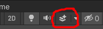

# Unity Camera & Cursor 🎯

<div class="row row-cols-lg-2"><div>

#### Preview camera

Simply click on the camera, you will see a little preview.

#### Set camera view

You can make the camera configure itself according to the current position of the view using "Align with view." 

#### Camera background

You can replace the Skybox with a black background or something else by clicking on the camera and editing both "clear flags" and background. On top of that, you can also turn off the skybox in the editor with this button.


</div><div>

#### Scripts

```cs
Camera.current // may be null
Camera.allCameras
Camera.main    // may be null

Camera.main.ViewportToScreenPoint() // ex: mouse position to world position
Camera.main.ScreenToViewportPoint() // ex: world position to mouse position

Cursor.visible = true;
Cursor.visible = false;
Cursor.SetCursor(cursorTexture, hotSpot, cursorMode);
```
</div></div>