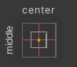

# Unity UI Creation 🖼️

<div class="row row-cols-lg-2"><div>

User Interface (UI) elements are rendered inside a **canvas**. A canvas is automatically created when creating a UI element.

Canvas are 2D elements. Click on the 2D button in the scene view to switch to 2D and design the UI more easily.


</div><div>
</div></div>

<hr class="sep-both">

## Positioning Components

<div class="row row-cols-lg-2"><div>

Arbitrarily arranging elements in a canvas is not responsive, e.g., the elements will not adapt themselves to the size of the screen.

We often use anchors to place elements. Each element is rendered relatively to a border or another element.

Click on a UI element, and check the "Rect Transform". Then click on this (**Anchor presets**) . By pressing **ALT** and selecting an element of the grid, it will automatically position your component somewhere in the canvas, and you can stretch it too if you selected one of the stretching icons <small>(increase width, height, both)</small>.
</div><div>

Here is an example of positioning an image near the top:


</div></div>

<hr class="sep-both">

## Layout managers

<div class="row row-cols-lg-2"><div>

Layout managers are components allowing you to arrange elements more easily. We often create an empty game object for the layout, but it's not mandatory.

The children of the layout game object will be arranged in a specific way, according to the selected layout.

#### Horizontal Layout

Components are on the same line with a gap (0 by default).
</div><div>

#### Vertical Layout

One component per line with a gap between lines (0 by default).

#### Grid Layout

A horizontal layout by default. You can make columns and rows by selecting another value for the field "constraint".
</div></div>

<hr class="sep-both">

## UI Events

<div class="row row-cols-lg-2"><div>

You can add a listener, e.g., a method that will be called when an event is triggered:

#### Add A Listener From The Code

```cs
GetComponent<Button>().onClick.AddListener(() => {});
GetComponent<Button>().onClick.AddListener(MyMethod);
```
</div><div>

#### Add A Listener From The Editor

You need to add an entry inside "On Click" <small>(ex: Button > On Click)</small>.

Select "Runtime Only" and drag and drop a component having the script in which you got the method you want to call. Then select the method in "No Function."
</div></div>

<hr class="sep-both">

## 👻 To-do 👻

Stuff that I found, but never read/used yet.

<div class="row row-cols-lg-2"><div>

* [UI Builder](https://www.youtube.com/watch?v=NQYHIH0BJbs&ab_channel=CocoCode): new way to build interfaces
</div><div>
</div></div>