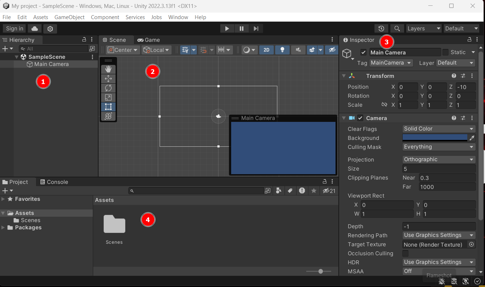
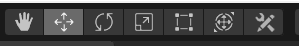
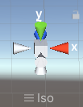
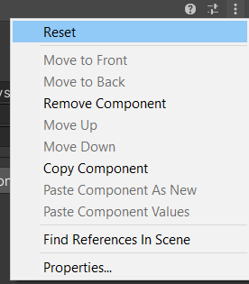
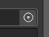
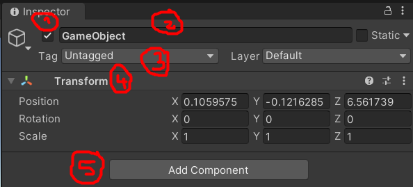
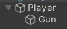

# Unity Editor 🕹️

The Unity Editor is where we will build and assemble our games. Unity Editor versions are managed by [Unity Hub](https://unity.com/unity-hub) which can download [here](https://unity.com/pricing#plans-student-and-hobbyist).

It's recommended to pick a LTS version of the Unity Editor, as they are stable versions. They will still receive patches for 2 years.

✍️ Heavily refer to the [Official Documentation](https://docs.unity3d.com/Manual/index.html).

🚀 There are multiple ways to achieve the same goal. Some may use buttons, some may use shortcuts, others may use the toolbar.

This content is further developed in other pages:

* [Input](../core/input/index.md) (*handle user input*)
* [Physics & Collision](../core/physics/index.md) (*handle collisions and physics*)
* [Camera & Cursor](../core/camera/index.md) (*manipulate cameras and handle the cursor*)
* [Animations](../core/animations/index.md) (*handle animations and particle systems*)
* [Audio](../core/animations/index.md) (*handle sounds, music, and SFX*)
* [Materials & Textures](../core/animations/index.md) (*handle 2D Textures and 3D Materials*)
* [Meshes & Sprites](../core/mesh/index.md) (*handle 2D Sprites and 3D Meshes*)
* [User Interfaces](../core/mesh/index.md) (*handle user interfaces*)

⚠️ Warning: content under development. Last update: 2021.

## Component-based architecture

#### Game Object

Every entity in the game world is a game object:

* Characters and Items
* Lights and Cameras
* Sounds and Musics
* UI Elements
* ...

A game object can contain other game objects.

📚 Prefabs are preconfigured GameObjects that we can create and reuse throughout our project.

#### Components

Unity uses a component-based architecture, where you attach various components to GameObjects to give them specific functionality.

Every game object has a TransformComponent handling the position, rotation, and scale of a Game object.

We can create our components using [Scripts](/games/unity/scripts/index.md).

#### Scenes

Scenes are individual levels or sections of your game. We often have one scene per screen.

## Unity Editor Interface

The editor is divided into four windows:

1. **hierarchy window** 📚: list of all game objects in the scene
2. **scene window** 🛠: show the scene tab by default.
    * **scene tab**: edit your scene 
    * **game tab**: run your scene
3. **inspector window** ⚙: edit the properties of the selected object
4. **project window** 🗄: all of your project files

➡️ When running the game, the scene tab will still be available, but any changes to it will be discarded when the simulation stops.

✍️ Some are using a color tint <small>(Edit > Preferences > Colors > Playmode tint)</small> to visually see when their changes will be discarded.

## Basic Editor Usage

In most windows, using right-click, you can create game objects, components, scripts, etc.

#### Hierarchy window

The order of elements is important in 2D. Elements at the top are rendered before/below the ones at the bottom.

* <kbd>Double-click</kbd> on a item to focus it in the scene view
* <kbd>F2</kbd> to rename the selected item
* <kbd>CTRL+D</kbd> to duplicate the selected item
* <kbd>ALT</kbd>+`expand/hide`: to expand/hide all children of a group
* <kbd>SearchBar</kbd>: search game objects or components <small>(write the fullname)</small>

 

#### Scene window

You can move, rotate, and scale game objects. You can also change your point of view by clicking on an axis. Click back on the square to go back to Perspective.

 &nbsp;

* <kbd>F</kbd> to focus a game object
* <kbd>Mouse Wheel</kbd> to zoom/de-zoom
* <kbd>Left-Click/Middle-click</kbd> to move your point of view
* <kbd>CTRL</kbd> when moving something will update the position by 0.25
* <kbd>CTRL</kbd>/<kbd>SHIFT</kbd> to select multiple game objects

#### Inspector Window

We can edit the properties of any selected game objected <small>(from the hierarchy or from the project view)</small>. We can also manipulate components:

Some values are game objects or files. You can drag-and-drop the game object/file to the field. You can also use the small circle with a dot, to browse values for this field ().

📚 You can drag-and-drop a component to a game object in the hierarchy/scene to add it to a game object <small>(a shortcut)</small>.

 

#### Project Window

The project window is like a warehouse. It's a file explorer allowing you to browse your scenes, your assets and open them in Unity. We usually sort our assets in folders such as:

* Animations, Audio, Cutscene
* Images, Materials
* Plugins, Prefabs, Scenes
* Scripts
* Settings, Shaders

➡️ You can create scene, materials, scripts, etc. from there.

## Manipulating Game Objects

Every Game object has the same properties:

1. Enable/Disable
2. Name
3. Tag
4. Transform
5. Add new components

A game object that is disabled is not update nor rendered.

Pros are disabling game objects that are far from the camera and only enabling those near the camera. In some cases, we may show objects that are far if they are visible to the player <small>(ex: building, etc.)</small>.

⚠️ Avoid using scaling. It may cause performance issues.

 

#### Game Object Nesting

You can nest game objects inside game objects. While it make everything looks cleaner, too much nesting decreases performance.

Nested objects are rendered relatively to their parents. It means that moving the parent will move the children.

📚 If the parent is disabled, its nested game objects are disabled too. One trick is to disable the renderer instead of the game object.

#### Prefabs 🤖

We can save a Game Object inside a file as a prefab. Each time we add a prefab to a scene, it creates a new instance. 

When we modify the prefab, every instance is modified. But each instance can independently make some changes. In that scenario, the changes of the prefab are not overriding the local changes.

* ✅ We update only one game object to update all instances
* ✅ Changing the Transform Component doesn't impact instances
* ❌ It we change the prefab, we may create problems as we have very little control on what instances did change on their side.

To create a prefab, drag-and-drop a game object from the scene or the hierarchy to a folder in the project window. Do the reverse process to create an instance. Instances have a blue logo in the hierarchy 🟦.

If an instance modifies the prefab, a blue bar is shown next to each modified property and any different value  is in bold. Use right-click on a property to apply/revert changes. You can see every overridden property by clicking on "override," right below "layer."

Double-click on a prefab to edit it. From the inspector, you can also use the arrow at the top.

📚 Prefab means "Prefabricated Game Object."

## Unity Asset Store 🏪

You can access [Unity Asset Store](https://assetstore.unity.com/) directly from Unity Editor. 

* **Window > Asset store**: open the asset store in your browser
* **Window > Package manager**: browser assets

Packages are categorized in different views. Right next to the "+", you can set the package view to:

* **My assets**: download and import your assets here
* **Unity Registry**: download and install verified plugins
* **In Project**: manage anything installed in the current project

## Build A Game

#### Scene Manager

You need to add your scene in the SceneManager for them to be in the game that will be built. 

* File > Build Settings
* You may use "Add opened scenes in build"
* You may drag-and-drop scenes in the list

🪲 It seems updating Unity will empty the list.

⚠️ Save project settings after changes, e.g., not just the scene.

#### Unity Editor Modules

To compile to a specific platform, you need to have the required modules installed. Open Unity Hub, navigate to the "Installs" tab, Right-click on your Unity version, and select "Add Modules".

#### Generate A Build

Navigate to `File > Build` or `File > Build and Run`.

#### Build Configuration

Go to `Edit > Project Settings > Player`. You could also find the menu in `File > Build` at the bottom-left button "Player settings...".

* Set the company name, the product name, the version
* You may set the icon 🚀 <small>(and multiple icons for each resolution)</small>
* You can define the initial configuration
* In splash image
   * You may remove the unity logo <small>(up to you, or You can move it)</small>
   * Add a splash screen with your own logo
      * First, exit and add your logo in the project files
      * Click on your logo, in texture type, set sprite 2D, and apply
      * Go back to the splash screen
      * Click on "+" and drag and drop your logo inside the field
      * You may set the duration
* You may set the background too

It's sometimes advised to check `Edit > Project Settings > Quality` as you may be able to reduce your build size.

## Random Notes

#### Debug Inspector Window

On the top of the inspector window, there are three small dots. You can switch from "normal" to "debug" mode here, which will show you way more fields in the inspector.

#### Unity Editor Settings

Go to <kbd>Edit, Then Preferences</kbd>.

* <kbd>General > Disable editor analytics</kbd>: up to you, [more info here](https://docs.unity3d.com/Manual/EditorAnalytics.html)
* <kbd>General > Editor Theme</kbd>: Light/Dark

## 👻 To-do 👻

Stuff that I found, but never read/used yet.

* Selections=Shortcuts to Game Object
* Tags + Hell
* [PlayerPrefs](https://docs.unity3d.com/ScriptReference/PlayerPrefs.html) to save stuff
* Active Scene and Additive Scenes
* Game resolution
* Profiler + IDE debugger
* Scene templates
* NavMeshAgent/SetDestination (AI)

* Enable post-processing in the scene bar (enabled by default)
* You can use calculations in the editor, they are evaluated

