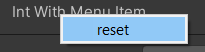
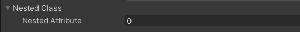
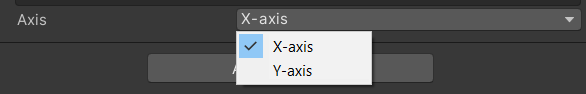
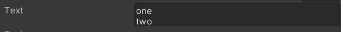
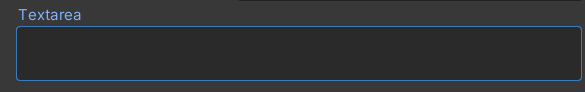

# Serialize Field : basic

<details class="details-e">
<summary>New Menu 🚀</summary>

When clicking on "adding component", you got a list of menus such as "Audio", ... You can add a new menu here 🚀!

```cs
// this is a path, you can subfolders (=nested menus) with /
[AddComponentMenu("CubeMaster/Movement")]
public class MovementManager : MonoBehaviour {}
```


</details>

<hr class="sl">

## Serialize Field: more

<details class="details-e">
<summary>General 🛠</summary>
<br>
<table class="table table-striped table-bordered border-dark">
<tr><th>Code</th><th>Editor/Description</th></tr>

<tr><td>

```cs
[HideInInspector] public float hide;
```
</td><td><br>

No field "hide".
</td></tr>

<tr><td>

```cs
[RequireComponent(typeof(Collider))]
// [RequireComponent(typeof(Collider), typeof(Rigidbody))]
public class SomeClass : MonoBehaviour {}
```
</td><td><br>

You can't add this class as a component of a game object, if this class does not have a collider.
</td></tr>

<tr><td>

```cs
[DisallowMultipleComponent]
public class SomeClass : MonoBehaviour {}
```
</td><td><br>

You can't have more than one instance of this component per game object.
</td></tr>

<tr><td>

```cs
[HelpURL("https://memorize.be/games")]
public class SomeClass : MonoBehaviour {}
```
</td><td><br>

You can set the link opened when clicking on the "?" mark, next to the 3 dots, to remove a component.
</td></tr>

<tr><td>

```cs
[ContextMenuItem("reset", "ResetIntWithMenuItem")] 
public int intWithMenuItem;
private void ResetIntWithMenuItem()
{
	intWithMenuItem = 12;
}
```
</td><td><br>

When using your left-click on a field, you can add fields in the context menu. If you want to add something for the class, check [ContextMenu](https://docs.unity3d.com/ScriptReference/ContextMenu.html).


</td></tr>

<tr><td>

```cs
// using System; // for Serializable
[Serializable]
public class NestedClass // <=> struct
{
	public int nestedAttribute; 
}
[SerializeField] private NestedClass nestedClass;
```
</td><td><br>

You can make a dropdown nested inside your component, as other native components do. The class must be Serializable, then simply give the Serializable class as the type of the field.


</td></tr>

<tr><td>

```cs
private enum Axis
{
	[InspectorName("X-axis")] X, 
	[InspectorName("Y-axis")] Y
}
[SerializeField] private Axis axis = Axis.X;
```
</td><td><br>

You can use this to rename the values of your enum in the inspector. It does not work for attributes 😭.



</td></tr>
</table>
</details>

<details class="details-e">
<summary>Numbers 🔢</summary>
<br>
<table class="table table-striped table-bordered border-dark">
<tr><th>Code</th><th>Editor/Description</th></tr>

<tr><td>

```cs
[Min(10)] public int speed = 15;
```
</td><td>


If the value is lower than min, then value = min.
</td></tr>

<tr><td>

```cs
[Range(0, 1)] public float volume;
```
</td><td><br>


</td></tr>

</table>
</details>

<details class="details-e">
<summary>Strings 📚</summary>
<br>
<table class="table table-striped table-bordered border-dark">
<tr><th>Code</th><th>Editor/Description</th></tr>

<tr><td>

```cs
[Multiline(2)] public string text = "";
```
</td><td><br>


</td></tr>

<tr><td>

```cs
// or [TextArea( minLines, maxLines )]
[TextArea] public string textarea = "";
```
</td><td><br>


</td></tr>

</table>
</details>

You got way more attributes, you can

* use [SelectionBase](https://docs.unity3d.com/ScriptReference/SelectionBaseAttribute.html) to a class (even if you are not showing it in the editor), to pick whether this class should be selected (no attribute, default), or the base (this attribute)
* add an **entry** in the **preferences** with [SettingsProvider](https://docs.unity3d.com/ScriptReference/SettingsProvider.html) (new version of [PreferenceItem](https://docs.unity3d.com/ScriptReference/PreferenceItem.html))
* add an **entry** in the **toolbar** with [MenuItem](https://docs.unity3d.com/ScriptReference/MenuItem.html)
* add an **entry** in the **assets list** with [CreateAssetMenu](https://docs.unity3d.com/ScriptReference/CreateAssetMenuAttribute.html) (attached to a class extending ScriptableObject)
* make this component show up when **selecting multiples game objects** with [CanEditMultipleObjects](https://docs.unity3d.com/ScriptReference/CanEditMultipleObjects.html)

<hr class="sep-both">

## Coroutines

**Coroutines** are functions with multiple returns. Each time the function is called, the code will be executed until the next return. **This is quite used when you need to do a job after X seconds, or when a condition is true, etc.**.

<div class="row row-cols-md-2 mx-0"><div>

If you only need to call a method in x seconds, and there is no optional parameter delay (ex: we got one for Destroy...), you may use `Invoke(methodName, delay);`.

Inside such function, you can call

* `yield return null`: tell unity to wait one frame and call again the coroutine
* `yield return ...`
    * `new WaitForSeconds(1f);`: wait for 1 second
    * `new WaitUntil(() => false);`: wait until the function returns true
    * `new WaitWhile(() => true);`: wait until the function returns false
    * `new WaitForSecondsRealtime(1f)`: wait for 1 real second (unscaled time)
    * You can create new ones by extending `CustomYieldInstruction`
    * ...
* `yield break` (or no other return): coroutine done
</div><div class="align-self-center">

**Declare a function**

```cs
private IEnumerator MyCoroutine()
{
	// when started, wait for one second then print "some code"
	yield return new WaitForSeconds(1f);
	Debug.Log("Some code");
}
```

**Start/Stop your coroutine**

```cs
StartCoroutine(MyCoroutine());
StartCoroutine(nameof(MyCoroutine)); // or StartCoroutine("MyCoroutine");

var c = MyCoroutine();
StartCoroutine(c);
StopCoroutine(c);
StopAllCoroutines();
```
</div></div>