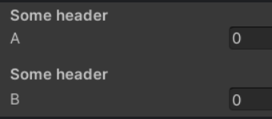
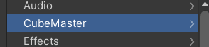
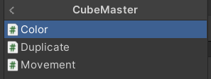

# Unity Scripts 🐲

<div class="row row-cols-lg-2"><div>

Unity Scripts are written in [C#](/programming-languages/high-level/oo/cs/index.md). The version of C# used changes according to the editor version. 

For reference, it's [C# 9.0 for Unity 2022.3](https://docs.unity3d.com/2022.3/Documentation/Manual/CSharpCompiler.html). Note that some features from each C# version were not implemented in Unity. Refer to the Unsupported features of the link above.

Inside the project window of the editor, you can create new scripts, for instance, `Example.cs`. We usually store them in a folder `Scripts`.

✍️ Unity Scripts are documented in the [Scripting Reference](https://docs.unity3d.com/ScriptReference/).
</div><div>

The name of the script is the same as the name of the class. Use UpperCamelCase for naming scripts/classes.

```cs
using UnityEngine;

public class Example : MonoBehaviour
{
    // Awake is called when the script instance is being loaded
    private void Awake() { }

    // Start is called before the first frame update
    private void Start() { }

    // Update is called once per frame
    private void Update() { }
}
```
</div></div>

<hr class="sep-both">

## Game Objects and MonoBehavior

<div class="row row-cols-lg-2"><div>

Most unity scripts are inheriting the class [MonoBehaviour](https://docs.unity3d.com/ScriptReference/MonoBehaviour.html) as it is the base class for components that can be attached to GameObjects.

#### Associated Game Object

The associated game object is available in the `gameObject` attribute. You can edit any value as you would in the editor.

```cs
// Name of the game object (attribute 'name')
// Tag of the game object (attribute 'tag')
// State of the game object (attribute 'enabled')
// Access the TransformComponent (attribute 'transform')
string previousName = name;  // store in a variable
name = "Hello, World";       // change the name
```

➡️ You can use `this.attribute` or `gameObject.attribute` too.
</div><div>

#### Accessing Other Game Objects

You can find game objects that have a tag `tagName`:

```cs
GameObject obj = GameObject.FindWithTag("tagName"); // null if not found
GameObject obj = GameObject.FindGameObjectWithTag("tagNametagName"); // same
GameObject[] objects = GameObject.FindGameObjectsWithTag("tagName");
```
</div></div>

<hr class="sep-both">

## Basic Methods

<div class="row row-cols-lg-2"><div>

#### Game Object Methods

Clone a game object, e.g., create a new one.

```cs
var _obj = Instantiate(obj);
var _obj = Instantiate(obj, pos, rot);
var _obj = Instantiate(obj, pos, Quaternion.identity);
```

Destroy a game object.

```cs
Destroy(obj);
Destroy(obj, time_before_death);
```

Call a method on every MonoBehavior of our game object.

```cs
SendMessage("methodName");
SendMessageUpwards("methodName"); // and on its ancestors
```
</div><div>

#### Position-Related Methods

A class used to represent a position (x,y) or (x,y,z).

```cs
// shortcuts to create vectors
Vector3.back, Vector3.down, Vector3.up, ...
someVector.normalized; // magnitude=1, just a direction
Vector3.MoveTowards(current, target, maxDistancePerStep);
Vector3.Reflex(inDirection, inNormal) // sort of mirror, bounce
if (Vector3.Distance(a, b) <= 0.0001f) {} // a near b?
```

We can use these functions with transforms:

```cs
// transform.position, ...
transform.LookAt(target);
transform.Rotate(axis, angle);
transform.Rotate(axis, Time.deltaTime * angle, Space.World); // or Space.Self
```
</div></div>

<hr class="sep-both">

## Serialize Field

<div class="row row-cols-lg-2"><div>

SerializeField makes the attributes of the script visible from the inspector, allowing users to edit them.

```cs
[SerializeField]
private int number = 0;
// Can be on one line
[SerializeField] private int number = 0;
```

The result is:


📚 The field shown is determined based on the attribute type.

</div><div>

We can customize the inspector for our script. There are a few existing attributes we can use, while there are libraries with new attributes.

* [Existing Attributes](#unity-scripts-existing-attributes)
* [NaughtyAttributes](https://github.com/dbrizov/NaughtyAttributes): an open-source library 🚀
* [Markup-Attributes](https://github.com/gasgiant/Markup-Attributes): another open-source library ✨
* [Odin](https://assetstore.unity.com/packages/tools/utilities/odin-inspector-and-serializer-89041): paid unity plugin

➡️ The archived [Unity-Attributes-Example](https://github.com/LastAssertor/Unity-Attributes-Example/tree/master) project listed quite a lot of examples to learn how to use the existing attributes.

⚠️ Any "public" attribute is visible in the editor, but it's a side effect.

📚 You can merge attributes: `[A][B]` and `[A,B]` is the same.
</div></div>

<hr class="sep-both">

## Coroutines

<div class="row row-cols-lg-2"><div>

A coroutines is a task that can be paused. They are quite used for tasks such as animations and delays. It's a normal function that has multiple returns according to our need:

* `yield return null`: pause until the next frame/update call
* `yield return ...`
    * `new WaitForSeconds(1f);`: wait for roughly 1 second
    * `new WaitUntil(Function);`: wait until `Function` returns true
    * `new WaitWhile(Function);`:  wait until `Function` returns false
    * `new WaitForSecondsRealtime(1f)`: wait for 1 real second
    * You can create new ones by extending `CustomYieldInstruction`
    * ...
* `yield break`: mark the task as done
* `return`/End-Of-Function: implicit `yield break`

👉 `Function` could be an inline function: `() => true`.

📚 Use `Invoke(methodName, n)` to call `methodName` after waiting `n` s.
</div><div>

#### Declare a coroutine function

```cs
private IEnumerator MyCoroutine()
{
    // when started, wait for one second then print "some code"
    yield return new WaitForSeconds(1f);
    Debug.Log("Some code");
}
```

#### Start/Stop your coroutine

```cs
StartCoroutine(MyCoroutine());
StartCoroutine(nameof(MyCoroutine)); // same
StartCoroutine("MyCoroutine");       // same
// You need to store the result to stop it manually
var c = MyCoroutine();
StartCoroutine(c);
StopCoroutine(c);
StopAllCoroutines();
```
</div></div>

<hr class="sep-both">

## Unity Scripts Existing Attributes

<div class="row row-cols-lg-2"><div>

##### Add Tooltips

Add a message shown when hovering the property.

```cs
[Tooltip("Some description blah blah blah")]
[SerializeField] private int number = 0;
```

##### Add Headers

Display a header before attributes to visually group them.

```cs
[Header("Some header")]
// some attributes
```

##### Add Spacing

You can add some vertical spacing to increase readability.

<div class="row row-cols-lg-2"><div>

```cs
[Header("Some header")]
[SerializeField] private int a;
[Space(2)]
[Header("Some header")]
[SerializeField] private int b;
```
</div><div>


</div></div>

##### Backward compatibility

Backward compatibility when renaming an attribute:

```cs
[SerializeField]
[FormerlySerializedAs("oldName")] private int number = 0;
```

##### Add Entry To Create Menu

You can sort your new components in the "create" menu, similarly to how the existing components are sorted <small>(Audio, UI, etc.)</small>.

```cs
[AddComponentMenu("CubeMaster/Movement")] // [Path/]Name
public class MovementManager : MonoBehaviour {}
```




##### Help URL

You can define the link opened when clicking on the "?".

```cs
[HelpURL("https://example.com/documentation/SomeClass.html")]
public class SomeClass : MonoBehaviour {}
```

##### Hide Public Attributes

To hide a public attributes from the inspector, use:

```cs
[HideInInspector] public float hide;
```
</div><div>

##### Component Usage Restrictions

When adding this component, required components are automatically added. If it's not possible, we can't use this component.

```cs
[RequireComponent(typeof(Collider))]
public class SomeClass : MonoBehaviour {} // One
[RequireComponent(typeof(Collider), typeof(Rigidbody))]
public class SomeClass : MonoBehaviour {} // Multiple
```

We can prevent users from using this component more than once to the same game object using:

```cs
[DisallowMultipleComponent]
public class SomeClass : MonoBehaviour {}
```

#### Input Numbers

We can customize the input field for numbers:

```cs
[Min(10)] public int speed = 15;   // max value
[Range(0, 1)] public float volume; // show a slider
```

#### Input Strings

We can customize the input field for strings:

```cs
[Multiline(2)] public string text = "";
// or [TextArea( minLines, maxLines )]
[TextArea] public string textarea = "";
```
</div></div>

<hr class="sep-both">

## Coding Conventions

<div class="row row-cols-lg-2"><div>

The name of a method should start with an uppercase.

```diff
- private void myMethod() {}
+ private void MyMethod() {}
```

You should explicitly add the qualifier.

```diff
- void MyMethod() {}
+ private void MyMethod() {}
```

Private attributes should start/end with an underscore (<code>_</code>).

```diff
- private int myAttribute;
+ private int _myAttribute;
```

Attributes should be private or protected

```diff
- int myAttribute;            // not private (implicit)
- public int myAttribute;     // not public
+ protected int _myAttribute; // either explicit protected
+ private int _myAttribute;   // or explicit private
```
</div><div>

Public attributes should NOT start/end with an underscore (<code>_</code>).

```diff
- public int _myAttribute;
- [SerializeField] private int _myAttribute;
+ public int myAttribute;
+ [SerializeField] private int myAttribute;
```

The last instruction must not be an "if" statement.

```diff
- private void MyMethod()
- {
- 	// some code here (optionnal)
- 	if (something) {
- 	    // some code here
- 	}
- }
+ private void MyMethod()
+ {
+ 	// some code here (optionnal)
+ 	if (!something) return; // faster return
+ 	// some code here
+ }
```

Don't call `GetComponent<T>()` often. Do it once.

```diff
-GetComponent<T>().smth()
-GetComponent<T>().smth()
+var component = GetComponent<T>(); // or an attribute
+component.smth()
+component.smth()
```
</div></div>

<hr class="sep-both">

## Random Notes

<div class="row row-cols-lg-2"><div>

#### Console Logs 📺

The console is a tab of the Project window. You can clear the console with `clear`. From the code, we can print logs in the console using:

* Normal Logs (Debug)

```cs
Debug.Log("message");
```

* Warnings

```cs
Debug.LogWarning("warning");
```

* Errors

```cs
Debug.LogError("error");
```
</div><div>
</div></div>

<hr class="sep-both">

## 👻 To-do 👻

Stuff that I found, but never read/used yet.

<div class="row row-cols-lg-2"><div>

* [_old](_old.md)
</div><div>
</div></div>