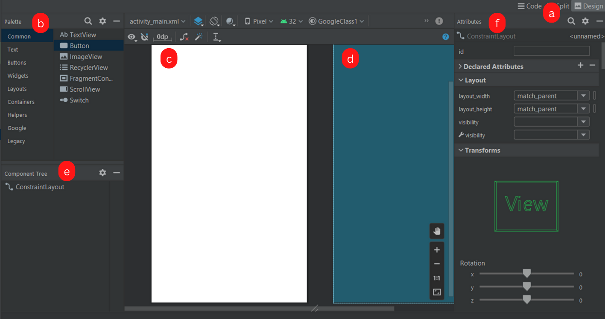
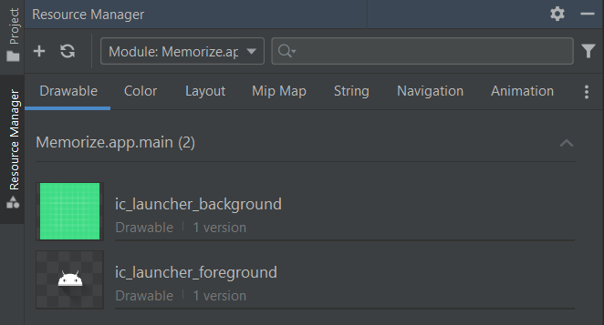

# Android development

There are multiple ways to develop apps for Android devices. This course will focus on Android apps written in **Kotlin**, using **Android Studio**. Kotlin which is recommended by Google since 2018, replacing Java which was mainly used until then. Switching from Kotlin to Java, and from Java to Kotlin is quite easy, Android Studio can even do the conversion for you.

> Android Studio (Google) is based on IntelliJ Community (JetBrains) 😎❤️

<hr class="sl">

## Activities, and Intents

<div class="row row-cols-md-2 mx-0"><div>

Each screen of your application is an **Activity**. The "main" screen is usually called "Main Activity". Each activity is made of two files

* **MainActivity.kt** for the code handling the view
* **activity_main.xml** for the view

An [**intent**](https://developer.android.com/guide/components/intents-filters) is an object representing some action to be performed. There are two kinds of intents

* **Explicit**: everything related to your app <small>(ex: launch another activity)</small>
* **Implicit**: this is a type of action that you request another app, or the system to do <small>(ex: open link, share something)</small>

</div><div>

<details class="details-e">
<summary>Base code for an Activity</summary>

```kotlin
import androidx.appcompat.app.AppCompatActivity
import android.os.Bundle

class MainActivity : AppCompatActivity() {
    override fun onCreate(savedInstanceState: Bundle?) {
        super.onCreate(savedInstanceState)
        // set the view: activity_main.xml
        setContentView(R.layout.activity_main)
        // add your code here
    }
}
```
</details>

<details class="details-e">
<summary>Explicit intent: start another activity</summary>

```kotlin
val intent = Intent(context, MainActivity::class.java)
// optional, you can add extra parameters
intent.putExtra("param", holder.myButton.text.toString())
context.startActivity(intent)
```

In the new activity, you may load some parameters using

```kotlin
val someParam = intent?.extras?.getString("param").toString()
```

**Note**: `"param"` should be a constant string.
</details>

<details class="details-e">
<summary>Implicit intent: start another activity</summary>

* ACTION_VIEW is used with a page web (`https:`), a mail (`mailto:`), or a telephone (`tel:`)

```kotlin
val intent = Intent(Intent.ACTION_VIEW, Uri.parse("???"))
context.startActivity(intent)
```

There is a lot of [Intents here](https://developer.android.com/reference/android/content/Intent).
</details>

</div></div>

<hr class="sr">

## Views

<div class="row row-cols-md-2 mx-0"><div>

Everything displayed on the screen is a **View**. `View` doesn't mean that this is only a something displayed, it be also be something clickable/editable...

Each View has attributes, or properties, for instance, you can define the text shown in TextView using the attribute `text`. As some views are sharing common properties, they are **inheriting** others views, which means that they have the attributes of the view that they are inheriting, along with their own attributes.

<details class="details-e">
<summary>View: the base class of all views</summary>

**Accessibility (attributes)**

* `contentDescription`: what's the purpose of this element
* `importantForAccessibility`: if this element is just decorative, you can set it to no
</details>

The layout, the arrangement of the views, is handled by a **ViewGroup**. Layouts are edited using the layout editor. They are located in `.../res/layout/xxx.xml`.

* [ConstraintLayout](layouts/ConstraintLayout.md): arrange elements in a flexible way
* [RecyclerView](layouts/RecyclerView.md): not a ViewGroup, but an efficient way of displaying a flexible list of elements.
</div><div>

<details class="details-e">
<summary>Display a text with <code>TextView</code></summary>

* **Inheritance**: TextView extends View
* **Documentation**: [TextView](https://developer.android.com/reference/android/widget/TextView)

**Useful attributes**

* `text`
*  (settings) `text`: this text is only shown when editing. <small>It's useful when a text should be empty by default, but you want to see what it will look like once filed.</small>

**useful methods**

* `setText(stringId)`: there is also `setText(string)`, but that's better to use `text` in such case.

</details>

<details class="details-e">
<summary>Display an image with <code>ImageView</code></summary>

* **Inheritance**: ImageView extends View
* **Documentation**: [ImageView](https://developer.android.com/reference/android/widget/ImageView)

**Useful attributes**

* `scaleType`: use "centerCrop" to scale without distorting (9patches)
* `srcCompat`: set image

**useful methods**

* `setImageResource(drawable_id)`: set image in the code. <small>Don't forget to update `contentDescription`, or any accessibility-related attributes, if needed.</small>
</details>

<details class="details-e">
<summary>Display a button with <code>Button</code></summary>

* **Inheritance**: Button extends TextView
* **Documentation**: [Button](https://developer.android.com/reference/android/widget/Button)

**Useful attributes**

* ...

**useful methods**

* `setOnClickListener`
</details>

<details class="details-e">
<summary>Display a RadioButton  with <code>RadioButton+RadioGroup</code></summary>

* **Inheritance**: RadioButton extends Button <small>(CompoundButton to be fair)</small>, RadioGroup extends LinearLayout
* **Documentation**: [RadioButton](https://developer.android.com/reference/android/widget/RadioButton), and [RadioGroup](https://developer.android.com/reference/android/widget/RadioGroup)

RadioGroup is a ViewGroup used to ensure that only one RadioButton can be selected at a time.

**Useful attributes**

* RadioGroup#`checkedButton`

**useful methods**

* RadioGroup#`setOnCheckedChangeListener`: parameters are radio group, and the Id of the checked button.
</details>

<details class="details-e">
<summary>Display a switch  with <code>Switch</code></summary>

* **Inheritance**: Switch extends Button <small>(CompoundButton to be fair)</small>
* **Documentation**: [Switch](https://developer.android.com/reference/android/widget/Switch)

**Useful attributes**

* `checked`

**useful methods**

* `isChecked`
</details>

<details class="details-e">
<summary>Display a text field  with <code>EditText</code></summary>

* **Inheritance**: EditText extends TextView
* **Documentation**: [EditText](https://developer.android.com/reference/android/widget/EditText)

**Useful attributes**

* `inputType`: determine the [keyboard](https://developer.android.com/develop/ui/views/touch-and-input/keyboard-input/style). Can use multiple types.
* `hint`: placeholder

**useful methods**

* ...
</details>
</div></div>

<hr class="sl">

## Layout Editor

<div class="row row-cols-md-2 mx-0"><div class="align-self-center">

<ol style="list-style-type: lower-alpha">
<li><b>Mode</b>: you can switch to code/layout editor here</li>
<li><b>Palette</b>: a library of views that you can drag and drop to the design view</li>
<li><b>Design view</b>: what the user will see</li>
<li><b>BluePrint view</b>: everything is shown on it, included hidden elements</li>
<li><b>Component tree</b>: list of all views of your screen</li>
<li><b>Attributes</b>: edit the properties of a view</li>

</ol>
</div><div>


</div></div>

**TIP**: you should rely on <kbd>CTRL+F</kbd> to search for attributes, or by clicking on the search icon at the top of the "Attributes" window.

<hr class="sr">

## Resources

<div class="row row-cols-md-2 mx-0"><div>

Images, texts, views, basically everything that is not a Kotlin file, is a resource. They are all stored in the  **📂res** folder

* **drawables**: images
* **layouts**: views
* **mipmap**: icons
* **values**: colors+theme, and strings
* ...

<details class="details-e">
<summary>Resources Manager</summary>

You can access the Resources Manager, which track every resource in `res`, and allow you to add new ones

* from the Left side, right under "project")
* with View > Tools Windows > Resources Manager


</details>

<details class="details-e">
<summary>Add a new "drawable" (image)</summary>

* Go to Drawables tab in the Resources Manager
* Click on "+"
* Import drawables

You can drag, and drop it in the design view (or select it when creating a new imageview).
</details>

Every folder in `res` may have multiples "copies" for different devices/languages. For instance, if there is a view for large screen devices, it will be used instead of the view made of "every" device.

* [strings.xml](values/strings.md): how to properly handle texts, and localization

</div><div>

**Access resources in the code**

<details class="details-e">
<summary>Access resource's (view...) Id in the code</summary>

Each resource may have an id. The main class `R` is managing every id trough subclasses such as `drawable`. If you want a drawable with the id `ic_launcher_foreground` do:

```kotlin
val drawableId : Int = R.drawable.myDrawable
val viewId : Int = R.id.hello_world
```
</details>

<details class="details-e">
<summary>findViewById</summary>

You can then use `findViewById(some_id)` to get a view.

```kotlin
val myButton: Button = findViewById(R.id.myButton)
```
</details>

<details class="details-e">
<summary>[new] view binding (alternative to findViewById)</summary>

You first need to add `viewBinding` in build.gradle, in the bloc "Android", and reload the project. It will create an object that reference all views with an id. 

```gradle
buildFeatures {
    viewBinding = true
}
```

Then, create an attribute `binding`, and you will be able to access every view from it.

<details class="details-e">
<summary>Android MainActivity base code with Binding</summary>

```kotlin
import androidx.appcompat.app.AppCompatActivity
import android.os.Bundle
import com.samples.google.cone.databinding.ActivityMainBinding

class MainActivity : AppCompatActivity() {
    lateinit var binding: ActivityMainBinding
    
    override fun onCreate(savedInstanceState: Bundle?) {
        super.onCreate(savedInstanceState)
        binding = ActivityMainBinding.inflate(layoutInflater)
        setContentView(binding.root)
    }
}
```
</details>
</details>

</div></div>

<hr class="sl">

## Useful stuff

<div class="row row-cols-md-2 mt-4"><div>

<details class="details-e">
<summary>Toasts (sort of non-aggressive popups)</summary>

A toast is something like this, usually at the bottom of the screen:


And, the code is as simple as that

```kotlin
// create
// LENGTH_SHORT (=short duration) LENGTH_LONG (=long duration)
val toast = Toast.makeText(this, "Some message", Toast.LENGTH_SHORT)
// show
toast.show()
```
</details>

<details class="details-e">
<summary>Keyboard</summary>

You can get an `` which is handling the input of the application with

```kotlin
val inputMethodManager = getSystemService(Context.INPUT_METHOD_SERVICE) as InputMethodManager
```

**Hide keyboard** (given a view)

```kotlin
inputMethodManager.hideSoftInputFromWindow(view.windowToken, 0)
```

</details>
</div><div>

As in Java, you have listeners which are called when an event is triggered (ex: `click on a button`).

<details class="details-e">
<summary>OnClickListener (click on a button)</summary>

Example for "OnClickListener", a listener added on a button, that is called when a user click on it.

```kotlin
val myButton: Button = findViewById(R.id.myButton)
myButton.setOnClickListener {
    println("Clicked on myButton")
}
```
</details>

<details class="details-e">
<summary>OnKeyListener (click on a key)</summary>

Example for "OnKeyListener", a listener added on a input field, that is called when a user press a key. The function takes a view, a keycode, and a keyEvent, and returns true if the event was handled.

```kotlin
val myEditText: EditText = findViewById(R.id.myEditText)
myEditText.setOnKeyListener { v, keyCode, keyEvent ->
    // if A pressed
    if (keyCode == KeyEvent.KEYCODE_A) {
        // ...
        return@setOnKeyListener true
    }
    return@setOnKeyListener false
}
```
</details>
</div></div>

<hr class="sr">

## Debugging

<div class="row row-cols-md-2 mt-4"><div>

In Android project, you should use the logger instead of the standard output (ex: println). Each logging function is taking a "tag" used to "sort" logs. Later, you can search for all logs having this tag, among the great amount of logs, so it's pretty useful.

```kotlin
// proper
private const val TAG = "MainActivity"
Log.v(TAG, "message")
// improper
Log.v("tag", "message")
```
</div><div>

There are 5 levels of logs. You can view your logs in the tab "logat", in which you can also change the Log settings, or create filtering rules for your tags.

* `Log.v`: verbose
* `Log.d`: debug
* `Log.i`: info
* `Log.w`: warn
* `Log.e`: error
</div></div>

<hr class="sl">

## References

* [Android Basics in Kotlin](https://developer.android.com/courses/android-basics-kotlin/course)