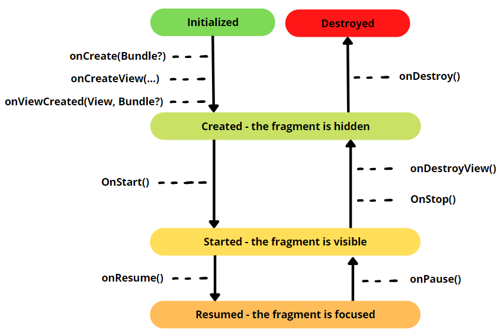

# Android development

There are multiple ways to develop apps for Android devices. This course will focus on Android apps written in **Kotlin**, using **Android Studio**. Kotlin which is recommended by Google since 2018, replacing Java which was mainly used until then. Switching from Kotlin to Java, and from Java to Kotlin is quite easy, Android Studio can even do the conversion for you.

> Android Studio (Google) is based on IntelliJ Community (JetBrains) 😎❤️

<hr class="sl">

## Activities, and Intents

<div class="row row-cols-md-2 mx-0"><div>

Each screen of your application is an **Activity**. The "main" screen is usually called "Main Activity". Each activity is made of two files

* **MainActivity.kt** for the code handling the view
* **activity_main.xml** for the view

<details class="details-e">
<summary>Base code for an Activity</summary>

```kotlin
import androidx.appcompat.app.AppCompatActivity
import android.os.Bundle

class MainActivity : AppCompatActivity() {
    override fun onCreate(savedInstanceState: Bundle?) {
        super.onCreate(savedInstanceState)
        // set the view: activity_main.xml
        setContentView(R.layout.activity_main)
        // add your code here
    }
}
```

This code can be shortened to

```kotlin
class MainActivity : AppCompatActivity(R.layout.activity_main) {
}
```
</details>

> An activity has an attribute `title` to change the title of the current window/frame.
</div><div>

An [**intent**](https://developer.android.com/guide/components/intents-filters) is an object representing some action to be performed, such as navigating to another activity. There are two kinds of intents

* **Explicit**: related to your app <small>(ex: launch one of your activities)</small>
* **Implicit**: you request another application, or the system, to do the wanted action <small>(ex: open link, share something)</small>

<details class="details-e">
<summary>Explicit intent: Start another activity</summary>

```kotlin
val intent = Intent(context, MainActivity::class.java)
// optional, you can add extra parameters
intent.putExtra("param", holder.myButton.text.toString())
context.startActivity(intent)
```

In the new activity, you may load some parameters using

```kotlin
val someParam = intent?.extras?.getString("param").toString()
```

**Note**: `"param"` should be a constant string.
</details>

<details class="details-e">
<summary>Implicit intent: Start another activity / Share / ...</summary>

[There is a lot of Intents here](https://developer.android.com/reference/android/content/Intent).

**ACTION_VIEW** is used with a URL (`https:`), a mail (`mailto:`), or a telephone (`tel:`). For instance, given a URL, it will try to open it in a browser...

```kotlin
val intent = Intent(Intent.ACTION_VIEW, Uri.parse("???"))
```

**Share**

```kotlin
val shareIntent = ShareCompat.IntentBuilder.from(this)
                .setText("...")
                .setType("text/plain")
                .intent
```

**Run an intent**

```kotlin
// context.startActivity(intent)
startActivity(intent)
```

But, as this may fail, you would better use a try-catch

```kotlin
try {
    startActivity(intent)
} catch (ex: ActivityNotFoundException) {
    // use a toast / ...
}
```
</details>

> Nowadays, you should use Jetpack navigation component.
</div></div>

<hr class="sr">

## Application life-cycle

<div class="row row-cols-md-2 mt-4"><div>


> **Note**: it should be highlighted again, that rotating your devices will destroy, and create again your app. On Android Studio, don't forget to enable device rotation to try it out.
</div><div>

Android life-cycle is a bit complex. When starting an app, you go from Initialized, to Created, then Started, then Resumed.

If the app is partially visible <small>(ex: click on share/...)</small>, then you go back to "Started".

If you press the home button, your app will go back to Created, until you start it again.

If Android need resources, then your app may be destroyed. If there are a lot of changes <small>(ex: language changed, rotation...)</small>, then android will most likely destroy, and re-create the app.

You can use `onCreate(Bundle?)`, `onRestoreInstanceState(Bundle)`, to load saved data, and `onSaveInstanceState(Bundle)` to save data. A "bundle" is a **small, in-memory** dictionary, in which you can save a bit of data, that will be reloaded when the app is created, or started again.

Code in `onPause()` must be lightweight, because it will delay the other application that is showing up in the front screen.
</div></div>

<hr class="sl">

## Views

<div class="row row-cols-md-2 mx-0"><div>

Everything displayed on the screen is a **View**. `View` doesn't mean that this is only a something displayed, it be also be something clickable/editable...

Each View has attributes, or properties, for instance, you can define the text shown in TextView using the attribute `text`. As some views are sharing common properties, they are **inheriting** others views, which means that they have the attributes of the view that they are inheriting, along with their own attributes.

<details class="details-e">
<summary>View: the base class of all views</summary>

* `padding`: gap between the border and the content outside (ex: 10dp)
* `layout_margin`: gap with the outside (ex: 10dp)

**Accessibility (attributes)**

* `contentDescription`: what's the purpose of this element
* `importantForAccessibility`: if this element is just decorative, you can set it to no
</details>

The layout, the arrangement of the views, is handled by a **ViewGroup**. Layouts are edited using the layout editor. They are located in `.../res/layout/xxx.xml`.

* [**ConstraintLayout**](layouts/ConstraintLayout.md): arrange elements in a flexible way
* [**RecyclerView**](layouts/RecyclerView.md): not a ViewGroup, but an efficient way of displaying a flexible list of elements.
* **FrameLayout**: if a view has ONE child, then this single child view, is the MOST appropriate view.
* **LinearLayout**: arrange elements horizontally/vertically <small>(see layout_weight on each item, and layout_orientation)</small>

</div><div>

<details class="details-e">
<summary>Display a text with <code>TextView</code></summary>

* **Inheritance**: TextView extends View
* **Documentation**: [TextView](https://developer.android.com/reference/android/widget/TextView)

**Useful attributes**

* `text`
*  (settings) `text`: this text is only shown when editing. <small>It's useful when a text should be empty by default, but you want to see what it will look like once filed.</small>

**useful methods**

* `setText(stringId)`: there is also `setText(string)`, but that's better to use `text` in such case.

</details>

<details class="details-e">
<summary>Display an image with <code>ImageView</code></summary>

* **Inheritance**: ImageView extends View
* **Documentation**: [ImageView](https://developer.android.com/reference/android/widget/ImageView)

**Useful attributes**

* `scaleType`: use "centerCrop" to scale without distorting (9patches)
* `srcCompat`: set image

**useful methods**

* `setImageResource(drawable_id)`: set image in the code. <small>Don't forget to update `contentDescription`, or any accessibility-related attributes, if needed.</small>
</details>

<details class="details-e">
<summary>Display a button with <code>Button</code></summary>

* **Inheritance**: Button extends TextView
* **Documentation**: [Button](https://developer.android.com/reference/android/widget/Button)

**Useful attributes**

* ...

**useful methods**

* `setOnClickListener`
</details>

<details class="details-e">
<summary>Display a RadioButton  with <code>RadioButton+RadioGroup</code></summary>

* **Inheritance**: RadioButton extends Button <small>(CompoundButton to be fair)</small>, RadioGroup extends LinearLayout
* **Documentation**: [RadioButton](https://developer.android.com/reference/android/widget/RadioButton), and [RadioGroup](https://developer.android.com/reference/android/widget/RadioGroup)

RadioGroup is a ViewGroup used to ensure that only one RadioButton can be selected at a time.

**Useful attributes**

* RadioGroup#`checkedButton`

**useful methods**

* RadioGroup#`setOnCheckedChangeListener`: parameters are radio group, and the Id of the checked button.
</details>

<details class="details-e">
<summary>Display a switch  with <code>Switch</code></summary>

* **Inheritance**: Switch extends Button <small>(CompoundButton to be fair)</small>
* **Documentation**: [Switch](https://developer.android.com/reference/android/widget/Switch)

**Useful attributes**

* `checked`

**useful methods**

* `isChecked`
</details>

<details class="details-e">
<summary>Display a text field  with <code>EditText</code></summary>

* **Inheritance**: EditText extends TextView
* **Documentation**: [EditText](https://developer.android.com/reference/android/widget/EditText)

**Useful attributes**

* `inputType`: determine the [keyboard](https://developer.android.com/develop/ui/views/touch-and-input/keyboard-input/style). Can use multiple types.
* `hint`: placeholder

**useful methods**

* ...
</details>
</div></div>

<hr class="sr">

## Layout Editor

<div class="row row-cols-md-2 mx-0"><div class="align-self-center">

<ol style="list-style-type: lower-alpha">
<li><b>Mode</b>: you can switch to code/layout editor here</li>
<li><b>Palette</b>: a library of views that you can drag and drop to the design view</li>
<li><b>Design view</b>: what the user will see</li>
<li><b>BluePrint view</b>: everything is shown on it, included hidden elements</li>
<li><b>Component tree</b>: list of all views of your screen</li>
<li><b>Attributes</b>: edit the properties of a view</li>

</ol>
</div><div>


</div></div>

**TIP**: you should rely on <kbd>CTRL+F</kbd> to search for attributes, or by clicking on the search icon at the top of the "Attributes" window.

**TIP**: you will most likely have a time when you want to replace a view with another view. In the component tree, right-click on a view, and use "convert view". You could also manually get the job done by directly editing the `.fxml`.

<hr class="sl">

## Resources

<div class="row row-cols-md-2 mx-0"><div>

Images, texts, views, basically everything that is not a Kotlin file, is a resource. They are all stored in the  **📂res** folder

* **drawables**: images
* **layouts**: views
* **mipmap**: icons
* **values**: colors+theme, and strings
* ...

<details class="details-e">
<summary>Resources Manager</summary>

You can access the Resources Manager, which track every resource in `res`, and allow you to add new ones

* from the Left side, right under "project")
* with View > Tools Windows > Resources Manager


</details>

<details class="details-e">
<summary>Add a new "drawable" (image)</summary>

* Go to Drawables tab in the Resources Manager
* Click on "+"
* Import drawables

You can drag, and drop it in the design view (or select it when creating a new imageview).
</details>

<details class="details-e">
<summary>Icons</summary>

* Open the resources manager
* "+" > new vector asset
* click on the android icon for "clip art"
* select an icon

For Android 20, or older versions, you need to add `vectorDrawables.useSupportLibrary = true` in build.gradle > Android > defaultConfig.

</details>

Every folder in `res` may have multiples "copies" for different devices/languages. For instance, if there is a view for large screen devices, it will be used instead of the view made of "every" device.

* [strings.xml](values/strings.md): how to properly handle texts, and localization
* [arrays.xml](values/arrays.md): handle arrays of strings/integers

</div><div>

**Access resources in the code**

<details class="details-e">
<summary>Access resource's (view...) Id in the code</summary>

Each resource may have an id. The main class `R` is managing every id trough subclasses such as `drawable`. If you want a drawable with the id `ic_launcher_foreground` do:

```kotlin
val drawableId : Int = R.drawable.myDrawable
val viewId : Int = R.id.hello_world
```
</details>

<details class="details-e">
<summary>findViewById</summary>

You can then use `findViewById(some_id)` to get a view.

```kotlin
val myButton: Button = findViewById(R.id.myButton)
```
</details>

<details class="details-e">
<summary>[new] view binding (alternative to findViewById)</summary>

You first need to add `viewBinding` in build.gradle, in the bloc "Android", and reload the project. It will create an object that reference all views with an id. 

```gradle
buildFeatures {
    viewBinding = true
}
```

Then, create an attribute `binding`, and you will be able to access every view from it.

<details class="details-e">
<summary>Android MainActivity base code with Binding</summary>

```kotlin
import androidx.appcompat.app.AppCompatActivity
import android.os.Bundle
import com.samples.google.cone.databinding.ActivityMainBinding

class MainActivity : AppCompatActivity() {
    lateinit var binding: ActivityMainBinding
    
    override fun onCreate(savedInstanceState: Bundle?) {
        super.onCreate(savedInstanceState)
        binding = ActivityMainBinding.inflate(layoutInflater)
        setContentView(binding.root)
    }
}
```
</details>
</details>

If you write in your code a method taking an id, then you can check if this id has the "right" type using annotation, as every id is an int. Add `@StringRes`, `@DrawableRes`, or `@LayoutRes` before a variable, a parameter, or an attribute.

```kotlin
fun loadIcon(@DrawableRes drawableId: Int) {
    val drawable = AppCompatResources.getDrawable(this, drawableId)
}
```
</div></div>

<hr class="sr">

## Useful stuff

<div class="row row-cols-md-2 mt-4"><div>

<details class="details-e">
<summary>Toasts (sort of non-aggressive popups)</summary>

A toast is something like this, usually at the bottom of the screen:


And, the code is as simple as that

```kotlin
// create
// LENGTH_SHORT (=short duration) LENGTH_LONG (=long duration)
val toast = Toast.makeText(this, "Some message", Toast.LENGTH_SHORT)
// show
toast.show()
```
</details>

<details class="details-e">
<summary>Keyboard</summary>

You can get an `` which is handling the input of the application with

```kotlin
val inputMethodManager = getSystemService(Context.INPUT_METHOD_SERVICE) as InputMethodManager
```

**Hide keyboard** (given a view)

```kotlin
inputMethodManager.hideSoftInputFromWindow(view.windowToken, 0)
```

</details>

<details class="details-e">
<summary>Dialogs (Popups)</summary>

Dialogs are made of a title (optional), a message, and some buttons (accept/close). Clicking on any button will close the popup.

```kotlin
 MaterialAlertDialogBuilder(this)
    .setTitle("XXX")
    .setMessage("YYY")
    // by default, pressing "back" closes the popup
    .setCancelable(false)
    .setNegativeButton("Button1") { _, _ ->
    }
    .setPositiveButton("Button2") { _, _ ->
    }
    .show()
```

</details>

<details class="details-e">
<summary>Menus</summary>

* Resources manager | Menus
* Create a new one

It will generate a new layout, in which you can add menu items. You should give each an `id`, a `title`, and maybe an `icon`. Finally, you might have noticed that your menus are shown in "...". You can modify this behavior with `showAsAction` such as `always` which means that the menu will never be in the "..." (overflow).

In your Activity

```kotlin
override fun onCreateOptionsMenu(menu: Menu?): Boolean {
    menuInflater.inflate(R.menu.refresh_menu, menu)
    // you may use
    // menu?.findItem(R.id.some_menu_item)
    // to setup your menu items
    return true
}

override fun onOptionsItemSelected(item: MenuItem): Boolean {
    return when (item.itemId) {
        R.id.xxx -> {
            // ... code if the user click on this menu item ...
            true
        }
        else -> super.onOptionsItemSelected(item)
    }
}
```
</details>
</div><div>

As in Java, you have listeners which are called when an event is triggered (ex: `click on a button`).

<details class="details-e">
<summary>OnClickListener (click on a button)</summary>

Example for "OnClickListener", a listener added on a button, that is called when a user click on it.

```kotlin
val myButton: Button = findViewById(R.id.myButton)
myButton.setOnClickListener {
    println("Clicked on myButton")
}
```
</details>

<details class="details-e">
<summary>OnKeyListener (click on a key)</summary>

Example for "OnKeyListener", a listener added on a input field, that is called when a user press a key. The function takes a view, a keycode, and a keyEvent, and returns true if the event was handled.

```kotlin
val myEditText: EditText = findViewById(R.id.myEditText)
myEditText.setOnKeyListener { v, keyCode, keyEvent ->
    // if A pressed
    if (keyCode == KeyEvent.KEYCODE_A) {
        // ...
        return@setOnKeyListener true
    }
    return@setOnKeyListener false
}
```
</details>
</div></div>

<hr class="sl">

## Debugging

<div class="row row-cols-md-2 mt-4"><div>

In Android project, you should use the logger instead of the standard output (ex: println). Each logging function is taking a "tag" used to "sort" logs. Later, you can search for all logs having this tag, among the great amount of logs, so it's pretty useful.

```kotlin
// proper
private const val TAG = "MainActivity"
Log.v(TAG, "message")
// improper
Log.v("tag", "message")
```
</div><div>

There are 5 levels of logs. You can view your logs in the tab "logat", in which you can also change the Log settings, or create filtering rules for your tags.

* `Log.v`: verbose
* `Log.d`: debug
* `Log.i`: info
* `Log.w`: warn
* `Log.e`: error
</div></div>

<hr class="sr">

## Multitasking

<div class="row row-cols-md-2"><div>

Most android applications runs on one "main" thread usually called "UI Thread", which is the one handling rendering the view, processing events, and so on.

To run long operations, you can't use this thread, and have to use background threads, as you can't render the view/respond to events, if the main thread is busy.

While you can use threads to run background tasks, you should use [**coroutines**](https://developer.android.com/kotlin/coroutines) which are a modern, and more efficient way of doing that. A coroutine is doing a job, that can be halted/resumed. They are created from a **CoroutineScope**, while the **Dispatcher** is the one telling on which thread a coroutine will execute.

Dispatchers are **Main** (main thread), Default, IO, or Unconfined.

Scopes are

* **GlobalScope**: executed as long as the app is running.
* **viewModelScope**: only inside a viewModel, canceled if the view model is cleared.
</div><div>

On each scope, you can call

* `launch {}`: the most used one, simply lunch a coroutine with some code
* `runBlocking {}`: block the running thread to execute some code
* `async {}` which generate a Deferred (=Promise) that can be "await".

Some code may be paused/resumed. If you use such a function, marked `suspend`, then you must make your own function `suspend`.

```kotlin
viewModelScope.launch {
    // lunch is suspend, we can call a suspend function
    waitFiveSeconds()
}

private suspend fun waitFiveSeconds() {
    // delay is a suspend function
    // we can call it, waitFiveSeconds is suspend too
    delay(5000)
}
```

</div></div>

<hr class="sl">

## ViewModel

<div class="row row-cols-md-2"><div>

ViewModel is a Jetpack component that existing **since the application is created, until the application is destroyed** (`ViewModel#onCleared()`). It is used to store data. Unlike methods such as `onXXXInstanceState` using a bundle, it's not limited in size, nor requiring additional code.

```gradle
implementation 'androidx.lifecycle:lifecycle-viewmodel-ktx:2.5.1'
// ACTIVITY-ONLY
implementation "androidx.activity:activity-ktx:1.6.0"
// FRAGMENTS-ONLY
implementation "androidx.fragment:fragment-ktx:1.5.3"
```

> Architectural note: this class should handle the data, along decision-making logic about that data, and helpers.
</div><div>

* Create a view model class

```kotlin
// always use a backing-field (private, var)
// and expose a public val
class XXXViewModel : ViewModel() {

    private var _list = listOf(5)

    val list: List<Int>
        get() = _list
}
```

* In your Activity, add a viewModel controlled by "viewModels". By doing that, you will ensure that "viewModel" is always filled with the same instance, instead of creating a new one using the constructor.

```kotlin
private val viewModel: XXXViewModel by viewModels()
```
</div></div>

<hr class="sr">

## LiveData

<div class="row row-cols-md-2"><div>

LiveData is a Jetpack component <small>(bundled with ViewModel)</small> which is creating observables, and life-cycle aware variables. By being observables, a listener is called every time the value is changed, and by being life-cycle aware, such listener is only called if the application is "Started", or "Resumed".

Instead of having a lot of calls to "xxx.text = value", or such calls to update the view when the data change, we will only update the view when the variable changed.

You can use `LiveData<T>`, and `MutableLiveData<T>`.

```kotlin
class XXXViewModel : ViewModel() {

    private var _list = MutableLiveData(listOf(5))

    val list: LiveData<List<Int>>
        get() = _list
}
```

To access your nested value, use `xx.value`, or `xx.value!!`.

```kotlin
viewModel.list.observe(this) { p ->
   // p is a List<Int>!
}
```
</div><div>

...
</div></div>

<hr class="sl">

## Retrofit: sending requests over the internet

<div class="row row-cols-md-2"><div>

Most of android apps are making requests to a server, mostly to REST API, which take GET/POST/PUT/DELETE/... requests, and returns some JSON/XML. You can do that easily using the [Retrofit Library](https://github.com/square/retrofit).

* In your manifest, before application, allow your app to use Internet

```xml
<uses-permission android:name="android.permission.INTERNET" />
```

* You will have to pick a "retrofit" extension according to your needs <small>(You must use Java 8)</small>

<details class="details-e">
<summary>XXXApiService.kt</summary>

```kotlin
import retrofit2.Retrofit
import retrofit2.http.GET

// URL
private const val BASE_URL = "https://url_to_your_api"

private val retrofit = Retrofit.Builder()
    // TODO: add the factory
    .addConverterFactory(xxx)
    .baseUrl(BASE_URL)
    .build()

// create an interface with the routes+methods
interface XXXApiService {
    @GET("posts")
    suspend fun getAllPosts() : SomeReturnType
}

object XXXXApi {
    val retrofitService : XXXApiService by lazy {
        retrofit.create(XXXApiService::class.java) }
}
```

Then in a ViewModel, you can do something like this

```kotlin
init {
    viewModelScope.launch {
        try {
            val res = XXXXApi.retrofitService.getAllPosts()
        } catch(e: Exception) {
            // ...
        }
    }
}
```

</details>
</div><div>

**Note**: if you are using localhost, for instance `localhost:3000`, then you must use `http://10.0.2.2:3000/`, as this address will redirect to localhost. You will also have to add `android:usesCleartextTraffic="true"` in your application attributes.

<details class="details-e">
<summary>Retrofit+JsonToText (use this for an initial test)</summary>

```gradle
implementation "com.squareup.retrofit2:retrofit:2.9.0"
implementation "com.squareup.retrofit2:converter-scalars:2.9.0"
```

The factory is the following

```kotlin
// ...
addConverterFactory(ScalarsConverterFactory.create())
// ...
```

Every method in `XXXApiService` returns a string, the resulting JSON is being converted to a string when using this library.
</details>

<details class="details-e">
<summary>Moshi: Json To Kotlin</summary>

```gradle
// https://github.com/square/moshi
implementation 'com.squareup.moshi:moshi-kotlin:1.13.0'
implementation 'com.squareup.retrofit2:converter-moshi:2.9.0'
```

The factory is the following

```kotlin
private val moshi = Moshi.Builder()
    .add(KotlinJsonAdapterFactory())
    .build()

// ...
.addConverterFactory(MoshiConverterFactory.create(moshi))
// ...
```

Now, the "hardest" part, is if your API return the following JSON for `/posts` (GET)

```json
[
    { "name": "toto" }, 
    { "name": "tota" } 
]
```

Then, you associated method will be

```kotlin
@GET("posts")
suspend fun getAllPosts() : List<Post>
```

And each key in the JSON, must have an attribute in the (data) class Player. If the attribute has a different name than the key, you may use `@Json(name = "name")` for moshi to handle that.

```kotlin
data class Player(
    @Json(name = "name") val name: String)
```
</details>
</div></div>

<hr class="sr">

## Fragments, and navigation component

<div class="row row-cols-md-2 mt-4"><div>

Fragments are recyclable views that can be reused in multiple activities, and they can't exist outside an activity. A simple example could be a navbar component. A fragment has its own lifecycle, which is pretty similar to the activity lifecycle.



**To create a new fragment**: File > new > fragment > ... You can actually right-click on any folder, and create one from the "new" menu.

Differences with activities

* `findViewById` should only be called in **onViewCreated**!
* `requireContext()` can be used, if there are some methods not available in a Fragment, that were available in an Activity
* use `activity?.intent?` instead of `intent` in Fragments
* `onCreateOptionsMenu()`: there is no `menuInflater`, instead a parameter `inflater` is provided. You will also have to call `setHasOptionsMenu(true)` in `onCreate()`.

<details class="details-e">
<summary>Fragment + ViewBinding</summary>

```kotlin
class XXXFragment : Fragment() {
    private lateinit var binding: FragmentXXXBinding

    override fun onCreateView(
        inflater: LayoutInflater, container: ViewGroup?,
        savedInstanceState: Bundle?
    ): View {
        binding = FragmentXXXBinding.inflate(layoutInflater, container, false)
        return binding.root
    }

    override fun onViewCreated(view: View, savedInstanceState: Bundle?) {
        val xxx = binding.xxx
        // ...
    }
}
```
</details>
</div><div>

Navigation component is a collection of libs simplifying android navigation. For instance, for a bottom navigation, you would want to click on icons, and move from one screen to another. In such case, the navigation component would handle for you stuff like highlighting the current menu.

<details class="details-e">
<summary>Navigation graph</summary>

This is a file, with an editor, allowing to link fragments, and define what **action** make the user move to another fragment, and what parameters are added... Each fragment/screen is called **destination**.

* Resource manager | Navigation | New
* Click on the phone with a +
* Add your fragments
* Use arrows to link your screens
  * ex: from a button to another screen
  * Click on an arrow to define arguments that are passed
* Select the initial screen, and click on the "Home button" (Assign start destination)

> **Note**: if you want the name shown in the navbar to match the current fragment, edit the property `label` of each fragment with something else than `@string/app_name`.
</details>
</div></div>

<hr class="sl">

## References

* [Android Basics in Kotlin](https://developer.android.com/courses/android-basics-kotlin/course)