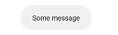

# Android development

There are multiple ways to develop apps for Android devices. This course will focus on Android apps written in **Kotlin**, using **Android Studio**. Kotlin which is recommended by Google since 2018, replacing Java which was mainly used until then. Switching from Kotlin to Java, and from Java to Kotlin is quite easy, Android Studio can even do the conversion for you.

> Android Studio (Google) is based on IntelliJ Community (JetBrains) 😎❤️

<hr class="sl">

## Views

<div class="row row-cols-md-2 mx-0"><div>

Everything displayed on the screen is a `View`. `View` doesn't means that this is only a "view", a view be clickable/editable...

* Display a text: `TextView`
* Display an image: `ImageView`
* Display a button: `Button`
* Display a input field: `EditText`
* Display a radio button: `RadioButton` + `RadioGroup`
* Display a toggle button: `Switch`
</div><div>

The layout is handled by a `ViewGroup`. Layouts are edited using the layout editor. There are located in `res > layout`.

* [ConstraintLayout](layouts/ConstraintLayout.md): arrange elements in a flexible way

</div></div>

<hr class="sr">

## Layout Editor

<div class="row row-cols-md-2 mx-0"><div class="align-self-center">

<ol style="list-style-type: lower-alpha">
<li><b>Mode</b>: you can switch to code/layout editor here</li>
<li><b>Palette</b>: a library of views that you can drag and drop to the design view</li>
<li><b>Design view</b>: what the user will see</li>
<li><b>BluePrint view</b>: everything is shown on it, included hidden elements</li>
<li><b>Component tree</b>: list of all views of your screen</li>
<li><b>Attributes</b>: edit the properties of a view</li>

</ol>
</div><div>


</div></div>

<hr class="sl">

## Attributes

You should rely on CTRL+F to search for attributes, or by clicking on the search icon at the top of the "Attributes" window.

<table class="table table-bordered table-striped border-dark">
<thead>
<tr><th>View</th><th>Useful attributes</th></tr>
</thead>
<tbody>

<tr><td><b>View</b><br><i>extends View</i></td><td>

</td></tr>

<tr><td><b>TextView</b><br><i>extends View</i></td><td>

* `text`
*  (settings) `text`: this text is only shown when editing. <small>It's useful when a text should be empty by default, but you want to see what it will look like once filed.</small>
</td></tr>

<tr><td><b>ImageView</b><br><i>extends View</i></td><td>

* `scaleType`: use "centerCrop" to scale without distorting (9patches)
* `srcCompat`: set image
</td></tr>

<tr><td><b>Button</b><br><i>extends TextView</i></td><td>

</td></tr>
</tbody></table>

<hr class="sr">

## Good practices

<div class="row row-cols-md-2 mt-4"><div>

<details class="details-e">
<summary>No HardCoded Text</summary>

If you create a TextField, or something having some text shown to the user, then it's a good practice to put the text inside a file "strings.txt". You can click on the "warning", then expand "Hardcoded text", and click on fix.
</details>
</div><div>

<details class="details-e">
<summary>Accessibility</summary>

You have some attributes to increase accessibility

* `contentDescription`: what's the purpose of this element
* `importantForAccessibility`: if this element is just decorative, you can set it to no
</details>
</div></div>

<hr class="sl">

## Resources Manager

<div class="row row-cols-md-2 mx-0"><div>

On the left side, or in View > Tools Windows, you got the "Resources Manager". This is a tab in which you can easily track every resource of your application, in other words, files in `res`.

<details class="details-e">
<summary>Add a new "drawable" (image)</summary>

* Go to Drawables
* Click on "+"
* Import drawables
* The new file should be in the list
* You can drag, and drop it in the design view (or select it when creating a new imageview)
</details>
</div><div>

Every folder in `res` may have multiples "copies" for different devices/languages. For instance, if there is a view for large screen devices, it will be used instead of the view made of "every" device.

<details class="details-e">
<summary>Localization</summary>

Locales are made of a

* a key
* a translation

```xml
<string name="some_key">Hello World!</string>
```

Every "strings.xml" shares the sames keys, but different translations. In the code, or in the view, you will only use the "key", and the appropriate value will be shown according to the user language.
</details>

<details class="details-e">
<summary>Localization: add another language</summary>

* Create a new "Android resources directory"
* Click on "Locale" then ">>"
* Select a locale, and optionally a region
* Switch to project view
* Copy, and paste "strings.xml" inside the new folder
* Switch back to android view
* Go in "String" inside the Resources manager
* Click on Open Translations Editor

You can edit locales here!
</details>

<details class="details-e">
<summary>Localization: variables in strings</summary>

If your string has variables, more commonly refered as **parameters**, you can use `%index$` in your text

```xml
<string name="some_key">Hello %1$</string>
```

And, later in the code

```kotlin
getResources().getString(R.string.myStringID, value_for_index1, ...)
```
</details>
</div></div>

<hr class="sr">

## Activities

<div class="row row-cols-md-2 mx-0"><div>

Activities are screens of your application. The "main" screen is usually called "Main Activity".

```kotlin
import androidx.appcompat.app.AppCompatActivity
import android.os.Bundle

class MainActivity : AppCompatActivity() {
    override fun onCreate(savedInstanceState: Bundle?) {
        super.onCreate(savedInstanceState)
        // set the layout: activity_main.xml
        setContentView(R.layout.activity_main)
        // add your code here
    }
}
```
</div><div>

<details class="details-e">
<summary>Access a <code>View</code> in the code</summary>

There is a class `R` representing the resources' folder. You can use `R.id.some_name_here` to the id of a view. `some_name_here` is the name of a view in the component tree.

You can then use `findViewById(R.id.some_name_here)` to get your view.

```kotlin
val myButton: Button = findViewById(R.id.myButton)
```
</details>

<details class="details-e">
<summary>Listeners</summary>

As in Java, you have listeners which are called when an event is triggered (ex: `click on a button`).

Example for "OnClickListener", a listener added on a button, that is called when a user click the button.

```kotlin
val myButton: Button = findViewById(R.id.myButton)
myButton.setOnClickListener {
    println("Clicked on myButton")
}
```
</details>

<details class="details-e">
<summary>Toasts (sort of non-aggressive popups)</summary>

A toast is something like this, usually at the bottom of the screen:



And, the code is as simple as that

```kotlin
// create
// LENGTH_SHORT (=short duration) LENGTH_LONG (=long duration)
val toast = Toast.makeText(this, "Some message", Toast.LENGTH_SHORT)
// show
toast.show()
```
</details>

<details class="details-e">
<summary>Set a drawable (image) in the code</summary>

You have `anImageView.setImageResource(int)` which is taking the ID of the new image (drawable). You can use `R.drawable.your_drawable` to get the ID of `your_drawable`. See Resources Manager if you need to important a drawable.

Don't forget to update `contentDescription`, or any accessibility-related attributes, if needed.
</details>

<details class="details-e">
<summary>Get/set a text from the code</summary>

You can get a text from the code using

```kotlin
var myString = getResources().getString(R.string.myStringID)
// for strings with parameters
var myString = getResources().getString(R.string.myStringID, param1, param2)
```

For some functions such as `#setText`, you can pass the ID

```kotlin
aTextView.text = myString
aTextView.setText(R.string.myStringID)
```
</details>
</div></div>

<hr class="sl">

## Debugging

<div class="row row-cols-md-2 mt-4"><div>

In Android project, you should use the logger instead of the standard output (ex: println). Each logging function is taking a "tag" used to "sort" logs. Later, you can search for all logs having this tag, among the great amount of logs, so it's pretty useful.

```kotlin
// proper
private const val MAIN_ACTIVITY_TAG = "MainActivity"
Log.v(MAIN_ACTIVITY_TAG, "message")
// improper
Log.v("tag", "message")
```
</div><div>

There are 5 levels of logs. You can view your logs in the tab "logat", in which you can also change the Log settings, or create filtering rules for your tags.

* `Log.v`: verbose
* `Log.d`: debug
* `Log.i`: info
* `Log.w`: warn
* `Log.e`: error
</div></div>

<hr class="sr">

## References

* [Android Basics in Kotlin](https://developer.android.com/courses/android-basics-kotlin/course)