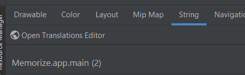

# strings.xml

[Go back](../index.md#resources)

<div class="row row-cols-md-2 mx-0"><div>

This file is used to store every text of the application. Usually programmers write text directly in the attribute `text`, but that's a bad practice generating a warning "Hardcoded Text". The file in question looks like this

```xml
<resources>
    <string name="app_name">Name of your app</string>
</resources>
```

Each row is made of

* a **name**, commonly referred as a key
* a **text**, which is actually the "default translation"

<hr>

In the code you can use that get the text for "app_name"

```kotlin
// implicit "context." (this.)
var appName = getString(R.string.app_name)
```
</div><div>

**Parameters**

You can add parameters/variables that will be later replace in the code. This is a string that will be evaluated with `String.format`, so you can basically do everything you could with functions such as `printf` in C.

```xml
<resources>
    <string name="price">Price: %s</string>
</resources>
```

<hr>

In the code you can use that get the text for "price"

```kotlin
var myText = getString(R.string.price, "$3")
```
</div></div>

<hr class="sl">

## Localization

<div class="row row-cols-md-2 mx-0"><div>

**Add/Edit translation**

1. Open Resources Manager
2. Go to "String"
3. Click on Open Translations Editor <small>(may take some time to appear)</small>



</div><div>

**Add another language**

1. Open Resources Manager
2. Go to "String"
3. Click on "+", and add new "String Resource File"
4. Enter "strings"
5. Click on "Locale" in Qualifiers, then ">>", and select your Locale
6. Directory name should have changed accordingly
7. Press "ok"

</div></div>

<hr class="sr">

## Currency

<div class="row row-cols-md-2 mx-0"><div>

Given an amount (int), you can generate a string for a currency with

```kotlin
val amount = NumberFormat.getCurrencyInstance().format(1300.74)
```
</div><div>

* `$1,300.74` (USA, CA...)
* `£1,300.74` (UK)
* `1 300,74€` (FR)
* ...
</div></div>

<hr class="sl">

## Dates

<div class="row row-cols-md-2"><div>

```kotlin
val formatter = SimpleDateFormat("FORMAT", Locale.getDefault())
val calendar = Calendar.getInstance()
val xxx = formatter.format(calendar.time)
```
</div><div class="align-self-center">

See [SimpleDateFormat](https://developer.android.com/reference/java/text/SimpleDateFormat#date-and-time-patterns).
</div></div>