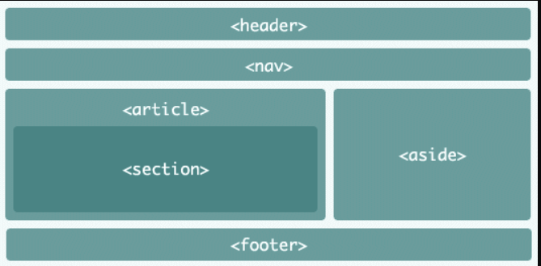

# HTML

Here you will learn how you can create a basic website,
in HTML. You may check
PHP course to handle the server logic (explained later)
or JS (can also handle server logic, mainly used to run
some code in the client browser) or CSS
to add some style to your website.

Just so you know, learning the web starts 
at [w3schools](https://www.w3schools.com/html/default.asp)
so be sure to check their tutorials.

<div class="sr"></div>

## Introduction

When you write some URL in your browser, you 
made a request like ``https://duckduckgo.com/`` to a
server. The server returns to you a make page, written
in ``HTML``.

You can write some ``index.html`` file with this
inside, then drag and drop it into your browser
and you got a page!

```html
<!DOCTYPE html>
<html lang="fr">
<head>
        <title>website title</title>
        <meta http-equiv="Content-Type" content="text/html; charset=utf-8" />
</head>
<body>
    <!-- code -->
    <h1>A big title here</h1>
    <p>Some text here</p>
    <!-- image -->
    
    <!-- link -->
    <a href="https://duckduckgo.com/">Link to duckduckgo.com</a>
</body>
</html>
```

<div class="sl"></div>

## Tags

The main idea when writing HTML is that you are gonna write
some tags like ``p`` for a paragraph or `a` for a link.
Then you can add some attributes, link ``href`` for a link
witch is the URL the link will be pointing to.

You will have to types of tags, tags like ````
called auto-closing tags because you don't write
``</img>`` and the others kind like `<a ...>...</a>`.

Finally, as a side note, you can

* tag name can be in lowercase or in uppercase (a or A is working)
* you can write ``attribute=value`` (without " but that
  may not work everytime according to value)
* you may write ``</img>`` or `` (without the /)
but you should write ``<tagname />`` like this for auto-closable
tags.

<div class="sr"></div>

## Structure in HTML5

The first line is always ``<!DOCTYPE html>``, then you
will have ``<html lang="your_language_code"> ... </html>``.
But in HTML tag, you will have

* ``head``: defines here the properties of your website such
as the title, the icon, the stylesheet, ...
* ``body``: defines what your website is actually looking
like.
  
Since HTML5, body use some inner tags

* ``header``: the top of your website, may contains the navbar
* ``nav``: for your navbar
* ``section``: a section of your website
* ``aside``: some content aside your main content in
your section like some contact info at the right etc.
* ``footer``: the footer of your website



```html
<!DOCTYPE html>
<html lang="fr">
<head>
        <title>titre du site</title>
        <meta http-equiv="Content-Type" content="text/html; charset=utf-8" />
</head>
<body>
        <header>
          ... some tags ...
          <nav>
            ...
          </nav>
        </header>
        <section>... some tags ...</section>
        <section>... some tags ...</section>
        <aside>... some tags ...</aside>
        <footer>... some tags ...</footer>
</body>
</html>
```

<div class="sl"></div>

## Learn the tags I

Learn a lof of body tags.

* [Titles](tags/h.md) with h1 to h6
* [Paragraphs](tags/p.md) with p
* [Link](tags/a.md) with a
* [Images](tags/img.md) with img

Some tags used for style/grouping tags later

* [span](tags/span.md) (ex: color in red a word in a paragraph )
* [div](tags/div.md) : container to move a group of components

<div class="sr"></div>

## Learn the tags II

And some basic tags to style a bit your page

* [Bold](style/b.md) with b
* [Underline](style/u.md) with u
* [Strikethrough](style/s.md) with s
* [Italic](style/i.md) with i
* [Jump a line](style/br.md) with br
* [Horizontal separator](style/hr.md) with hr

<div class="sl"></div>

## Learn the tags III

Then you can use some special tags like

* [Ordered list](special/ol.md) with ol and li
* [Unordered list](special/ul.md) with ul and li
* [Definition](special/dl.md) with dl and dd
* [Some code](special/code.md) with code and pre
* [Tables](special/tables.md) using table

<div class="sr"></div>

## Forms

...

<div class="sl"></div>

## Using the console

* press ``CTRL-SHIFT-I``
* or right click then inspect
* or ... > ... tools > development tools

In the console, at for now we will only do that, 
you can in ``Elements`` check out the tags used in the
page.

By pressing ``CTRL-SHIFT-C``, you can find the tag
in the html by simply moving your mouse.

<div class="sr"></div>

## W3 validator

Check out that the code you wrote is following the W3C
norms [here](https://validator.w3.org/#validate_by_input)
(https://validator.w3.org/#validate_by_input).

We don't have rules to follows but it's good to hear
how you could wrote your code in a better when following
with developers standards.

<div class="sl"></div>

## Meta tags

Do you remember ``head`` tag? Here some advices as to
what you wrote here.

* <https://www.google.com/webmasters/markup-helper/u/0/?hl=fr>
* <https://www.oodlesmarketing.com/blog/use-google-structured-data-markup-helper/>
* <https://www.seoptimer.com/meta-tag-generator>
* this one is pretty good <https://metatags.io/>

```html
<!-- website icon -->
<link rel="icon" href=".../icon.png">

<meta http-equiv="Content-Type" content="text/html; charset=utf-8" />
<!-- meta data -->
<meta name="AUTHOR" content="...">
<meta name="COPYRIGHT" content="...">
<meta name="KEYWORDS" content="....">
<meta name="DESCRIPTION" content="...">
```