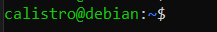

# Linux

Linux is an operating system, on which a lot of distributions such as Debian, Arch Linux, Fedora, Ubuntu, and so on... are based. I'm not an expert, so in this course, you will only learn the basics.

You might ask yourself, why are we learning this? Why are we using Linux? From my understanding, Linux is fast, free, open-source/customizable, and reliable. That's why most are installing a Linux-based OS on their servers. It means that as a user, you need to learn how to use the command line.

> **This course will refer to Windows a lot, as we are expecting readers to know Windows**.

## Console

The console (also called terminal/shell/`ìnvite de commande`) may be the only way for you to interact with your Linux OS. This console may use a language such as **sh**, csh, tesh, ksh, **bash**, ... Most are using **Bash**, which is based on **sh**.

Notes

* your are writing commands right after the `$`
* press <kbd>ENTER</kbd> to execute a command
* press <kbd>CTRL-C</kbd> to cancel a command
* press <kbd>CTRL-D</kbd> to end the input of a command waiting for input

Usually, when writing a command in a tutorial, we are doing one of these. For instance, for the command `ls`, we may write

* `$ ls`: run the command in any kind of shell (sh/bash/...)
* `sh> ls`: run the command in a sh console
* `# ls`: the command must be **run as administrator**

## Commands

Commands are the instruction you are typing in the console, in a specific language. We will use **Bash**. A command is made of three parts

* the name of the command (`èx: ls`)
* [optional] the arguments (ex: `ls /`)
* [optional] the arguments that are "options" (ex: `ls -l -a`)

You have a space between the name of the command, and the arguments/options. Some commands are made of multiples words, separated by a `-` such as `sphinx-build`, but MOST common commands on Linux are not like this, so if you are seeing `ls-la`, it's most likely `ls -la` while the one who wrote that forgot the space.

> **Pro tip**: In a lot of commands, options may be merged (`-l -a`=>`-la`). 
> **Pro tip**: A lot of commands have an option "help", always try `command -h`, `command -help`, or `command --help`. 
> **Pro tip**: You got a manual for a lot of commands. Try `man mycommand`. If some pages are missing, you may need to install `manpages-dev`.

## Users and permissions

Run as administrator / sudo

On Windows, whenever you need to install a program (in Program Files), you need to run it as administrator. It means that you are running the program in a privileged mode. We got the same thing on Linux with `sudo`.

You can run a command as administrator such as ls with `sudo ls`. You can run a bash as administrator with `sudo bash`.

 (Notice the # at the end, as we told you before)

> **Pro tip**: You should not able to do that on servers/... that you don't own (you shouldn't be able to on Windows too). 
> **Pro tip**: You may give someone the "right" do use sudo, by adding the user in the "sudoers". Simply call `sudo usermod -a -G sudo username`.

File / Folders

You may also restrict who can read (r), write (w), or execute/access (x) your files. Linux is considering 3 kinds of users

* **u**: you
* **g**: users of your main group (ex: `promo2023`)
* **o**: any other user

And 3 (there is more) kind of permissions

* **r** (4): can read
* **w** (2): can write
* **x** (1): can execute a script, can access a directory <small>(it means that if there is a folder without x in a path, even if we got r or w, we won't be able to work with this file)</small>

The permissions are a set of 3 numbers, for each kind of user. In binary, 000=0, 001=1, 010=2, 100=4, etc. As you saw, I put 4 after r, it means that 100=4=r. If we got 110=6=4+2=r+w, it means that the user can write and read.

* `110 100 100`: u (6=r+w), g (4=r), o (4=r) 
* `111 101 100`: u (7=r+w+x), g (5=r+x), o (4=r)

> * `chmod +x file`: give x to every user
> * `chmod u+x file`: give x to u
> * `chmod u+rw file`: give rw to u
> * `chmod 751 file`: give rwx to u, rx to g, x to o

## Edit files

A lot of times, you will have to open/edit files. You need to use a terminal editor, and you may use

* `vim` (there is a tutorial on this website), `neovim`, or `vim`
* `nano` (easy, good when you need to copy-paste something)
* `emacs` <s>(vim > emacs, change my mind 😂)</s>

Let's say you need to edit `file.txt`, you can do `vim file.txt`. If the file do not exists, then it will be created.

> If you need to see the content of a file, you may also use
> * <kbd>cat file.txt</kbd> (print the whole file)
> * <kbd>less file.txt</kbd> (print the file in the screen, you can use `up`/`down` to move up/down in the file, use `q` to exit)
> * <kbd>head file.txt</kbd> (see the first 10 lines)
> * <kbd>tail file.txt</kbd> (see the last 10 lines)