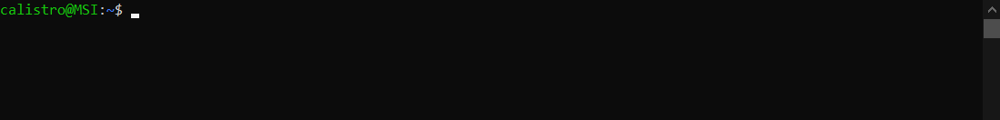
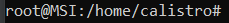
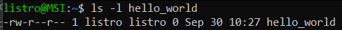

# Operating System

This course is a gathering of general knowledge shared between most, if not all, Linux-based distributions such as Debian, Ubuntu, Fedora, or Arch Linux... Most Linux-based distributions are free, open-source, light, secure, and performant. As the source code is public, anyone can improve it, modify it, and know how the underlying system is doing its job.

> **Note**: Linux-based distributions will be referred to as Linux. GNU/Linux will be referred to as Linux too. Let's keep things simple, and tidy.

<hr class="sl">

## Terminal

<div class="row row-cols-md-2"><div>

Linux in its simplest form is a **terminal** (console, `invite de commande`). Inside a terminal, we can write commands interpreted by something called **Shell**. There are multiple Shell languages that we can use <small>(sh, csh, tcsh, ksh, bash)</small>, but **most Linux distributions are using bash** <small>(bourne again shell)</small>, an improved version of sh.



Most "commands" that you will see are written like `$ xxx`, but **`$` IS NOT A PART OF THE COMMAND**; this is a token that indicates **where** we can execute the command. It could be `#`, `sh >`...

```shell
$ command_working_everywhere
sh > command_at_least_working_in_sh
bash > command_at_least_working_in_bash
```
</div><div>

**Open a terminal**

> * Look for "Terminal" in your Applications
> * Or, use the shortcut `CTRL+SHIFT+T`

**Change Zoom**

> Use `CTRL +`, and `CTRL -` to increase/decrease zoom

**Console mode** 🤕 - beginner killer

> You can use CTRL+ALT+F1 to swap to console mode <small>(from F1, up to F6)</small>, while you can use ALT+F7 to swap back 🤤.

**Paste something**

> Usually, pressing the scroll button will paste any copied content.
</div></div>

> There is no "echo" when writing a password, so don't be confused when you are writing one.

<hr class="sr">

## Commands

<div class="row row-cols-md-2"><div>

A command is **a name**, which may be followed by **arguments**, including some usually called **options**/flag; the difference being that an option starts with a `-`.

* you are writing commands right after the `$`
* press <kbd>ENTER</kbd> to execute a command
* press <kbd>CTRL-C</kbd> to cancel/kill a command
* press <kbd>CTRL-D</kbd> to end the input of a command waiting for input
* Usually, options can be merged <small>(ex: `-l -a` is the same as `-la`)</small>.
* Most commands have an option "help": `-h`, `-help`, or `--help`

</div><div>

```bash
$ ls
$ ls toto.txt
$ ls "toto.txt"
$ ls -l -a
$ ls -la
$ ls -la toto/
```

**There is some documentation for most commands.**

```bash
$ man ls
```
</div></div>

<details class="details-e">
<summary>Quoting in bash</summary>

<div class="row row-cols-md-2"><div>

Quotes are not mandatory unless there are some specials characters, such as a space in a path, for instance

```bash
$ ls /Documents/my bookmarks/ # Will not work
$ ls "/Documents/my bookmarks/" # 👌
$ ls '/Documents/my bookmarks/' # 👌
$ ls /Documents/my\ bookmarks/ # 👌
```
</div><div>

The main difference between single and double quotes, is that variables, and nested commands, will still be executed when using double quotes.

```bash
$ echo "$toto" # echo "OK"
$ echo '$toto' # echo "$toto" 
```
</div></div>
</details>

<details class="details-e">
<summary>Exit codes, nested commands, and operators <code>; && ||</code></summary>


<div class="row row-cols-md-2"><div>

Commands (processes) are returning a code:

* $0$: everything went fine
* Not $0$: an error occurred

The exit code of the last command is stored in `$?`

```bash
$ echo $?
```

You can execute a command inside another command (nested)

```bash
$ ls `echo ~` # ls ~
$ ls $(echo ~) # ls ~
```

</div><div>

You can run multiple commands in one go

```bash
$ ls toto; ls tata
```

The operator `&&` only execute the next command if the previous one successfully ended (code=0)

```bash
$ ls toto && ls tata
```

The operator `||` execute every command until a one is successful (code=0)

```bash
$ ls toto && ls tata
```
</div></div>
</details>

<hr class="sl">

## Text Editors

<div class="row row-cols-md-2"><div>

Text editors, or file editors, are tools allowing you to view, and edit a file. If you have a graphical interface, you may use the usual tools: vscode, sublime text, JetBrains' IDEs, emacs... But, if you only have a terminal, the most used are

* `vim` <small>(there is a course on this website)</small>, or `neovim`
* `nano`
* `emacs` <small>(vim > emacs, change my mind 😒)</small>
</div><div>

I think nano is the easiest to learn.

* **Open a file in nano**: `nano file.txt` <small>(created if it does not exist)</small>
* **Save a file in nano**: `CTRL+S`
* **Quit nano**: `CTRL+X`

If you only need to see the contents of a file, then you can use the commands `cat`, `less`, `head`, and `tail`.
</div></div>

<hr class="sr">

## Permissions, and users

<div class="row row-cols-md-2"><div>

There are 3 well-known levels of permissions

* <kbd>r</kbd> (4): can read
* <kbd>w</kbd> (2): can write <small>(=can edit+save, can create)</small>
* <kbd>x</kbd> (1): can execute a script, can move through a repository

Permissions are assigned on a file/folder, and are applied according to the target of the permissions (ownership)

* <kbd>u</kbd>: user, applied to the user (owner)
* <kbd>g</kbd>: group, applied to the main group of the user <small>(ex: students_2022)</small>
* <kbd>o</kbd>: others, applied to everyone else

Permissions are something is `u=r+w, g=r, o=r`, which means that user can read+write, group can r, and others can read.
</div><div>

You may have noticed a number next to every kind of permissions. This is because permissions are coded on 3 bits, which means that they can take 8 values <small>(000, 001, 010...)</small>.

* `0`: nothing <small>(000)</small>
* `1`: can execute <small>(001=1=x)</small>
* `2`: can write <small>(010=2=w)</small>
* `3`: can execute, and write <small>(1+2=x+w)</small>
* `4`: can read <small>(100=4=r)</small>
* `5`: can read, and execute <small>(4+1=r+x)</small>
* `6`: can read, and write <small>(4+2=r+w)</small>
* `7`: can read, write, and execute <small>(4+2+1=r+w+x)</small>

**Why?** We are usually using numbers instead of letters, because it's shorter. The syntax can be shortened to `u=6, g=4, o=4`, and because the order `ugo` is fixed, we can shorten it again to `644`. **This shortened version is the most used one** <small>(in commands, verbally...)</small>.
</div></div>

<details class="details-e">
<summary>Root / Administrator</summary>

There is a super-user, usually called root, that has absolute control over the machine. `root` can delegate this power to others by making them a part of the "sudoers" group. The command to do an action using elevated privileges is different according to the Linux distribution, but the command **sudo** is the most well-known one.



**Notice the # before every command**: in some tutorials, including ours, you will see a `#` instead of the usual `$` before a command needing elevated privileges.
</details>

<div class="row row-cols-md-2"><div>

<details class="details-e">
<summary>Commands</summary>

* <kbd>ls -l</kbd>: to view the permissions of a file/folder
* <kbd>chmod</kbd>: to change the permissions of a file/folder
* <kbd>umask</kbd>: to change the default permissions when a file/folder is created
* <kbd>chown</kbd>: to change the owner of a file/folder
</details>
</div><div>

<details class="details-e">
<summary>Practical knowledge: <code>ls -l</code> to see permissions</summary>



* Ignore the first `-` for now
* The 3 following letters `rw-` are the permissions of `u`: read+write.
* The 3 following letters `r--` are the permissions of `g`: read.
* The 3 following letters `r--` are the permissions of `o`: read.
* Ignore `1`
* The following string `listro` is the name of the user `u`
* The following string `listro` is the name of the group `g`
</details>
</div></div>

<hr class="sl">

## Paths

In both Linux, and Windows, there is a notion of **Path**. A path is made of one or more folders (`dossier/catalogue`), and may lead to a file (`fichier`).

<details class="details-e">
<summary>Notions: Path, Separator, root, home...</summary>

<table class="table table-bordered table-striped border-dark">
<thead>
<tr><th>Notion</th><th>Windows</th><th>Linux</th></tr>
</thead>
<tbody>

<tr><td><b>A path</b> (<code>chemin</code>)
</td><td><code>C:\Users\user\Documents\</code></td><td><code>/usr/home/user/Documents/</code></td></tr>

<tr><td><b>Separator</b><br>
Something that is separating folders in a path.
</td><td><code>\</code> (backslash)</td><td><code>/</code> (slash)</td></tr>

<tr><td><b>root</b> (<code>racine</code>)<br>
The folder is containing every other folder.
</td><td><code>C:\</code></td><td><code>/</code></td></tr>

<tr><td><b>(user) home</b> (<code>domicile</code>)<br>
The folder with every file belonging to "user".
</td><td><code>C:\Users\user\</code></td><td><p><code>/usr/user/home/</code></p>

* The path to the home is stored inside `$HOME`
* The home of every user is recorded in `/etc/passwd`
</td></tr>

<tr><td><b>hidden files</b> (<code>fichiers cachés</code>)<br>
Files that are not visible by default.
</td><td>❌ manually defined<td>Any file starting with <code>.</code> (dot), such as <code>.config</code></td></tr>

<tr><td><b>"Program files"</b><br>
Folders used to store programs/commands.
</td>
<td>
<code>C:\Program Files\</code><br>
<code>C:\Program Files (x86)\</code><br>
<code>%appdata%</code>
</td>
<td>
<code>/bin/</code><br>
<code>/usr/bin/</code><br>
<code>/usr/local/bin/</code>
</td>
</tr>
</tbody>
</table>
</details>

<details class="details-e">
<summary>Absolute and relative paths</summary>

* A path starting by the root is called **absolute path** (`chemin absolu`).
* A path that is not absolute, is called **relative path** (`chemin relatif`). We can create such paths using shortcuts:

<table class="table table-bordered table-striped border-dark">
<thead>
<tr><th>Shortcut</th><th>Description</th><th>Example</th></tr>
</thead>
<tbody>

<tr><td><kbd>.</kbd> (dot)</td><td>Path to <b>current</b> folder<br><small>(=output of <code>pwd</code>)</small></td><td>

If the current folder is `/usr/toto/home/`, then `./toto.txt` is an alias for `/usr/toto/home/toto.txt`.
</td></tr>
<tr><td><kbd>..</kbd> (2 dots)</td><td><b>Parent</b> folder of the current folder.</td><td>

If the current folder is `/usr/toto/home/`, then `..` is an alias for `/usr/toto/`.

* `root` is its own parent (`/../` is the same as `/`)

</td></tr>
<tr><td><kbd>~</kbd> (tilde)</td><td>Path to user <b>home</b></td><td>

If the home of the current user is `/usr/user/home/`, then `~` would mean the exact same path.
</td></tr>
</tbody></table>
</details>

<div class="row row-cols-md-2"><div>

<details class="details-e">
<summary>Notes</summary>

* Following slashes are merged into one <small>(ex: `///` is the same as `/`)</small>
* "Everything is a file": hard drive (/mnt/), a terminal (/dev/), a command (/bin/)...
* **Remember** that if you have spaces in your paths, then you must either quote them, or use `\` before any space.
</details>
</div><div>

<details class="details-e">
<summary>Commands</summary>

* <kbd>pwd</kbd>: see the path of the current folder
* <kbd>cd</kbd>: move to another folder
* <kbd>ls</kbd>: to list every file/folder in a directory
* <kbd>ls -a</kbd>: to list every file, including hidden files, in a directory
</details>
</div></div>

<hr class="sr">

## Environment variables

<div class="row row-cols-md-2"><div>

Environment variables (`Variables d’environnement`) are variables defined in the environment that can be used read by others apps. There a few well-known ones

* **HOME**: path to the current user home
* **USER**: username of the current user
* **LANG**: language of the current user
* **SHELL**: path to the shell
* **PWD**: path to the current folder

And, there is **PATH**. This variable is used to store a list of folders. When you write a command on Linux, then **the Shell will look for the command's file in the PATH**, starting from the first folder, up to the last folder.

* On Windows, folders are separated with `;`
* On Linux, folders are separated with `:`

</div><div>

Print all environment variables

```bash
$ env
$ printenv
```

Print the value of one environment variable

```bash
$ echo $PATH
$ printenv PATH
$ env | grep "^PATH="
```

Set an environment variable

```bash
$ export VAR_NAME=value
```

Add `/home/toto/bin` to the PATH

```bash
$ export PATH=/home/toto/bin:$PATH
```

</div></div>

<hr class="sl">

## Glob-patterns, and regex

<details class="details-e mt-4">
<summary>Glob-patterns</summary>

<div class="row row-cols-md-2"><div>

**Glob-patterns** allow us to define a set of filenames using **wildcards** (`motifs`). For instance, `*.h` will be replaced with every file -- and directory --, ending with `.h`. They are mostly used on commands taking many filenames, in which you don't want to manually have to write all of them 😎.

<table class="table table-bordered table-striped border-dark">
<thead>
<tr><th>Wildcards</th><th>Description</th></tr>
</thead>
<tbody>

<tr><td><code>x</code> (a character)</td><td>the character 'x'</td></tr>
<tr><td><code>*</code> (asterisk)</td><td>a possibly empty suite of characters</td></tr>
<tr><td><code>?</code> (question mark)</td><td>one character</td></tr>
<tr><td><code>[abc]</code></td><td>one character which is either a, b, or c.</td></tr>
<tr><td><code>[^abc]</code><br><code>[!abc]</code></td><td>any character which is not a, nor b, nor c.</td></tr>
</tbody></table>

**Note**: you may use ranges in `[]` such as `[0-9]`, or `[a-z]`, or shortcuts such as `[[:digit:]]` (a number), `[[:upper:]]` (uppercase), .`[[:lower:]]` (lowercase), `[[:space:]]` (space, tab, newline...), `[[:alnum:]]` (any alphanumeric character).

**Note**: You may want to use a token as a character such as "*", "?"...

* Use `[]` to escape it: `[?]`
* Or using `\` (backslash) which is its purpose: `\*`
</div><div>

List (`ls`) every file

```bash
$ ls *
```

List (`ls`) every file starting with `b`

```bash
$ ls b*
```

List (`ls`) every file NOT starting with `b`

```bash
$ ls [^b]*
```

List (`ls`) every file starting with "a-" followed by 2 numbers <small>(ex: a-22)</small>

```bash
$ ls a-[0-9][0-9]*
$ ls a-[[:digit:]][[:digit:]]*
```

List (`ls`) every three-letters long file ending with "n" <small>(ex: von)</small>

```bash
$ ls ??n
```

List (`ls`) every file ending with "?"

```bash
$ ls *[?]
$ ls *\?
```

</div></div>
</details>

<details class="details-e">
<summary>Regular expressions</summary>

<div class="row row-cols-md-2"><div>

**Regular expressions** (`expressions régulières`), commonly referred to as **regex**, are an enhanced version of glob-patterns used by tools such as `grep`, `sed`, and most, if not all, programming language.

* Every glob-pattern exists too in regexes
* But, `?` is now replaced with `.`

And, some new tokens were introduced

<table class="table table-bordered table-striped border-dark">
<thead>
<tr><th></th><th>Description</th></tr>
</thead>
<tbody>

<tr><td><code>x?</code></td><td>an optional character 'x'</td></tr>
<tr><td><code>x+</code></td><td>at least x times this character</td></tr>
<tr><td><code>^x</code></td><td>lines starting with x</td></tr>
<tr><td><code>[abc]</code></td><td>lines ending with x</td></tr>
<tr><td><code>(x|y)</code></td><td>either x or y</td></tr>
<tr><td><nobr><code>x{n, m}</code></nobr></td><td>at least $n$ times x, up to $m$ times, leave either empty if no limit</td></tr>
<tr><td><code>(ab)+</code></td><td>at least one time 'ab'</td></tr>
</tbody></table>
</div><div>

Use [regex101](https://regex101.com/), or similar websites to test your regexes.

* <kbd>sed</kbd>: find, and replace matching text with some other text
* <kbd>grep</kbd>: find matching text, or files having the matching text
* <kbd>awk</kbd>: sort of `grep`
* Many programming languages

<hr>

Something to note with regexes is the notion of **groups**. You can write some expression, and wrap it into escaped parenthesis `\(some_part_of_my_regex\)`. By doing so, you created a group, that may be later referred to as `$1`/`\1` if this was the first one. This is useful to extract some parts of the matching result.

* <kbd>sed</kbd>
* Many programming languages
</div></div>
</details>

<hr class="sr">

## Processes

<div class="row row-cols-md-2"><div>

Processes (`processus`) are a sort of box with

* a code to execute
* an environment (file descriptors, parameters, permissions...)
* some data (stack, variables...)

Each process is assigned an **PID** (process identifier). When a machine is starting, the first process (pid=0) is launched, and start the **systemd daemon**, which is the parent of every process.

> A **daemon** is a process that never ends. They are called **services** on Windows. They are usually ending with **d**.

> Processes are stored in `/proc/`, in a folder corresponding to their PID. 
</div><div>

No-one can create a process. A new process is "created" by duplicating an existing process, using a function called `fork()` hence we say **forking a process** instead of creating a process. 

When a process dies, they are returning a code: $0$ is everything went fine, and not $0$, if an error occurred. You can use `$?` to see the exit code of the last process that died.

```bash
$ echo $?
```

As every process is forked from another, they have a reference to their parent called PPID (Parent PID). If a parent process dies, the forked children **won't die**, and will be assigned $-1$ as their PPID.
</div></div>

<div class="row row-cols-md-2"><div>

<details class="details-e">
<summary>Scheduling (<code>Ordonnancement</code>)</summary>

Visually, you would see two processes such as `firefox`, and a file explorer running at the same time. They are not actually running in parallel, but something called pseudo-parallelism. 

The scheduler (`ordonnanceur/gouverneur`) is allowing each process to run a little, and because they are all running a little, you won't see that they are not executed at the same time.
</details>
</div><div>

<details class="details-e">
<summary>Signals</summary>

Signals are used for communication, both between processes, or between a user and a process. There are **34** signals, but a programmer may override the code executed when a process is receiving a signal.

* <kbd>CTRL+C</kbd> (SIGINT=exit): exit process
* <kbd>CTRL+Z</kbd> (SIGTSTP=suspend): terminate an action <small>(ex: waiting for input)</small>

> **Note**: <kbd>CTRL+D</kbd> is NOT a signal.
</details>
</div></div>

<div class="row row-cols-md-2"><div>
<details class="details-e">
<summary>Sessions</summary>

Every process is attached to a session, which can be found with their value for **SID** (Session identifier). Most sessions are attached to a terminal (`/dev/tty`). 

Sessions are partitioned into [groups of processes](https://en.wikipedia.org/wiki/Process_group). A signal sent to a group, is dispatched to every process of the group.

If a session dies, then the signal **SIGHUP** is sent to every process.
</details>
</div><div>

<details class="details-e">
<summary>Foreground, and background processes</summary>

In every terminal, there is a session running, which means at least one group of processes. There is two "slots" that groups in a session

* **foreground**: only one group may be at the foreground
* **background**: every other group will be there

The main difference, is that background processes

* can't read, and write<sup>1</sup> on the terminal
* aren't receiving signals, except **CTRL-Z** (suspend)

<sup>1</sup> In some shells, or actually in most shells, this feature is enabled by default, but it can be disabled by editing an environment variable (but, I forgot which one sadly).
</details>
</div></div>

<details class="details-e">
<summary>Commands</summary>

* <kbd>&</kbd>: run a command (process) in the background
* <kbd>ps</kbd>: list process
* <kbd>kill</kbd>: send a signal to a process
* <kbd>fg</kbd>: bring a process back to the foreground
* <kbd>bg</kbd>: bring a process to the background
* <kbd>top</kbd>: list all process, and their memory usage <small>(same as the task manager on Windows)</small>
</details>