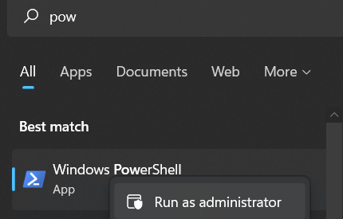
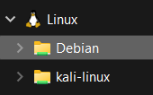

# Linux on Windows

Knowledge related to using Linux on Windows.

<hr class="sl">

## Windows Subsystem for Linux (WSL)

<div class="row row-cols-md-2"><div>

Windows Subsystem for Linux lets developers run a GNU/Linux environment including most command-line tools, utilities, and applications, directly on Windows [according to the Windows Subsystem for Linux Documentation](https://learn.microsoft.com/en-us/windows/wsl/).

1. Click on the search icon / search for a program
2. Look for powershell
3. Right-click on it > "Run as administrator"


</div><div>

4. Enter `wsl --install` to install Ubuntu
5. You can install `debian`, `kali-linux`... See `wsl --list --online`.
6. You will most likely have to reboot

Once, you did, in the search bar / search for a program, 

7. Search for `WSL`, or `debian` if you installed Debian...
8. Wait for a few seconds
9. Enter a username, and a password <small>(there is no echo, you won't see your password)</small>

On Windows, you can browse your WSL files in the Linux section of your file explorer



> You can also enter the PATH `\\wsl.localhost\`, or `\\wsl$`.
</div></div>

> There are a lot of downsides to a WSL, such as the lack of a graphical user interface, or some commands not working, including many of the network-related commands such as "ping".

<div class="row row-cols-md-2"><div>

<details class="details-e">
<summary>Add a low-quality graphical user interface (GUI)</summary>

It will be a low quality once, but it still possible for some software. You need to install [XMing](http://www.straightrunning.com/XmingNotes/), and [XMing fonts](http://www.straightrunning.com/XmingNotes/). **Scroll to "public domain" to find the download links**. Then, every time you need to use `-c` (graphical version), start XMing first. For instance

```bash
$ sudo apt-get update
# editor: sublime text
$ sudo apt-get install sublime-text
$ subl -c
# editor: emacs
$ sudo apt-get install emacs
$ emacs -c
# editor: IntelliJ
# ... get the tar.gz on their Website, tar xvf idea.tar.gz
# inside the bin folder, run the .sh
$ ./idea.sh -c
```
</details>
</div><div>

<details class="details-e">
<summary>Instead of adding a GUI, use WSL in your GUI</summary>

Instead of adding a low-quality graphical user interface, it would be better to use WSL directly in your text editor (VSCode...), or directly in your IDE (IntelliJ...).

* [IntelliJ](https://www.jetbrains.com/help/idea/how-to-use-wsl-development-environment-in-product.html) can use a Java installed on a WSL, detect installed WSLs, and create a project on one of them.
* [Configure CLion](https://www.jetbrains.com/help/clion/how-to-use-wsl-development-environment-in-product.html) to use a WSL C Compiler, which make functions such as `fork()` available
* [Get started using VSCode with WSL](https://learn.microsoft.com/en-us/windows/wsl/tutorials/wsl-vscode), or this for [C/C++, and WSL](https://code.visualstudio.com/docs/cpp/config-wsl)
</details>
</div></div>