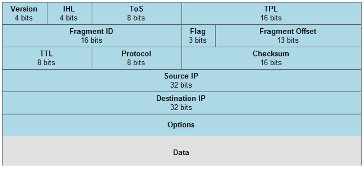
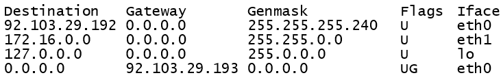

# Networking

A network is a net of things connected to each other. We call a network of devices "internet", and what we refer to (The) "Internet" are many small networks all joined together. Networking is someone complex, has it involves a lot of things: devices <small>(Routers, Hub/Switches...)</small>, Protocols <small>(TCP/UDP/ICMP/ARP/DNS...)</small>, Ports, Network interfaces, models <small>(OSI, TCP/IP)</small>, and addresses <small>(IPV4/IPV6/MAC...)</small>.

<hr class="sr">

## LAN, and WAN networks

<div class="row row-cols-md-2"><div>

**Wide area network** (WAN, `réseau modial/étendu`) is every network outside your LAN network.

**Local Area Network** (LAN, `réseau domestique`) is a network established within a limited area such as your home.

**Router**: a device usually connecting a LAN network, with a WAN network. It does "routing", meaning sending determining the route that packets will take to arrive to the destination network.

**Hub/Switch**: a device that can be connected via ethernet to usually at least 4, up to 64 devices. They are receiving packets from others hosts, and they handle the delivery of packets while ensuring that they are received in the right order, and are not corrupted.

<details class="details-n">
<summary><b>Ethernet</b>: this is a cable that can be used to connect a device to a Hub/Switch.</summary>

Instead of connecting nodes/devices to each others, they all are connected to a switch/hub using Ethernet (norm IEE 802.3). They are using a technique called "Carrier sensitive multiple access with collision detection", or **CSMA/CP** in short, to handle collisions.

If both the switch and the machine try to send a message at the same time, then both messages are colluding, and are destroyed
  * each other signal that they will re-send the message
  * each network card has its own delay before sending a message again
  * the machine/switch send the message first, and there is hopefully no problem this time
</details>
</div><div>

**Network topologies** are different ways of connecting devices in a network.

* **Star Topology**: all devices are connected to a central networking device such as a switch or hub

* **Bus Topology**: a single cable "backbone cable", and all devices connect to the cable. If a lot of packets are send, the cable most likely be saturated.

* **Ring/Token Topology**: each computer is connected to another one forming a loop. Packets are only moving in one direction, meaning that sometime packets will do a whole loop (not efficient). If a computer/cable is faulty, then the loop is broken.
</div></div>

<hr class="sl">

## How is communication taking place?

<div class="row row-cols-md-2"><div class="align-self-center">

To send a message from A to B, 

1. You first need to know how to contact is B
   * **IP address**: know where is B <small>(logical identifier)</small>
   * **MAC address**: identifying B given a location <small>(physical identifier)</small>
   * **Network interface**: this represents where <small>(physically)</small> the data will pass by
2. Then, you need to determine how you will communicate
   * **Protocol**: set of rules to define a way of exchanging messages
   * **Port**: this represents where <small>(virtually)</small> the data will pass by
3. Send the message, and way for a reply
</div><div>

This is a sort of simplified representation of all elements that are a part of the communication of two machines.


</div></div>

<hr class="sr">

## Network interface

<div class="row row-cols-md-2"><div>

A **network interface** is the connection between your machine, and the network. It's most likely done by a network card. From the machine point of view, a virtual representation of a network interface was introduced, called virtual network interface.

For instance, if you are using Ethernet, then you will most likely have a virtual interface called `eth0` <small>(or ethSomething)</small>.

If you are using a vpn, you may see virtual network interfaces such as `tun0` <small>(or tunSomething)</small>.
</div><div>

For application on a local machine to communicate with each other, there is a special virtual network called **localhost** (127.0.0.1), which is associated with the virtual network interface  **lo** (loop back), allowing local application to locally transfer data over this virtual network.

> As a machine may have multiple network cards, or a network card have connections to multiple networks, you have to determine which interface will be used for each communication.
</div></div>

<hr class="sl">

## Ports

<div class="row row-cols-md-2"><div>

A port is something virtual associated with a protocol. By using that, we know that if something is coming to the port XXX, then it's using the protocol YYY. 

* There are 65535 available ports
* There are 1024 are standard ports

> Ports are not set in stone, for security-related concerns, they are usually changed.
</div><div>

There a TCP ports, and UDP ports. The most well-known one being TCP ports. Here is the list of [TCP/UDP ports](https://en.wikipedia.org/wiki/List_of_TCP_and_UDP_port_numbers).

* **21**: FTP
* **22**: SSH, SFTP, SCP
* 23: telnet
* 25: SMTP
* **80**: HTTP
* 137: NetBios
* **443**: HTTPS
</div></div>

<hr class="sr">

## MAC address

<div class="row row-cols-md-2"><div>

A **media access control address (MAC address)** is a **unique (physical) address** associated with the network card (`carte réseau`) of the machine uses to connect itself to the internet.

* Can be [spoofed](https://en.wikipedia.org/wiki/MAC_spoofing) <small>(some hacker can usurp your MAC)</small>
* An IP address changes when a computer is connecting from another network. That's why we need a MAC address.

</div><div>

This is a 6-bytes-long address such as `ff:ff:ff:ff:ff:ff` with 12 hexadecimal character, separated with a colon.

* The first 6 characters are identifying the vendor/manufacturer. This is called a [OUI](http://standards-oui.ieee.org/oui/oui.txt) <small>(Organizationally unique identifier)</small>.
* The last 6 characters are the unique address
</div></div>

<hr class="sl">

## IPV4 addresses

Internet Protocol version 4 (**IPV4**) addresses are **32-bits long addresses**.

<details class="details-e">
<summary>Dot-decimal notation (<code>Notation décimale pointée</code>, DDN)</summary>

<div class="row row-cols-md-2"><div>

This is the most-known representation of a IPV4 address. We are splitting ours **32 bits** into **4 groups of 8 bits** called **bytes**/octets (`octect`), we are converting them to decimal, and separated with a **dot**.

* Starting with a binary IP <small>(ex: `0101100010[...]01`)</small>
* We are ending with **n.n.n.n** <small>(with each $n \in \[0,\ 255]$)</small>
* Example: `127.0.0.1`

</div><div class="align-self-center">

Given this IP (binary): `01001101001000011110000100000000`

* Split into 4 blocs: `01001101`, `00100001`, `11100001`, and `00000000`
* We convert each bloc: `77`, `33`, `225`, and `0`
* We separate them with a dot: `77.33.225.0`
* [Online tool to convert bin to IP](https://www.browserling.com/tools/bin-to-ip)
</div></div>
</details>

<details class="details-e">
<summary>id_net, id_host, and network address</summary>

<div class="row row-cols-md-2"><div>

The bits in the IP address are actually separated in 2 parts

* **id_net**: a fixed part for every address in a network, that is used to identify the network
* **id_host**: every remaining bit. Pointing to a host in a network, but if there is only null-bits (0), then this is the **address of the network**.

You can't guess the number of fixed bits, either it is given by an organism <small>(such as your ISP)</small>, or you are given something called the netmask which is explained a bit further.
</div><div>

Example: is xxx a network address?

We consider the IP `01001101001000011110000100000000` (`77.33.225.0`). We are told that for the fixed part is 17 bits long.

* id_net: `01001101001000011` (17 bits)
* id_host: `110000100000000` (32-17=15 bits)

The id_host has non-null bits, so it's not a network address.
</div></div>
</details>

<details class="details-e">
<summary>Classless Inter-Domain Routing (CIDR)</summary>
<div class="row row-cols-md-2"><div>

It is a way to write/share an IP address along the number of bits of the fixed part. The syntax is `ip/n`, such as `192.168.0.0/12`.

* `ip` is the network address
* `n` is the amount of fixed bits

> Traditionally, before CIDR, n could only be 8, 16, or 24. They were called A-class, B-class, and C-class networks, used by big, medium, small scale organisation. Unfortunately, there was a very fast shortage of B-class networks, which leads to CIDR, and it's flexible network size.
</div><div>

We have the address `01001101001000011110000100000000` (`77.33.225.0`). We were told that there is 24 fixed bits.

* We are extracting 24 bits from the address: `010011010010000111100001`
* We are filling the missing bits with `0` (32-24=8): `01001101001000011110000100000000`
* We are converting the bits to DDN: `77.33.225.0`
* We are adding `/24`: `77.33.225.0/24`

The CIDR notation is `77.33.225.0/24`.
</div></div>
</details>

<details class="details-e">
<summary>netmask (<code>Masque de sous-réseau</code>)</summary>

<div class="row row-cols-md-2"><div>

This is an IP address which is a mask that can be used to find the number of fixed bits in another IP address.

* We are writing **n** non-nul bits (1), with $n$ the number of fixed bits
* We are completing with nul bits (0)

If we know that `77.33.225.0` has 24 fixed bits, then we will write 24 times "1", and 8 <small>(32-24)</small> times "0", giving us `11111111111111111111111100000000` which is `255.255.255.0`.
</div><div>

Given a CIDR address `77.33.128.0/17`, it's even easier to find the netmask.

* Calculate $\frac{n}{8}$: $\frac{17}{8}$ gives us $q=2$, $r=1$
* Calculate $c=255-2^{8-r} + 1$: $255-2^{8-1}=128$
* The result is $q$ times $255$, 1 time $c$, and $\min(4-q-1, 0)$ times $0$
* Giving us $255.255.128.0$
</div></div>
</details>

<details class="details-e">
<summary>broadcast mask (<code>Masque de diffusion</code>)</summary>

<div class="row row-cols-md-2"><div>

This mask is used to send a message to EVERY machine of the network. 

Basically, you are simply filling the **id_host** with non-nul bits (1).
</div><div>

Given the IP `77.33.225.0/24`,

* id_net: `010011010010000111100001` (extract 24 bits)
* id_host: `11111111` (fill last 8 bits with 1)

Giving us `01001101001000011110000111111111` which is `77.33.225.255`.
</div></div>
</details>

<div class="row row-cols-md-2"><div>

<details class="details-e">
<summary>Reserved/Private IP addresses</summary>

There are 3 ranges of IPV4 addresses that are said private/reserved for internal use

* `10.0.0.0/8`
* `172.16.0.0/12`
* `192.168.0.0/16`
</details>
</div><div>

<details class="details-e">
<summary>DHCP Server</summary>

IP address are either attributed manually, or by something called a <small>(Dynamic Host Configuration Protocol)</small> server. If a new device with no address IP is connecting to the network

1. **DHCP Discover**: the device sends a request to retrieve an IP
2. **DHCP Offer**: if there is a DHCP server, it answers with an IP
3. **DHCP Request**: the device confirms that it wants the attributed IP address
4. **DHCP ACK**: the DHCP server confirms that the device was assigned the given IP address
</details>
</div></div>

<details class="details-e" open>
<summary>Subnetwork, subnet, subnetting: divide your network</summary>

<div class="row row-cols-md-2"><div>

Dividing a network into subnetworks/subnet (`sous-réseaux`), is called **subnetting**. For instance, given a network address, you may split it into $n$ subnetworks. In such case

* each network will have its own netmask, and broadcast address <small>(the "minus 2" when counting IPs)</small>
* it means that each network will have $2^{32-n} - 2$ addresses, with $n$ the number of fixed bits

The process is a bit complicated to explain 😢, please read the example too. Your current network address has $N$ fixed bits. Let's say you want to divide your network so that there are $x$ subnetwork.

* Find the lowest $n$ solving $2^n \ge x$
* If $N + n \ge 32$, then you can't
* Each network will have $2^{(32−N-n)}−2$ IP addresses
* Each network is made by permutations of the newly added $n$ bits
</div><div>

Example: Given $172.16.254.0/23$, we have $N = 23$, and we want to divide our network in $x=2$. Currently, your network can host $2^{32-23} - 2 = 512 - 2 = 510$. Dividing the network won't give us $255$ per subnet...

* $2^{1} \ge 2$ giving us $n=1$
* $22 + 1 \le 32$, so we can split our network in two
* Each network will have $2^{(32−23-1)}−2 = 254$ IP addresses
* $172.16.254.0/23$ will be split in
  * $172.16.254.0/24$ <small>(the 24th bit is 0)</small>
  * $172.16.255.0/24$ <small>(the 24th bit is 1)</small>

> **Subnet** are a logical way of dividing a network, while **network segments** are a physical way of doing so.
</div></div>
</details>

<hr class="sr">

## IPV6 addresses

<div class="row row-cols-md-2"><div>

The Internet Protocol version 6 (**IPV6**) address is a **128-bits long address**. It was introduced because of the shortage of IPV4. It's also more efficient due to new technologies.

It looks like this: `2002:6963:6961:2046:616c:636f:6e20:3c33`, which is 8 blocs of 16 bits, separated with `:`. Because it's somewhat long, there are a few rules to shorten it

* Any leading $0$ in a bloc can be removed <small>(`0014 -> 14`)</small>
* A whole bloc of $0$ can be replaced with one $0$ <small>(`0000 -> 0`)</small>
* **One**, and only one suite of nul-groups, may be merged in `::` <small>(`...:0000:0000:... -> ...::...`)</small>
</div><div>

There are 8 kind of IPV6 addresses

| Type/Name                        | Prefix (128 bits) | IPV6 notation            |
|----------------------------------|-------------------|--------------------------|
| Unspecified (`non spécifié`)     | 0...0             | ::/128                   |
| LoopBack (=localhost)            | 0...01            | ::1/128                  |
| Multicast (=broadcast)           | 111111110...0     | ff00::/8                 |
| Multicast (using ARP)            |                   | ff02::/8                 |
| Link-local Unicast (subnet only) | 1111111110...0    | ff80::/10                |
| Unique local Unicast (private)   | 11111101...0      | ffd0:://8<br>ffc0::/7    |
| Global Unicast (Internet)        | ...               | 2001..<br>2002...<br>... |
</div></div>

<hr class="sl">

## OSI model

The Open Systems Interconnection (**OSI**) model is a standardised representation of how we could send a message between two machines. It's made of **7 layers** (`couche`): Physical, Data Link, Network, Transport, Session, Presentation, and Application. Although it's newer that the TCP/IP model, the later remain the most widely used one as it is more compact.

<div class="row"><div class="col-md-7">

When a computer send a message, it will be send starting a layer, and go down. When a computer receive a message, it will go up every layer in the reverse order.

* **Layer 7 - Application**: Programs are exchanging data <small>(HTTP, SSH, FTP, SMTP...)</small>
* **Layer 6 - Presentation**: Standardize, add encryption/compression... <small>(SSL, TLS...)</small>
* **Layer 5 - Session**: Try to establish a connexion <small>(RPC, PAP...)</small>
* **Layer 4 - Transport**: select a protocol <small>(TCP, UDP...)</small>
* **Layer 3 - Network** (`Réseau`, Router): create a packet <small>(IP, NAT, ICMP...)</small>
* **Layer 2 - Data Link** (`Liaison`, Switch): resolve MAC <small>(ARP, ETH...)</small>
* **Layer 1 - Physical** (HUB): binary to signals <small>(links, USB...)</small>
</div><div class="col-md-5">

Each time a `data` go down to be sent, a header is added. This process is called **encapsulation**. 

When a message is received, each header will be removed when going up. This process is called **de-encapsulation**.

The data being send is named differently according to the headers that were added

* **Level 5 to 7**: data
* **Level 4**: segments (TCP), or datagrams (UDP)
* **Level 3**: packets
* **Level 2**: frames
* **Level 1**: stream (bits)
</div></div>

<hr class="sr">

## TCP/IP model

The TCP/IP model was introduced way before the OSI model, and remain the most used because it's more compact. It's made of 4 layers

* **Layer 4 - Application**: Layers 5 to 7 of OSI
* **Layer 3 - Transport**: Layers 4 of OSI <small>(socket, port...)</small>
* **Layer 2 - Internet**: Layers 3 of OSI <small>(IP, ETH...)</small>
* **Layer 1 - Physical**: Layers 1, and 2 of OSI <small>(WIFI, ADSL, ETH...)</small>

Some are splitting the "Layer 1" back in two layers, but it's not in the RFC1122 standard.

<hr class="sl">

## Protocols

<div class="row row-cols-md-2"><div>

A **protocol** is a set of rules used to formalize of way of exchanging messages <small>(endianness, floating numbers format, charset, separators, integrity...)</small>.

Each protocol is following a [**Message Sequence Chart**](https://en.wikipedia.org/wiki/Message_sequence_chart) which is simply describing how two machines are interacting using this protocol.

**Protocol Data Unit (PDU)**: this is format that is used to transfer data. This is made of the **headers** of the protocol, followed by the data which is called **Payload** (`charge`).
</div><div>

**Maximum Transmission Unit (MTU)**

To avoid data loss, each interface has a maximum size for a packet. The MTU of `lo` is usually 65536ko, while others, it's something more like 1500ko <small>(default value)</small>. If a packet is bigger than the MTU, then it will be **fragmented** (`fragmentés`) into smaller packets.

<details class="details-e">
<summary>Example of a packet being fragmented (handled by IP)</summary>

**State of the network**: A is linked to R1 (MTU=1500), R1 is linked to R2 (MTU=1000), and R2 is linked to B (MTU=1500).

* A send 1200 ko to B
* **A to R1**: not fragmented
* **R1 to R2**: we need to split the packet into 2. Each packet will have its own headers, which means that the two packets will be bigger than the original one.
* **R2 to B**: Actually, we don't know what will happen here
  * R2 may merge packets before sending them
  * or, R2 may send two packets, and B will merge them

</details>

</div></div>

<details class="details-e mt-4">
<summary>TCP (6): transmission control protocol</summary>
<div class="row row-cols-md-2"><div>

It's a **connection-based protocol**. It's used when there is a need for a **trustworthy/reliable** (`fiable`), and ordered way of sending messages.. If there is an error, then the sender is notified, and the message is sent again.

> TCP PDU are called **segments**.

**Example**

* `ssh`

TCP messages all have a [flag](https://en.wikipedia.org/wiki/Transmission_Control_Protocol)

* `1`: F=FIN
* `2`: S=Syn
* `4`: R=Reset
* `8`: P=Push
* `16`: A=Ack
* ...

</div><div>

**Header**

* 2 bytes for "source port"
* 2 bytes for "destination port"
* 4 bytes for "sequence number" (seq)
* 2 bytes for "acknowledgement number" (ack)
* 4 bits for the "offset"
* 3 bits "reserved" (000)
* 9 bits for the "flag"
* 2 bytes for the "frame/windows" (`cadre`)
* 2 bytes for the "checksum"
* 2 bytes for the "urgent pointer"
* 4 bytes for "options" (optional)
</div></div>
</details>

<details class="details-e mt-4">
<summary>UDP (17): user datagram protocol</summary>
<div class="row row-cols-md-2"><div>

It's a **connection-less protocol**. It's used for fast messaging, by applications that don't mind if a packet is loss/incorrect. It's **not trustworthy** (`non fiable`)

* No warranty that the message will be received
* No warranty that the message received is correct

> UPD PDU are called **datagrams**.
</div><div>

**Example**

* `dig`

**Header**

* 2 bytes for "source port"
* 2 bytes for "destination port"
* 2 bytes for "size of the message"
* 2 bytes for "checksum of the message"
</div></div>
</details>

<details class="details-e mt-4">
<summary>ICMP (1): internet control message protocol</summary>
<div class="row row-cols-md-2"><div>

It's used by a machine to indicate success or failure when communicating with another machine.

* Host unreachable
* Port closed

For instance, if someone tries to send a message using TCP to a closed port, then the server may respond with an ICMP message saying that the port is closed.

**Example**

* `ping`
* `traceroute`
</div><div>

**Header**

* 1 byte for "type"
* 1 byte for "code"
* 2 bytes for "checksum of the message"
* 4 bytes for "additional/specific information"

Each code is associated with a type. Here some of them (code: type). See [Control Messages (ICMP) on Wikipedia](https://en.wikipedia.org/wiki/Internet_Control_Message_Protocol#Control_messages)

* `0`: echo reply
* `3`: destination unreachable
* `5`: redirect
* `8`: echo
* `11`: time exceeded

</div></div>
</details>

<details class="details-e mt-4">
<summary>IP: internet protocol</summary>
<div class="row row-cols-md-2"><div>

The IP protocol is using this header



* **version**: 4 (IPV4), or 6 (IPV6)
* **IHL**: a quarter of the length of the header, which is usually of 20 bytes <small>(so, the IHL would be 5)</small>.
* **TPL**: size of the entire packet in bytes
* **Fragment ID**: identifier of the packet. Fragmented packet have the same fragment ID.
</div><div>

* **FLAG**:
  * 010 (DF): do not fragment
  * 001 (MF): more fragments are coming
  * 100 (X): reserved
* **Fragment Offset**: index of this package payload in the un-fragmented data. This is the sum of the length of the previous fragmented packets payloads. This value is in **bytes** <small>(TPL divided by 8)</small>. For instance, the first fragment would have 0.
* **TTL**: decrease by one each time the packet transit by a host. The packet is destroyed if the TTL reaches 0. This is used to prevent looping.
* **Protocol**: which protocol was used <small>(1=ICMP, 6=TCP, 17=UDP...)</small>. [See the list of IP protocol numbers](https://en.wikipedia.org/wiki/List_of_IP_protocol_numbers).

The size of the payload is **TPL-IHL**.

To check if two packets are fragments, they MUST have

* the same source, destination, id, and protocol
* every packet aside from the last one have the flag MF <small>(flag[+])</small>, while the last has the flag DF <small>(flag[none])</small>.

</div></div>
</details>

> One thing to note, is that for instance in UDP, there is no "IP address" in the header. You should remember than UDP is working at a layer above (Layer 4) the one adding such information (Layer 3). And, as written before, each layer is adding its header, so still for UDP, you would have the header of IP followed by the header of UDP...

<hr class="sr">

## Address Resolution Protocol (ARP)

<div class="row row-cols-md-2"><div>

The Address Resolution Protocol (ARP) is used **to find a MAC given an IPV4 address**. Once found, the MAC is stored in the ARP cache.

You can observe an ARP request by using `tcpdump`, and a `ping` on an uncached target

```none
... request who-has <target_IP> tell <sender_IP> ...
```

```none
... reply <target_IP> is-at <MAC_address> ...
```

> ARP packets are bound to their subnet, so they won't leave it. If a machine isn't found in a subnet, then the requested will send a packet to the gateway, which will most likely either return the IP address, or repeat the same process.
</div><div>

**Protocol**

**ARP Request broadcast**: A machine is asking every machine of a network is a MAC is theirs using the broadcast MAC address.

* Mac source (requester MAC address)
* Mac destination (`ff:ff:ff:ff:ff:ff`)
* IP source (requested IP)
* IP destination (target IP)

**ARP Reply**/Response: if a machine found its IP in the Request, they are replying to the sender with their MAC.
* Mac source (its MAC address)
* ...
</div></div>

<hr class="sl">

## Domain Name System (DNS) protocol

<div class="row row-cols-md-2"><div>

Remembering IP addresses can be a trough process. Because of that, **Fully Qualified Domain Name** (FQDN), mostly simply called **Domain names**, were introduced, pointing to IP addresses.

For instance, the domain name `example.com` is pointing to `93.184.216.34`.

> Note: `example.com` is actually `example.com.`, with a "`.`" at the end. That's why "`.`" is called the root, as every domain is "starting" with "`.`".

> DNSSEC stands for DNS Secure, which is an extension of the DNS protocol adding security as they were no such thing originally.

</div><div>

When a computer requests the IP associated with a domain name

<details class="details-n">
<summary>1. It will check if there is the answer in the cache</summary>

DNS records are stored in the cache for a duration determined by their **Time-to-live (TTL)** <small>(in seconds)</small> which is sent along the IP when requesting a DNS record.
</details>

<details class="details-n">
<summary>2. If not cached, it will ask a <b>recursive DNS server</b></summary>

Your internet provider (ISP) maintain its own recursive servers.

The **root domain** is "`.`", and its servers are keeping track of the IP addresses of the **Top level domain (TLD)** servers.

* Generic Top Level (gTLD): `.com`, `.net`...
* Country Code Top Level Domain (ccTLD): `.fr`, `.ca`...

Historically, gTLD were used to indicate a purpose <small>(ex: com for commercial)</small>, and ccTLD were used for geographical purposes. There is also Restricted TLD, and Experimental TLD.

TLD are keeping track of servers one-level down: **Authoritative name servers**, also called **nameserver**, in which DNS records are stored, mostly for **Second-Level Domain**, such as `example.com`. They may keep track of Third-Level Domains <small>(such as www)</small>, or even every Subdomain <small>(any third-level domain, and below)</small>.

DNS records include IPV4 (A), and IPV6 addresses (AAAA), along mail servers (MX), CNAME records <small>(ask another domain)</small>, TXT RECORDS <small>(mainly used to ensure ownership of a domain by third-parties websites)</small>... See [rfc1035 specification](https://www.ietf.org/rfc/rfc1035.txt).
</details>

<details class="details-n">
<summary>RFC 1034 approach</summary>

The iterative approach mandated by the RFC 1034 is

* A client is asking the IP of `www.example.com` to the root server `.`
* The root server tell him to ask `.com`, and give the IP of `.com`
* The client asks `.com`, which responds with the IP of `example.com`
* The client asks `example.com`, which responds with the IP we were looking for

But, in practice, to reduce traffic, and not put a heavy pressure on the root servers, practices such as caching are used.
</details>
</div></div>

<hr class="sr">

## Routing table

<div class="row row-cols-md-2"><div>

When a machine want to send a packet to another one, the **routing table** will be used to determine

* if we can send the packet directly to the destination
* or, which machine can we ask to do the delivery



You can relate this table to a (switch) case statement which exists in many programming languages.

* The IP will try each destination. The GenMask (Netmask) will be used to get the **network address**. Then, if the IP is withing the network range, then we will use this destination.
* If no destination is found, then `0.0.0.0` , will be used. It's leading to what we call the **Default Gateway**, which is usually ending with either ".1" or ".254".
</div><div>

Once you found a destination, the **gateway** indicate what to do to reach this destination. If the gateway is `0.0.0.0`, then it means that you can directly send the packet (LAN). Otherwise, you have to send the packet to the IP in gateway.

Another thing that you should take note of is **Iface**, which is the network interface that will be used to send the packet.
</div></div>