# AVL trees

[Go back](../index.md#data-structures)

An **AVL** (Adelson-Velsky and Landis) is a balanced **Binary Search Trees**. We are making sure that the depth is $\pm 1$, instead of having something like the tree below with your usual **Binary Search Trees**. The complexity is now $\log{(n)}$.


Everything is the same as for a **Binary Search Trees**, but we will balance our tree in **add** and **remove**.

<hr class="sl">

## Depth

You will have to check whether or not your tree is balanced. The depth is the height of your tree. The depth of the root is the maximum between the depth of its children.

In OCaml, it's strongly advised to store the depth of the tree. **I'm starting from 0**, you may start from 1 <small>(replace d+1 with d, and add 1 to max ...)</small>.

```ocaml
(* elt is the type of one element *)
type avl = Empty | Node of set * elt * int * set
let get_depth s = match s with | Empty -> 0 | Node(_,_,d,_) -> d + 1
(* create a node *)
let node l h r = Node(l, h, max (get_depth l) (get_depth r), r)
```

<hr class="sr">

## Rotations

We got four rotation, that we will use to balance our tree.

<div class="row mx-0 justify-content-center"><div class="col-4  border border-dark me-3">

[comment]: <> ([h [l] [rh [rl] [rr]] ])
[comment]: <> ([rh [h [l] [rl]] [rr] ])

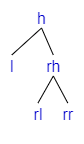
**Left Rotation**
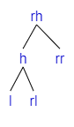

**(1/4) Left Rotation**: If we are adding a child in **rr**.
</div><div class="col-4 border border-dark">

[comment]: <> ([h [lh [ll] [lr]] [r]])
[comment]: <> ([lh [ll] [h [lr] [r]]])  

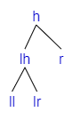
**Right Rotation**
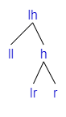

**(2/4) Right Rotation**: If we are adding a child in **ll**.
</div></div>

<div class="p-3 border border-dark mt-3">

[comment]: <> ([h [lh [ll] [lrh [lrl] [lrr]]] [r]])
[comment]: <> ([h [lrh [lh [ll] [lrl]] [lrr]] [r]])
[comment]: <> ([lrh [lh [ll] [lrl]] [h [lrr] [r]]])


Inserting in lr
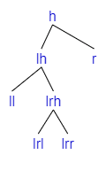
**Left Rotation**
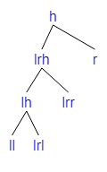
**Right Rotation**
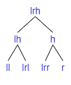

**(3/4) Left-Right Rotation**: If we are adding a child in **lr** <small>(=lrh if lr is empty, otherwise either lrl or lrr)</small>.
</div>

<div class="p-3 border border-dark mt-3">

[comment]: <> ([h [l] [rh [rlh [rll] [rlr]] [rr]]])
[comment]: <> ([h [l] [rlh [rll] [rh [rlr] [rr]]]])
[comment]: <> ([rlh [h [l] [rll]] [rh [rlr] [rr]]])


Inserting in rl
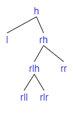
**Right Rotation**
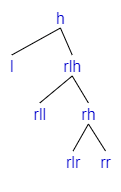
**Left Rotation**
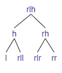

**(4/4) Right-Left Rotation**: If we are adding a child in **rl**
<small>(=rlh if lr is empty, otherwise either rll or rlr)</small>.
</div>

<hr class="sl">

## Balance your tree

You know about the depth/height. Each node got this information.

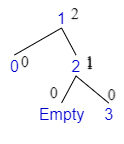
The tree was almost balanced, but not anymore after adding **4**


Notes

* We are allowing a difference of depth of $\pm 1$
* The difference is now 2

We can see it in our code by checking what we call the **Balance factor** (bf). This is the difference of depth between two branches (left minus right).

* check in which side the tree in unbalanced
  * **bf(tree) = 2**: then left balanced
  * **bf(tree) = -2**: then right balanced
  * **else** <small>(if 0, 1, or -1)</small>: then almost balanced or balanced (do nothing)
* if right balanced, check the balance factor of the right
  * **bf(right) = 1**: **Rotate Right Left**
  * **bf(right) = 0**: ❌ (not possible)
  * **bf(right) = -1**: **Rotate Left**
* if left balanced, check the balance factor of the left
  * **bf(left) = 1**: **Rotate Right**
  * **bf(left) = 0**: ❌ (not possible)
  * **bf(left) = -1**: **Rotate Left Right**

<hr class="sr">

## Examples

### Example 1 - Rotate Left

<div class="row justify-content-center mx-0"><div class="col-4">

[comment]: <> (["1" ["0"] ["3" ["2"] ["4" [Empty] ["5"]]]])

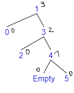
</div><div class="col-6">

* $bf(tree) = depth(left) - depth(right) = 0 - 2 = -2$
* The tree is **Right balanced**
* $bf(right) = depth(r\\_left) - depth(r\\_right) = 0 - 1 = -1$
* **Rotate Left**
</div></div>

[comment]: <> (["h=1" ["l=0"] ["rh=3" ["rl=2"] ["rr=4" [Empty] ["5"]]]])
[comment]: <> (["rh=3" ["h=1" ["l=0"] ["rl=2"]] ["rr=4" [Empty] ["5"]]])
[comment]: <> (["3" ["1" ["0"] ["2"]] ["4" [Empty] ["5"]]])

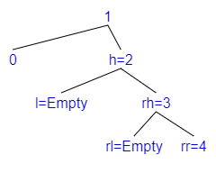
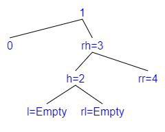
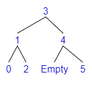