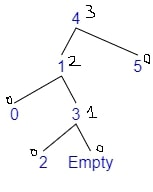
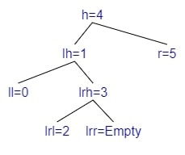
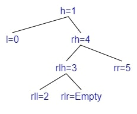

# AVL trees

[Go back](../index.md#data-structures)

An **AVL** (Adelson-Velsky and Landis) is a balanced **Binary Search Trees**. We are making sure that the depth is $\pm 1$, instead of having something like the tree below with your usual **Binary Search Trees**. The complexity is now $\log{(n)}$.


Everything is the same as for a **Binary Search Trees**, but we will balance our tree in **add** and **remove**.

<hr class="sr">

* ✅: faster than an ordered list for `add, remove`
* ✅: better than an unbalanced BST
* ✅: aside from add and remove, same implementation as a BST
* ❌: add and remove are difficult to understand/implement
* ❌: sightly slower than an ordered list for `mem`, `get_min`
* ❌: Unless storing the cardinal, calculating it takes too much time

*The time was tested with a sample of around 500 000 randomly generated values in [0;10000]*.

```none
>>>>>>>>>> TIME FOR LISTS <<<<<<<<<<
Average time of add:                     0.000046
Average time of remove:                  0.000047
Average time for mem:                    0.002340
Average time for get_min:                0.001870
Average time for cardinal:               0.353290 (long)
>>>>>>>>>> TIME FOR BST <<<<<<<<<<
Average time of add:                     0.000002
Average time of remove:                  0.000002
Average time for mem:                    0.006270
Average time for get_min:                0.003290
Average time for cardinal:               inf (too long)
>>>>>>>>>> TIME FOR AVL <<<<<<<<<<
Average time of add:                     0.000010
Average time of remove:                  0.000005
Average time for mem:                    0.003430
Average time for get_min:                0.002800
Average time for cardinal:               inf (too long)
```

<hr class="sl">

## Depth

You will have to check whether your tree is balanced. The depth is the height of your tree. The depth of the root is the maximum between the depth of its children.

In OCaml, it's strongly advised to store the depth of the tree. **I'm starting from 0**, you may start from 1 <small>(replace d+1 with d, and add 1 to max ...)</small>.

```ocaml
(* elt is the type of one element *)
type avl = Empty | Node of set * elt * int * set
let get_depth s = match s with | Empty -> 0 | Node(_,_,d,_) -> d + 1
(* create a node *)
let node l h r = Node(l, h, max (get_depth l) (get_depth r), r)
```

> **My note 🙄**: the depth is usually called the height of the tree, but it was disturbing me because we were also calling "h" the head of the tree, now with the depth I'm fine 😬🙄.

<hr class="sr">

## Rotations

We got four rotations, that we will use to balance our tree.

<div class="row mx-0 justify-content-center"><div class="col-4  border border-dark me-3">

[comment]: <> ([h [l] [rh [rl] [rr]] ])
[comment]: <> ([rh [h [l] [rl]] [rr] ])


**Left Rotation**


**(1/4) Left Rotation**: If we are adding a child in **rr**.
</div><div class="col-4 border border-dark">

[comment]: <> ([h [lh [ll] [lr]] [r]])
[comment]: <> ([lh [ll] [h [lr] [r]]])  


**Right Rotation**


**(2/4) Right Rotation**: If we are adding a child in **ll**.
</div></div>

<div class="p-3 border border-dark mt-3">

[comment]: <> ([h [lh [ll] [lrh [lrl] [lrr]]] [r]])
[comment]: <> ([h [lrh [lh [ll] [lrl]] [lrr]] [r]])
[comment]: <> ([lrh [lh [ll] [lrl]] [h [lrr] [r]]])


Inserting in lr

**Left Rotation**

**Right Rotation**


**(3/4) Left-Right Rotation**: If we are adding a child in **lr** <small>(=lrh if lr is empty, otherwise either lrl or lrr)</small>.
</div>

<div class="p-3 border border-dark mt-3">

[comment]: <> ([h [l] [rh [rlh [rll] [rlr]] [rr]]])
[comment]: <> ([h [l] [rlh [rll] [rh [rlr] [rr]]]])
[comment]: <> ([rlh [h [l] [rll]] [rh [rlr] [rr]]])


Inserting in rl

**Right Rotation**

**Left Rotation**


**(4/4) Right-Left Rotation**: If we are adding a child in **rl**
<small>(=rlh if lr is empty, otherwise either rll or rlr)</small>.
</div>

<hr class="sl">

## Balance your tree

You know about the depth/height. Each node got this information.


The tree was almost balanced, but not anymore after adding **4**


Notes

* We are allowing a difference of depth of $\pm 1$
* The difference is now 2

We can see it in our code by checking what we call the **Balance factor** (bf). This is the difference of depth between two branches (left minus right).

* check in which side the tree in unbalanced
  * **bf(tree) = 2**: then left balanced
  * **bf(tree) = -2**: then right balanced
  * **else** <small>(if 0, 1, or -1)</small>: then almost balanced or balanced (do nothing)
* if right balanced, check the balance factor of the right
  * **bf(right) = 1**: **Rotate Right Left**
  * **bf(right) = 0**: ❌ (not possible)
  * **bf(right) = -1**: **Rotate Left**
* if left balanced, check the balance factor of the left
  * **bf(left) = 1**: **Rotate Right**
  * **bf(left) = 0**: ❌ (not possible)
  * **bf(left) = -1**: **Rotate Left Right**

<hr class="sr">

## Examples

### Example 1 - Rotate Left

<div class="row justify-content-center mx-0"><div class="col-4">

[comment]: <> (["1" ["0"] ["3" ["2"] ["4" [Empty] ["5"]]]])


</div><div class="col-6">

* Adding 5
* $bf(tree) = depth(left) - depth(right) = 0 - 2 = -2$
* The tree is **Right balanced**
* $bf(right) = depth(r\\_left) - depth(r\\_right) = 0 - 1 = -1$
* **Rotate Left**
</div></div>

[comment]: <> (["h=1" ["l=0"] ["rh=3" ["rl=2"] ["rr=4" [Empty] ["5"]]]])
[comment]: <> (["rh=3" ["h=1" ["l=0"] ["rl=2"]] ["rr=4" [Empty] ["5"]]])
[comment]: <> (["3" ["1" ["0"] ["2"]] ["4" [Empty] ["5"]]])


### Example 2 - Rotate Right

<div class="row justify-content-center mx-0"><div class="col-4">

[comment]: <> (["4" ["2" ["1" ["0"] [Empty]] ["3"]] ["5"]])


</div><div class="col-6">

* Adding 0
* $bf(tree) = depth(left) - depth(right) = 2 - 0 = 2$
* The tree is **Left balanced**
* $bf(left) = depth(l\\_left) - depth(l\\_right) = 1 - 0 = 1$
* **Rotate Right**
</div></div>

[comment]: <> (["h=4" ["lh=2" ["ll=1" ["0"] [Empty]] ["lr=3"]] ["r=5"]])
[comment]: <> (["lh=2" ["ll=1" ["0"] ["Empty"]] ["h=4" ["lr=3"] ["r=5"]]])
[comment]: <> (["2" ["1" ["0"] ["Empty"]] ["4" ["3"] ["5"]]])


### Example 3 - Rotate Left Right

<div class="row justify-content-center mx-0"><div class="col-4">

[comment]: <> (["4" ["1" ["0"] ["3" ["2"] ["Empty"]]] ["5"]])


</div><div class="col-6">

* Adding 2
* $bf(tree) = depth(left) - depth(right) = 2 - 0 = 2$
* The tree is **Left balanced**
* $bf(left) = depth(l\\_left) - depth(l\\_right) = 0 - 1 = -1$
* **Rotate Left Right**
  * We will Rotate Left the left
  * We will Rotate Right the tree
</div></div>

[comment]: <> (["h=4" ["lh=1" ["ll=0"] ["lrh=3" ["lrl=2"] ["lrr=Empty"]]] ["r=5"]])
[comment]: <> (["h=4" ["lrh=3" ["lh=1" ["ll=0"] ["lrl=2"]] ["lrr=Empty"]] ["r=5"]])
[comment]: <> (["lrh=3" ["lh=1" ["ll=0"] ["lrl=2"]] ["h=4" ["lrr=Empty"] ["r=5"]]])
[comment]: <> (["3" ["1" ["0"] ["2"]] ["4" ["Empty"] ["5"]]])


**Left Rotation**

**Right Rotation**


### Example 4 - Rotate Right Left

<div class="row justify-content-center mx-0"><div class="col-4">

[comment]: <> (["1" ["0"] ["4" ["3" ["2"] ["Empty"]] ["5"] ]])


</div><div class="col-6">

* Adding 2
* $bf(tree) = depth(left) - depth(right) = 0 - 2 = -2$
* The tree is **Right balanced**
* $bf(right) = depth(r\\_left) - depth(r\\_right) = 1 - 0 = 1$
* **Rotate Right Left**
  * We will Rotate Right the right
  * We will Rotate Left the tree
</div></div>

[comment]: <> (["h=1" ["l=0"] ["rh=4" ["rlh=3" ["rll=2"] ["rlr=Empty"]] ["rr=5"] ]])
[comment]: <> (["h=1" ["l=0"] ["rlh=3" ["rll=2"] ["rh=4" ["rlr=Empty"] ["rr=5"]]]])
[comment]: <> (["rlh=3" ["h=1" ["l=0"] ["rll=2"]] ["rh=4"["rlr=Empty"] ["rr=5"]]])
[comment]: <> (["3" ["1" ["0"] ["2"]] ["4"["Empty"] ["5"]]])


**Right Rotation**

**Left Rotation**

