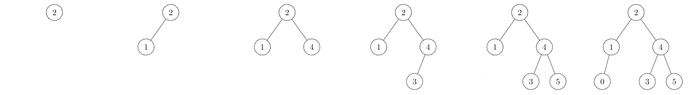
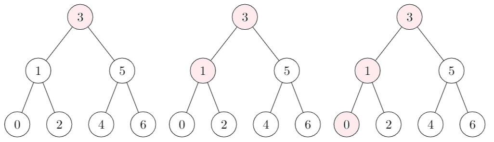

# Binary Search Trees (BST)

[Go back](../index.md#data-structures)

Binary search trees (`ABR, Arbre binaire de Recherche`) are trees with nodes having up to two children. The complexity is up to $O(n)$, but in average with got a complexity of $O(h)$ with $h$ the height of the tree.

* ✅: easy to learn, and easy to implement
* ✅: faster than an ordered list for `add, remove`
* ❌: sightly slower than an ordered list for `mem`, `get_min`
* ❌: AVL trees are better
* ❌: Unless storing the cardinal, calculating it takes too much time

*The time was tested with a sample of around 500 000 randomly generated values in [0;10000]*.

```none
>>>>>>>>>> TIME FOR LISTS <<<<<<<<<<
Average time of add:                     0.000046
Average time of remove:                  0.000047
Average time for mem:                    0.002340
Average time for get_min:                0.001870
Average time for cardinal:               0.353290 (long)
>>>>>>>>>> TIME FOR BST <<<<<<<<<<
Average time of add:                     0.000002
Average time of remove:                  0.000002
Average time for mem:                    0.006270
Average time for get_min:                0.003290
Average time for cardinal:               inf (too long)
```

<hr class="sl">

## The main idea

A tree is made of Nodes. Each name can have up to two children. Each node is storing a value "v". If we want to add a value "e", we are following this rule

* if `e > v` then we are inserting in the right
* if `e < v` then we are inserting in the left

Simply apply this rule recursively until you can add your node.


<hr class="sl">

## Add an element in a BST

<div class="mt-3">


</div>

* We are adding **2** in the empty tree
* We are adding **1**: **left** (1 < 2)
* We are adding **4**: **right** (4 > 2)
* We are adding **3**: **right** (3 > 2) **left** (3 < 4)
* We are adding **5**: **right** (5 > 2) **right** (5 > 4)
* We are adding **0**: **left** (0 < 2) **left** (0 < 1)

**You mustn't add an element already in the tree**. Use an exception to exit faster your add, and returning the set (unchanged).
```ocaml
let add e set = try
	real_add_function set
with In -> set
```

<hr class="sr">

## Remove an element in a BST

<div class="mt-3">


</div>

* We are removing **3**: we are taking as the new head **4** (the min in the right)
* We are removing **4**: we are taking as the new head **5** (the min in the right)
* We are removing **6**: we are replacing **6** with **"Empty"** as **6** does not have children
* We are removing **5**: we don't have elements in our right, the new tree is made of the previous left

**Same as add. Use an exception to exit faster, if the element is not inside** (and return the unchanged set).
```ocaml
let remove e set = try
	real_remove_function e set
with Not_found -> set
```

<hr class="sl">

## Check if an element is in a BST

* Is **2** inside? 
  * As **2** is lesser than **3**, we are checking **1**. 
  * As **2** greater than **1**, we are checking **2**.
  * Result: IN. 


An element is **not in** if we can't check the next location we were supposed to check.

<hr class="sr">

## Minimum or Maximum?

* The minimum is the bottom left value, the value
that was lesser than every other value



* The minimum is the bottom right value, the value
  that was greater than every other value

