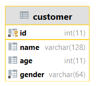
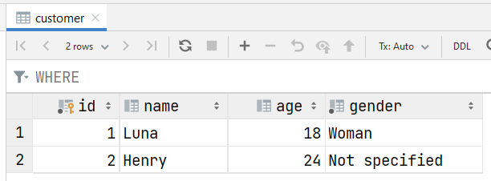
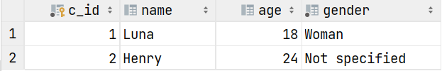

# Structured Query Language

Structured Query Language, often abbreviated **SQL** is a normalized language to process queries on a relational database. It's based on a "model" that you defined. If you need something flexible, you should look at NoSQL databases.

Relational databases are provided by a **DataBase management system DBMS** (`Système de gestion de base de données (SGBD)`). You will need one to manage your databases among

* **Oracle**
* **PostgresSQL**
* **MariaDB**
* MySQL
* SQLite
* ...

> **You need to install one**, to continue this course. Please, refer to your DBMS documentation 🤓. A temporary solution might be to use [SQLiteOnline](https://sqliteonline.com/) (🙄).
> 
> **ENSIIE students** got a some notes [in the WEB section](../../special/web/parts/db-acc.md) to use our school database.

> **SQL 89/92**: Both **SQL-89** and **SQL-92** are quite used. There is one major difference: what we call "JOIN clauses" are **not available in SQL-89**.

<hr class="sl">

## Relational model

In the second screen, you can see the usual representation of your data in a database. This is a literally an Exel table with rows, columns, and entries. In the first screen, this is the UML representation, that we use when creating a database from specifications (see **relational modeling**).

<div class="row justify-content-center mx-0">
<div class="col-12 col-md-3">


</div><div class="col-12 col-md-8">


</div>
</div>

✨ **Some vocabulary** ✨
 
| Element | Name (UML) | Name (DBMS) | Note |
|---------|---------|---------|---------|
| Customer | **Class** | **Table** |  |
| id, name, age, gender | **Attributes** | **Attributes** | <small>(=columns)</small> |
| `(1, "Luna", 18, "Woman")`, ... | **Objects** | **Tuples**/Records | <small>(=rows)</small>. We are saying "tuples" in French too. |
| id | **Identifiers** <br> <small>(Keys, but this is a mistake)</small> | **Keys** | A **primary key** is a set of **one or more attributes**.<br>We can find a row in a table, given its values in the primary key.<br> The primary key as a whole is **unique** and **not-null**. <br>This is used to reference a tuple in another table (**Foreign key**).<br>Usually, we are using an **artificial key** <br>which is incrementing (+=1) each time we are adding a row.<br><small>Here, given "id=1", we know we are talking of "(1, Luna, ...)".</small> |

> Note: I know that "customer" **should starts with an uppercase**, as every class should do. I should also **add something before id** <small>(as many class may have an attribute id, so I won't have to prefix it)</small>, and I should **add something before name** <small>(as name is a **reserved keyword** otherwise, I will have to escape it later)</small> (ex: c_id, c_name).

<hr class="sl">

## Zest of knowledge

> **Clause**
> 
> This is the keywords SELECT, FROM, ... that are making a SQL request.

> **Request**
> 
> This is a statement in which you are using clauses to do something on the database. **A request must ends with a `;`** <small>(unless this is a simple request)</small>.

> **Schema**
> 
> To make it simple, this is a table storing data. Some are saying this is a library of databases. To call a table in a schema, do `schema.table`.
> 
> * For an user, this is the list of its tables, views, constraints
> * For a database, this is the table **INFORMATION_SCHEMA** (TABLES, USERS, COLUMNS/DOMAINS, CHECK_CONSTRAINTS)
> 
> This word is also used for requests 🧐: this is the selected tables, and the attributes.
> 
> As the ENSIIE, we got one schema per user (ex: `prenom.nom`) in which we got another schema called `public`. You will store your databases in it.

> **DML, DDL, DCL**
> 
> We are using DML/DDL/DCL, to talk about a category of clauses. This is something quite used by pros 😎.
> 
> * DML (Data Manipulation): Select, Insert, Update, Delete
> * DDL (Data Definition): Create, Alter, Drop
> * DCL (Data control): Grant, Revoke

> ☑✅ **Primary and Foreign keys** ☑✅
> 
> **YOU MUST KNOW THIS**. The primary key is explained in the previous section. This is usually one attribute called "id" which is an artificial key. A **Foreign key** is a set of attributes (=keys) which are taking values from another key.
> 
> For instance, a customer(c_id, c_name, ...) will make purchases(p_id, date, description, ...). You will add in the table purchases an attribute "c_id" (the name does not matters) taking values from the table "customer". You should see this as referencing a customer inside another table.

<hr class="sr">

## SQL Syntax

Before digging into the clauses, here is a list of everything that you will be supposed to known in the next sections.

<div class="row mx-0"><div class="col-6">

```sql
SELECT * 
FROM information_schema.TABLES T
WHERE T.TABLE_SCHEMA = 'information_schema';
```
</div><div class="col-6 align-self-center">

* **Clauses name are not case sensitive** <small>(uppercase, lowercase, mix of both)</small>
* **Requests end with a ;** <small>(unless they are simples)</small>
* You can put everything on the same line
</div></div>

More specifically

| Notion (General) | In SQL |
| ------ | ------- |
| Assignment <small>(PL/SQL only)</small> | `a = 5`, or `à := 5` |
| Comments | `-- comment` (no inline comment) |
| a % b | `MOD(a,b)` |
| Reserved words | `Select date [...]` ❌ (date, name, ... are reserved)<br><code>Select \`date\` [...]</code> ✅ |
| convert/cast | <ul><li>Simple CAST<br>`CAST(value as new_type)`</li><li>Extract something from a date<br>`EXTRACT(element from some_date)` <br>With element YEAR, MONTH, DAY, HOUR, ...</li></ul> |

| Notion (Strings) | In SQL |
| ------ | ------- |
| String | `'a'` or `"a"` (the latter may not work) |
| String (escape) | ex: use a quote in a quote `'\''` |
| Concatenate | <code>'a' \|\| 'b'</code> |
| Extract chars | Left(string, count) or RIGHT(string, count) |

> **Note**: More functions at [W3Schools - SQL Server Functions](https://www.w3schools.com/SQL/sql_ref_sqlserver.asp).<br>
> **Test a function?**: `SELECT EXTRACT(DAY from '2020-03-25')`<br>
> **Test a function?**: `SELECT CAST(15 AS VARCHAR(11))`

<details class="details-e">
<summary>Types</summary>
<br>

| Notion | Type in SQL | Description |
| ------ | ------- | ------- |
| Char  | `varchar(1)` | A string of one character |
| String  | `varchar(n)`<br>`varchar2(n)` (Oracle) | A string of n character |
| String  | `text` | A string taking a non-determined number of characters |
| Integer  | `int`, `int(n)`, `number` | An Integer. `int` is the same as `int(11)`. |
| Boolean  | `int(1)` | An int, but taking only 0 or 1 |
| Real  | `float` or `real` | To represents a price, you may use `decimal(n,p)`  |
| date  | `date` | To represents a date |
| Enumeration  | `enum('v1', 'v2', ...)` | An attribute/value that can take a fixed number of values. |
</details>

<hr class="sl">

## DML (Data Manipulation)

You can see a DML request, as a request returning a table. You will define in **SELECT** the attributes of your table, in **FROM** where the tuples are selected, and in **WHERE** some restrictions on the tuples selected.

<details class="details-e">
<summary>Select</summary>

<div class="row mx-0 row-cols-md-2"><div>

If I'm using `Select name FROM customer`, I will get a table with **a column "name"** and the tuples will be the values for "name" in customer <small>(I should escape name, otherwise this may not work in every DBMS)</small>.

```sql
-- Select every attribute of a table
SELECT * FROM customer;
SELECT id, name, age, gender FROM customer;

-- no duplicate results (each line once)
SELECT DISTINCT name, gender FROM customer;

-- name is renamed as 'Customer name'
SELECT name as 'Customer name', id FROM customer;
-- escape name
SELECT `name`, id FROM customer;

-- a request that is returning one row+one column
-- ALMOST NEVER USED
SELECT (SELECT name FROM customer where id='1') FROM customer;
```
</div><div>

```sql
SELECT id as 'c_id', `name`, age FROM customer;
```

Output: 

```sql
SELECT DISTINCT 5 as 'GroupID', -- every row will have 5 
                LEFT(name, 1) as 'Letter' -- first letter only
FROM customer;
```

Output: 

</div></div></details>

<details class="details-e">
<summary>From</summary>

You are using columns in select. But they are coming from somewhere... That's where the `FROM` come in handy. Pick the table <small>(for more than one, see JOINT clauses)</small> you want to select columns (and their values) from.

```sql
-- the basic 🤓
SELECT * FROM customer;
-- prefix (used later WHEN NEEDED, not always)
SELECT customer.* FROM customer;
SELECT c.* FROM customer c;
SELECT c.name FROM customer c;

-- this is the cartesian product, you will get
-- count_lines(c1) * count_lines(c2) records
-- LEARN ABOUT JOINTURES LATER
SELECT * FROM customer c1, customer c2;
```
</details>

<details class="details-e">
<summary>Where</summary>

Most likely the most complex one. You can filter your result using this clause.

```sql
-- you can use > >= = <> (same as !=) < <=
SELECT name FROM customer WHERE name <> 'Luna'; -- Henry
SELECT name FROM customer WHERE name = 'Luna'; -- Luna

-- && and || are working too, but we are using AND and OR
Select name FROM customer WHERE name = 'Luna' OR gender <> 'Woman'; -- Both
Select name FROM customer WHERE name = 'Luna' AND gender <> 'Woman'; -- None

SELECT name FROM customer WHERE name IN ('Luna'); -- Luna
SELECT name FROM customer WHERE name IN ('Luna', 'Henry'); -- Both
SELECT name FROM customer WHERE name NOT IN ('Luna');

SELECT name FROM customer WHERE name IS NULL; -- none
SELECT name FROM customer WHERE name IS NOT NULL; -- Both

-- age in [18,24], same as age >= 18 AND age <= 24
SELECT name FROM customer WHERE age BETWEEN 18 AND 24;
```

You can use **Patterns** too, with `_` a unknown character, and `%` a string of unknown characters that may be empty.

```sql
-- any character followed by una
SELECT name FROM customer WHERE name LIKE '_una';
-- Ending with una
SELECT name FROM customer WHERE name LIKE '%una';
-- Starting with Lun
SELECT name FROM customer WHERE name LIKE 'Lun%';
```

And you can used a nested request

```sql
-- you will use the variable c in the nested request.
-- if the request return one row, then EXISTS is true
SELECT name FROM customer c WHERE EXISTS (SELECT NULL);
SELECT name FROM customer c WHERE NOT EXISTS (SELECT NULL);

-- same as previously, but the set is generated with a request
SELECT name FROM customer WHERE name IN (SELECT NULL)
SELECT name FROM customer WHERE name NOT IN (SELECT NULL)

-- the attribute is greater than every value returned in the nested request
-- the nested request must return exactly one attribute
SELECT name FROM customer c WHERE name >= ALL (SELECT NULL, NULL);
-- at least one
SELECT name FROM customer c WHERE name >= ANY (SELECT NULL)
```
</details>

A summary is needed 🧐, here you go ✨🚀.

| Select | From | Where |
| --- | --- | --- | 
| one attribute | one table | >, >=, <, <=, =, !=, <> |
| multiples attributes (,) | multiples tables = **cartesian product**| IN, NOT IN a set |
| all (*) | multiples tables = see JOINT (later) | IS/IS NOT (NULL/...) |
| no duplicates (DISTINCT) | prefix a column | BETWEEN min and max |
| rename (... as ...) | | LIKE 'pattern' | 
| a value | | EXISTS/NOT EXISTS request |
| a function | | IN/NOT IN request |
| another request | | ALL/ANY |

<hr class="sl">

## DML (Data Manipulation) - Useful stuff

<details class="details-e">
<summary>LIMIT <i class="small">(Skip results, number of results)</i></summary>

You will use LIMIT a lot, to skip the first **n** results, and optionally define the max number of results **k**.

```sql
LIMIT n; -- skip n results
LIMIT n, k; -- skip n results, returns up to k rows
LIMIT 0, 1; -- up to one row
LIMIT 1, 1; -- up to one row, skip the first one
```
</details>

<details class="details-e">
<summary>ORDER BY <i class="small">(sort results)</i></summary>

You can sort your results with ORDER BY, with ASC (**default**=optional, A -> Z) and DESC (Z -> A)

```sql
SELECT name from customer c ORDER BY name; -- (ASC) Henry, Luna
SELECT name from customer c ORDER BY name ASC; -- Henry, Luna
SELECT name from customer c ORDER BY name DESC; -- Luna, Henry
SELECT name from customer c ORDER BY id DESC; -- Henry (2), Luna (1)
```
</details>

<details class="details-e">
<summary>UNION/INTERSECT/EXCEPT <i class="small">on two sets of results</i></summary>

You can make the union, the intersection, or the difference of two requests' results, **but they must have the same number of attributes** in SELECT. We usually use `SELECT NULL` to fill missing arguments <small>(you could have used a number such as 20, if you wanted to fill the missing data of the second request with 20 instead of NULL)</small>.

```sql
SELECT name, age from customer c
UNION -- you could use INTERSECT or EXCEPT 
SELECT name, NULL from customer c
-- 4 rows
-- Luna (18), Henry (24)
-- Luna (null), Henry (null)
```

> **Note**: ORDER, or LIMIT may only be applied on the whole request.
</details>

<details class="details-e">
<summary>Calculations <i class="small">(on all tuples, on groups of tuples)</i></summary>

You can **only** make calculations in **SELECT** and in a new clause **HAVING** <small>(NOT in WHERE, you may use a nested request)</small>.

```sql
-- the most used ones
SELECT SUM(age) FROM customer; -- 18+24
SELECT AVG(age) FROM customer; -- (18+24)/2
SELECT MIN(age) FROM customer; -- 18
SELECT MAX(age) FROM customer; -- 24
SELECT COUNT(*) FROM customer; -- 2 = number of tuples
-- you may add DISTINCT (no duplicates)
-- or ALL (default, allow duplicates)
SELECT COUNT(DISTINCT age) FROM customer; -- 2 (no duplicates ages)
SELECT SUM(DISTINCT age) FROM customer; -- 18 + 24
SELECT SUM(ALL age) FROM customer; -- same as SUM(age)
```

The clause **HAVING** is only working on groups <small>(ex: group by name, and check the average age per records having this name)</small>. You may create groups of one elements by making groups on the primary key as the primary key is unique.

```sql
-- this request is returning the sum of age PER GENDER
SELECT gender, SUM(age) FROM customer 
GROUP BY gender -- Woman(18), Not specified (24)

-- same but we are ONLY KEEPING GROUPS for which the SUM is greater (or equals) than 20
SELECT gender, SUM(age) FROM customer 
GROUP BY gender HAVING SUM(age) >= 20 -- Not specified (24)
```
</details>

<hr class="sr">

## DML (Data Manipulation) - Joint clause

The last time we tried to use two table, we got the cartesian product, **which is what you will get if the joint clause fails**. This clause will try to merge the tables in the FROM. Given the two following tables Customer2 ("A") and Purchase ("B")




<details class="details-e">
<summary>A NATURAL JOIN B <small>(>=SQL-92)</small></summary>

Cartesian product based on the columns having the **same name**.

```sql
-- name of every customer that made of purchase
SELECT * FROM customer2 NATURAL JOIN purchase
-- result: [(1, 'Luna', ..., '1', '2021-10-23'), (1, 'Luna', ..., '2', '2021-10-23')]
```

> Beware of Natural Join! You may have missed the fact that you got the column 'name' (example) in both table making your request something different than what you were expecting.
</details>

<details class="details-e">
<summary>NATURAL JOIN before? <small>(<=SQL-89)</small></summary>

We can't use NATURAL JOIN, so we need to put the jointure in the where.

```sql
SELECT * FROM customer2 c, purchase p
WHERE c.c_id = p.c_id
```
</details>

<details class="details-e">
<summary>A JOIN B USING/ON</summary>

Cartesian product based on the columns that you will pick in ON/USING.

```sql
SELECT * FROM customer2 JOIN purchase USING (c_id)
-- merge the column c_id available in both table
-- sort of better NATURAL JOIN as you are picking columns

SELECT c.*, p_id, `date` FROM customer2 c JOIN purchase p oN c.c_id = p.c_id
-- same result, we should use using in this case so this is more wordy than usual
```

* you may use `,` to add conditions in `USING`
* you may use `AND` to add conditions in `JOIN ON`
</details>

<details class="details-e">
<summary>OUTER JOIN</summary>

Until now, the rows "(2, Henry, ...)" was never shown, because there was no "c_id=2" in purchases. You can make still show such records such OUTER JOIN.

* **LEFT OUTER JOIN**

```sql
SELECT * FROM customer2 c LEFT OUTER JOIN purchase p
	ON c.c_id = p.c_id -- p.c_id can be null 
SELECT * FROM customer2 c RIGHT OUTER JOIN purchase p
	ON c.c_id = p.c_id -- c.c_id can be null 
SELECT * FROM customer2 c FULL OUTER JOIN purchase p
	ON c.c_id = p.c_id -- either c.c_id or p.c_id can be null 
```

</details>
