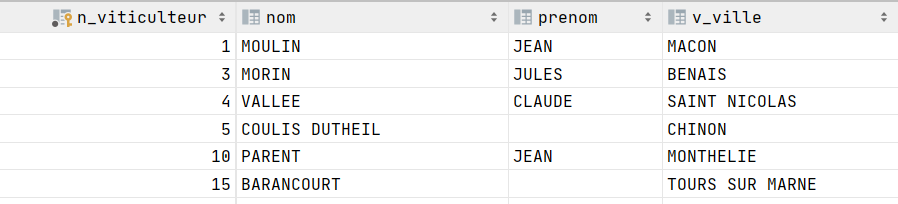

# First Query

[Go back](..)

So a SQL query looks like this

```sql
-- this is a comment
Select * 
from a_table
where an_attribute = a_value;
```

Just so you know, this query select (`Select`) all (`*`) attributes
from ``a_table``, but only show tuples where their `an_attribute`
have the value ``a_value``.

As you might want to know, a database looks like this
where the `columns` are `attributes` and `rows` are ``tuples``

