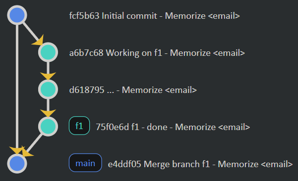

# Version-control using Git

As a student, you may enjoy the benefits of the [GitHub student pack](https://education.github.com/pack).

> **edit 21/08/2021**: A lot of content that was in this course (README, LICENSE, CONTRIBUTING, CODE_OF_CONDUCT, ...), was moved to "[Make Git project](../../../archives/proj/make-git-project/index.md)". This is because I wanted to separate a bit more the commands and the concepts 🙇. Still, I kept a short description here, for those that are not interested in the advanced or the proper way to use these files.

<hr class="sr">

## Introduction

  * usually the original is on the branch "master" or "main"
  * you're cloning it, creating a new branch, on which you'll work
  * then you are **merging** or dropping your changes

* [set things up server-side](server-install.md)

As a side note before starting, you can create aliases for a command like `git name` with the command `git config --global alias.name 'a command'` where a command could be `add .` or `commit`...

<hr class="sl">

## Basic usage

Please take note that every command is starting with "git", followed by one space.

* [Get your repository from server](commands/clone.md)
* [Update your local version](commands/pull.md)
* [Save your local changes](commands/commit.md)
* [Send your changes to the server](commands/push.md)
* [Check the git status](commands/status.md)

As a side note

```bash
git add .
git commit -m "I worked a lot"
# is almost the same as (new files aren't added)
git commit -am "I worked a lot"
```

<hr class="sr">

## Main concepts

Here are commands that you will use on a project, if you are not working alone (you may also use it when working alone, if you're consistent).

* `git branch name`: create a branch "name"
* `git checkout name`: move to the branch "name"
* `git checkout -b name`: create and move
* `git merge name`: merge the current branch with the branch "name"
* `git branch -d name`: delete a branch

By default, you are coding on a branch called `master` (or `main`). Let's explain what's a branch. If you're smart, you will want to always have a working version of your project ("main" here). In that case, if you want to add one functionality (let's call it "f1"), 

* you will copy your project in "f1":  `git branch f1`
* you will move to the copy: `git checkout f1`
* [...] *work on the copy* (you can use add, commit, push, ...) [...]
* you can go back to "main": `git checkout main`
  * delete the new copy `git branch -d f1`
  * or accept your changes `git merge f1`
    * if "main" didn't change, no problems, the copy replace "main"
    * but if "main" changed, then you may have to manually pick which parts of the two copies you want in the new "main" (=resolving conflicts).

> As a side note, when you have to resolve conflicts, the merge command's output will list what files need to be reviewed. In each file, you have the two different versions and need to delete the code you don't want to keep. Some software provides you an interface to do that quite easily such as [PHPStorm](https://www.jetbrains.com/help/phpstorm/resolving-conflicts.html#distributed-version-control-systems), or any software made by [JetBrains](../../../archives/tools/jetbrains/index.md).



> **Note**: if you think main is better than "master" then don't forget to add that to your config `git config --global init.defaultBranch main`.

<hr class="sl">

## Good practices

**Atomic commits**: one commit means one change, such as adding one functionality. Do not make hundreds of changes in one commit, making it hard to find what you did. You can select the lines of a file you want to commit using `git add -p file`.

**Short-Long description**: you should make a short and a long description of your commits, like that

```bash
git commit -m "a short inline description

A long description, where I further describe
what I did
"
```

**README.md**: put a README in all of your projects, that is the start of a great adventure.

**LICENSE**: you may also put a LICENSE even if you don't want to put restrictions on your code, to protect yourself from complaints (MIT LICENSE is good for that, or The Unlicense). You should [pick your license here](https://choosealicense.com/).

**.gitignore**: you may not want to commit some files like high-churn ones or big files... Create a file called "gitignore" is a good practice, you can

* [generate a gitignore here](https://www.toptal.com/developers/gitignore).
* [use a template here](https://github.com/github/gitignore)

<hr class="sr">

## Advanced concepts

Here are some functionalities that you can find on GitHub, but you may find things similar (if not exactly the same) on GitLab or Gogs.

* General
  * [Wikis](github/wiki.md): write documentation
  * [Actions](github/actions.md): continuous integration (**ci**)
    * [Heroku](notes/heroku.md): preconfigured continuous integration and deployment
    * [External websites for reviews](notes/tools.md): a bunch of tools such as tools to get automated feedback on your code
    * [Dependabot](github/dependabot.md): get pull requests to update your dependencies when new versions are available
  * [Pull requests (PR)](github/pull-requests.md): ask before merging
  * [Issues](github/issues.md): got a question? Report a bug?
  * [Pages](github/pages.md): host your website on GitHub
  * [Project board](github/project.md): you can have your scrum board directly on GitHub
  * [Discussions](https://docs.github.com/en/discussions): you can allow discussions on GitHub
  * [Fork](github/fork.md): you want to submit a pull request on a repository, but you can't create a branch (nor commit)
* Special
  * [Digital Object Identifiers](github/doi.md): researchers' stuff
  * [Referencing code in PR/issues](github/ref-code.md): reference a line or a block of code in a PR or an issue
* Commits
  * [Verified commits](notes/verified.md): add "verified" to your commits
  * [Multiples authors](notes/multiples.md): add multiples authors to a commit
  * [Referencing ...](notes/reference.md): reference a user, an issue, or a pull request

Note: I'm putting a lot of files in a folder `.github`, because it makes my root folder cleaner, but you can put the files directly in your root folder (😐). You can also replace UPPER_CASE names with lowercase names. You can use `docs` instead of `.github`.

This page [Working Open Workshop](https://mozillascience.github.io/working-open-workshop/github_for_collaboration/) is summarizing with a lot of pictures (issues, forking a repository, pull requests, etc.).

> Note: On Github, you can add a description
> 
> * [on your profile page](https://docs.github.com/en/account-and-profile/setting-up-and-managing-your-github-profile/customizing-your-profile/managing-your-profile-readme)
> * [on your organization page](https://github.blog/changelog/2021-09-14-readmes-for-organization-profiles/)

<hr class="sl">

## Git master

You may, like me, hear about these commands, so I'm adding them here, but unfortunately, I didn't use even one of them yet 🙄

* **Searching a bug** with [git bisect](master/bisect.md) 🐛

* **Make an empty commit** with [--allow-empty](master/empty.md) 🗑️

* **Get information about the remote repository** with [git ls-remote](master/ls-remote.md) 🧐

* **Editing your commit history** with [git rebase](master/rebase.md) 😎

* **Pick up commits with** [git cherry-pick](master/cherry-pick.md) 🍒

Instead of providing a SHA1, you may use one of these shortcuts

* **HEAD**: the last commit
* **@**: the last commit
* **HEAD^**: the commit before HEAD <small>(not working well on Windows)</small>
* **HEAD^n**: the n-th commit before HEAD <small>(not working well on Windows)</small>
* **HEAD~n**: the n-th commit before HEAD (same as ^)
* **SHA1**: either the sort SHA1 such as `54b01d4a` or the whole SHA1
* **HEAD@{two month ago}**: the closed commit that we made after a date <small>(you may add "" on Windows)</small>
* **HEAD@{2021-05-05}**: the closest commit after a date (YYYY-MM-DD) <small>(you may add "" on Windows)</small>
* **origin/master@{two month ago}**: same as before, but we can add a branch

<hr class="sl">

## Fancy notes

* You can make a [Profile card](https://github.com/anuraghazra/github-readme-stats)

* You can also show an [achievements badge](https://github.com/ryo-ma/github-profile-trophy)

* You can look at your [most used languages](https://github.com/anuraghazra/github-readme-stats#top-languages-card)

* And you can even find things like [joke cards](https://readme-jokes.vercel.app/api)

* You can also **create a skyline** [with your contributions](https://skyline.github.com/).

* You can bring [Microsoft IA - GitHub Copilot](https://copilot.github.com/) inside VSCode ([I enjoyed this feedback](https://www.sitepoint.com/github-copilot-ai-pair-programming/)).

* As you could see with [Memorize](https://github.com/lgs-games/memorize), the repository's language is Markdown, which is unusual as Markdown isn't considered to be a programming language. You do that by tweaking the file [.gitattributes](https://github.com/lgs-games/memorize/blob/master/.gitattributes) while following [linguist documentation](https://github.com/github/linguist/tree/master/docs).

* You can make a [card for a repository](https://github.com/anuraghazra/github-readme-stats#repo-card-exclusive-options)

[](https://github.com/lgs-games/memorize)

<hr class="sr">

## Cheatsheet

You may look at these cheat sheets

* [GitLab Cheatsheet](https://about.gitlab.com/images/press/git-cheat-sheet.pdf)
* [GitHub Cheatsheet](https://education.github.com/git-cheat-sheet-education.pdf)
* [GitHub Cheatsheet (2)](https://training.github.com/downloads/github-git-cheat-sheet.pdf)
* [cheat-sheets.org](http://www.cheat-sheets.org/saved-copy/git-cheat-sheet.pdf)
* [Atlassian Cheatsheet](https://www.atlassian.com/dam/jcr:e7e22f25-bba2-4ef1-a197-53f46b6df4a5/SWTM-2088_Atlassian-Git-Cheatsheet.pdf)

<hr class="sl">

## Sources

* [GitHub git guide](https://github.com/git-guides/)
* [changing remote](https://docs.github.com/en/github/using-git/changing-a-remotes-url)
* [add ssh key](https://docs.github.com/en/free-pro-team@latest/github/authenticating-to-github/generating-a-new-ssh-key-and-adding-it-to-the-ssh-agent)
* http://adopteungit.fr/ (reported down as of 08-2021, [GitHub](https://github.com/lgiraudel/adopteungit))
* [git_commits_atomiques](https://francoisbrucker.github.io/cours_informatique/cours/dfs/git_commits_atomiques.html)
* [git tutorial](https://dubrayn.github.io/IPS-DEV/git.html#1)
* <https://github.com/nicoespeon/gitgraph.js/>
* [Git & GitHub Desktop](https://docs.google.com/presentation/d/1vtK6LoqwF4rQQZZy-ovuEgsYUwwMRXsqDVMOjAPSBt0/edit#slide=id.gad119073e1_0_6)
* [learn-git-milestones](https://github.com/omundy/learn-git-milestones)