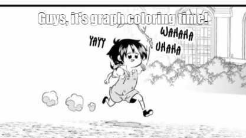

# Vertex coloring

[Go back](..#graph-coloring-problems)

The **rules** are

* you must use the least colors possibles
* two neighbors can't have the same color

We are calling chromatic number (``nombre chromatique``) 
$\gamma(G)$ (gamma) or $\chi(G)$ (chi) of $G$ the minimum
number of colors that we will have to use to color the graph.
This is a value hard to found but we know

* $1 \le \gamma(G) \le n$
* if a graph is not planar: $\gamma(G)=|V|$
* if a graph is planar: $\gamma(G) \le 4$
* if a graph is stable: $\gamma(G)=1$
* if a graph is bipartite: $\gamma(G)=2$
* if a graph is complete: $\gamma(G)=|V|$
* minoring: $\gamma(G) \ge |\text{longest_clique_of_G}|$
* majoring: $\gamma(G) \le d_{max}(G)+1$ (max degree+1)

## Welsh-Powell greedy algorithm

* order the vertex by decreasing degree
* while all vertices are not colored
  * pick the first not colored vertex
  * pick an unused color
  * while conserving the order above, color every uncolored
  vertex, not adjacent to the ones we are coloring with
  this color

To check if the solution is the best one, check if
the solution is

* greater than the minoring: not the best one
* equals than the minoring: good

## Contraction

In French it's called ``Algorithme Reliement-contraction``.
We are either

* contracting two vertex
* linking two vertex with an edge

Your goal is to get a clique. This algorithm is
evaluated as $2^z$ graph to make, with $z$ the number
of edges missing for the graph to be complete.

Algorithm

* until all of our subgraphs are complete
* create 2 subgraph
  * one contracting two vertex
  * one linking two vertex

Once you are done, all the graph at the end should be
complete graphs. The degree of the smallest clique is
the chromatic number. Note that the vertex in the smallest
clique that are contracted together will have the same
color.

