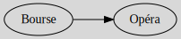

# Introduction

A graph $G$, is a set of vertices (=nodes=`sommets/nœuds`) $V$
linked by edges (=links=`arrêtes`) $E$ giving us the notation
$G(V, E)$. Vertices can have a direction or not.

You will use graphs in databases in GraphDatabase,
check the NoSQL course if that was what you are looking
for.