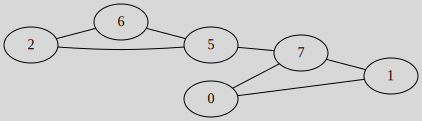

# Eulerian graph

[Go back](..)

A graph is eulerian if

* all vertex's degrees are even
* it has a eulerian cycle/circuit traversing **each edge once**

A graph is semi-eulerian if

* only 2 degree are odd
* it has a eulerian chain/path traversing **each edge once**

Legends say that we are adding "semi-" before eulerian because
adding one vertex will make the graph eulerian.

## Algorithm

Remember: a bridge (=`isthme`) is an edge that once removed
will disconnect the graph. You got one in semi-eulerian
graphs.

* let $S$ be the list of traversed edges
* randomly pick a vertex (unless you got a bridge where at one
  of the bridge extremities)
* while all the edges are not in $S$
  * we are looking at our current vertex links
  * if all of them are in $S$ then "fail"
  * else if the only edge is a link, then we traverse it
  * else we randomly traverse one of the other links

Traversing means adding it to $S$ and changing our
current vertex.

## Example

All degree aside from $d(5)$ and $d(7)$
are even so we may have a semi-eulerian graph. 
We can only start at 5 or 7 because we got a bridge here,
let's start at 7 and look for a eulerian chain

* go to 7
* we can traverse (7,0), (7,1), or (7,5: bridge): (7,0)
* go to 0
* no choice, go to 1: (0,1)
* no choice, go to 7: (1,7)
* no choice, we are destroying the bridge, go to 5: (7,5)
* we can traverse (5,6) or (5,2) : (5,2)
* go to 2
* no choice, go to 6: (2,6)
* no choice, go to 5: (6,5)

So we got the eulerian chain/walk $7-0-1-7-5-2-6-5$
or $(7,0)-(0,1)-(1,7)-(7,5)-(5,2)-(2,6)-(6,5)$.