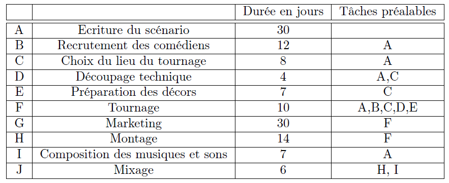

# P.E.R.T. method

[Go back](..#scheduling-problem)

In the P.E.R.T. method, the vertices aren't the tasks anymore, they are the states of our project. When you're doing a task, you putting your project in another state. A task that need other tasks, will now be depending on a state of the project where the do tasks got tackled.

* we got nodes like 1, 2, 3, ... that are the states of our project (1 may not be before 2)
* they have properties
  * early start time
  * last start time
  * free margin (optional)
  * total margin (optional)
* we have a node START
* we have a node END

From one state of your project (START), you may do some tasks like A and B. In P.E.R.T., this is 2 states (1 and 2), and on each edge ($START \to 1$, and $START \to 2$), we will put

* the name of the task
* the cost of the task

But, if a task C is dependant on A and B, this is the same as being dependent of state 1 and state 2. What we do is adding a directed dotted arrow $1 \to 2$ (or $2 \to 1$) with the duration $0$. Then we start the edge with $C(cost)$ from $1$ (resp. $2$, up to the one you picked) giving us $2 \to 3$ (resp. $1 \to 3$).

**Note**: You may have some cases of **redundancy** like C is dependant on A, and D is dependant on C and A. You must remove $A \to D$ because we got it by transitivity since we have $A \to C \to D$.

## Example

This is a specifications table in French. Nothing complicated, you got the task id (A, B, ...), the task full name, the duration (=cost), and the dependencies.

And the resulting P.E.R.T diagram is

 

**Explanations (dependencies)**

* Starting from Start
* The first task is $A(30)$ (since no previous tasks, cost=30)
* So we move to "1" with $A(30)$
* Then B, C, I are **only** dependant of A, we are
making their states like for "1".
* since D is dependant on A and C, and C is dependant on A then we are making D dependant on state 3
* since we are entering state 10 with $I$ and state 9 is dependant (for $J$) from $I$, we are using a directed dotted arrow
* ...

Note: we removed (A, F), (A, D), (C, F) because of redundancy.

**Explanations (early/last start)**

* Start early start is 0 (always)
* 1's early state is $0 + 30$ (previous + A cost)
* 6's early state is $38 + 4$ (previous 38 + D cost)
* ...

As for the last start, once we did all the early_start value, starting from the End

* End's last_start is early_start value (always)
* 9's last_start is $85-6=79$ (End's last_start minus J cost)
* 3's last_start is $min(45-7, 45-4)=38$ (4's last_start minus E cost, and resp. 5's and D)
* ...

**Explanations (free/total margin)**

* The total margin is $\text{last_start-early_start}$
* 9's total margin is simply $79-69=10$
* 10's total margin is simply $79-37=42$
* ...

As for the free margin

* we are trying to get a total margin without changing the next early_date
* 9's free margin is $x + 69 + 6 \le 85 \Leftrightarrow x=10$
* 10's free margin is $x + 37 + 0 \le 69 \Leftrightarrow x=32$
* 5's free margin is $x + 42 + 0 \le 45 \Leftrightarrow x=3$
* ...

**Explanations (note)**

The critical path is $(Start, A, C, E, F, G, End)$.