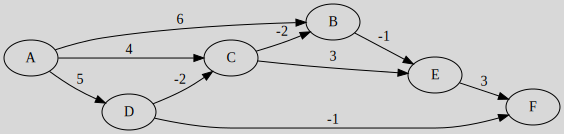

# Bellman–Ford algorithm

[Go back](..)

This algorithm is similar to Dijkstra's algorithm, but the weight can be either positive or negative (complexity $O(n*m)$).

The algorithm will fail if there is a negative-weight cycle because we can always make another iteration and reduce the shortest path value.

You will have up to $|V|-1$ iterations, but if you have an iteration with no changes, then the algorithm is done.

The differences with Dijkstra are for $i+1$

* you start at a vertex
* you will replace the distance if the old one is bigger
* but you can also use the distances calculated in the current iteration

It can be summarized as "at each iteration, you will try to find if you can have a better predecessor for each vertex".

## Example

We are starting from A

| Step |   A  |   B  |   C  |   D  |   E  |   F  |
|------|------|------|------|------|------|------|
|  $0$ | $0$  |$+\infty$|$+\infty$|$+\infty$|$+\infty$|$+\infty$|
|  $1$ |      |$A(6)$|$A(4)$|$A(5)$|$+\infty$ $B(5)$ $\xcancel{C(7)}$|$+\infty$ $D(4)$ $\xcancel{E(8)}$|
|  $2$ |      |$C(2)$|$D(3)$|      |$B(1)$|      |
|  $3$ |      |$C(1)$|      |      |$B(0)$|$E(3)$|
|  $4$ |      |      |      |      |      |      |

The interpretation is the same as for Dijkstra.