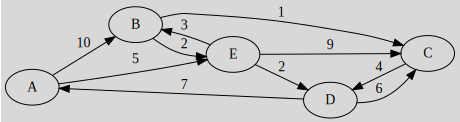

# Dijkstra's algorithm

[Go back](..)

If $G$ is a weighted graph with **only positives
weights** then you can use dijkstra's algorithm
(complexity $O(n^2)$).

Dijkstra will give you the shortest path starting
from a vertex (`A` for instance) to any other vertices
(B, ...).

The easiest way to modelize the dijkstra's algorithm
is a table of the steps (i=0 to n) by the vertices
(A, B, ...). A case like (0,A) is representing the
shortest path value after 0 iterations.

At $i=0$, the shortest path value is $0$ for your
starting vertex and $+\infty$ for all other vertex.
You will also consider your selected vertex done,
meaning that the value as the shortest path value
is the final result.

At $i+1$, (**it's a bit hard to explain, learn with the example**)

* if there is an edge between the last done vertex and
  another one having the weight $w$
* if the other one is not "done"
* and the other one weight is greater $w+\text{last done value}$
* then we replace the shortest path value by $w+\text{last done value}$

Then, once you did all that, you will set as done the
vertex having the least weight until all of them are done.

## Example

<table class="table table-bordered table-striped">
    <thead>
        <tr>
            <th>Step</th>
            <th>A</th>
            <th>B</th>
            <th>C</th>
            <th>D</th>
            <th>E</th>
            <th>Done</th>
        </tr>
    </thead>
    <tbody>
        <tr>
            <td>$0$</td>
            <td>$0$</td>
            <td>$+\infty$</td>
            <td>$+\infty$</td>
            <td>$+\infty$</td>
            <td>$+\infty$</td>
            <td>$A$</td>
        </tr>
    </tbody>
</table>

$A$ is linked to $B$ by 10 and to $E$ by 5. We are replacing
both $+\infty$ since the new weights are smaller
($0+10$ and $0+5$). We are
writing $A(10)$ to remember what value was used
for B sum ($0+10$, the $0$ is A value).

<table class="table table-bordered table-striped">
    <thead>
        <tr>
            <th>Step</th>
            <th>A</th>
            <th>B</th>
            <th>C</th>
            <th>D</th>
            <th>E</th>
            <th>Done</th>
        </tr>
    </thead>
    <tbody>
        <tr>
            <td>$0$</td>
            <td>$0$</td>
            <td>$+\infty$</td>
            <td>$+\infty$</td>
            <td>$+\infty$</td>
            <td>$+\infty$</td>
            <td>$A$</td>
        </tr>
        <tr>
            <td>$1$</td>
            <td>$0$</td>
            <td>$A(10)$</td>
            <td>$+\infty$</td>
            <td>$+\infty$</td>
            <td>$A(5)$</td>
            <td>$E$</td>
        </tr>
    </tbody>
</table>

For the third line, $E(8)$ in $B$ column means
that we added the value of $E=5$ plus the weight
for $weight(E \to B)=3$.
The idea is the same so we are filling our table.

<table class="table table-bordered table-striped">
    <thead>
        <tr>
            <th>Step</th>
            <th>A</th>
            <th>B</th>
            <th>C</th>
            <th>D</th>
            <th>E</th>
            <th>Done</th>
        </tr>
    </thead>
    <tbody>
        <tr>
            <td>$0$</td>
            <td>$0$</td>
            <td>$+\infty$</td>
            <td>$+\infty$</td>
            <td>$+\infty$</td>
            <td>$+\infty$</td>
            <td>$A$</td>
        </tr>
        <tr>
            <td>$1$</td>
            <td></td>
            <td>$A(10)$</td>
            <td>$+\infty$</td>
            <td>$+\infty$</td>
            <td>$A(5)$</td>
            <td>$E$</td>
        </tr>
        <tr>
            <td>$2$</td>
            <td></td>
            <td>$E(8)$</td>
            <td>$E(14)$</td>
            <td>$E(7)$</td>
            <td></td>
            <td>$D$</td>
        </tr>
        <tr>
            <td>$3$</td>
            <td></td>
            <td>$E(8)$</td>
            <td>$D(13)$</td>
            <td></td>
            <td></td>
            <td>$B$</td>
        </tr>
        <tr>
            <td>$4$</td>
            <td></td>
            <td></td>
            <td>$B(9)$</td>
            <td></td>
            <td></td>
            <td>$C$</td>
        </tr>
    </tbody>
</table>

For the interpretation,
the shortest path from A to ... is ...

* A to B is $[A-E-B]$ (weight=8)
* A to C is $[A-E-B-C]$ (weight=9)
* A to D is $[A-E-D]$ (weight=7)
* A to D is $[A-E]$ (weight=5)

If you are wondering how I got these results, for
$A to B$, the weight is the value in the column: $8$
and for the path

* B
* go back to E (since $E(8)$)
* go back to A (since $A(5)$)
* giving us $[A-E-B]$