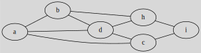

# Adjacency matrix

[Go back](..#advanced-terminology)

This may also be called the boolean matrix (rarely)
or ``Matrice d’adjacence/Matrice booléenne``.
This is a matrix vertex by vertex, and the value are 
0 or 1. If we are at row=A, col=B 

* **1**: $A \to B$ exists 
* **0**: $A \to B$ do not exist 

In a undirected graph, the matrix is symmetric.

## Example 1

The adjacency matrix for

is

\[
\displaylines{
\hspace{0.7cm}\begin{array}{} a&b&c&d&h&i \end{array} \ \ \
\\
\begin{array}{} a\\b\\c\\d\\h\\i \end{array}
\begin{pmatrix}
0 & 1 & 0 & 1 & 0 & 0  \\
1 & 0 & 0 & 1 & 1 & 0  \\
1 & 0 & 0 & 0 & 0 & 1  \\
0 & 0 & 1 & 0 & 1 & 0  \\
0 & 0 & 0 & 0 & 0 & 1  \\
0 & 0 & 0 & 0 & 1 & 0  \\
\end{pmatrix}
}
\]

## Example 2

The adjacency matrix for

is

\[
\displaylines{
\hspace{0.7cm}\begin{array}{} a&b&c&d&h&i \end{array} \ \ \
\\
\begin{array}{} a\\b\\c\\d\\h\\i \end{array}
\begin{pmatrix}
0 & 1 & 1 & 1 & 0 & 0  \\
1 & 0 & 0 & 1 & 1 & 0  \\
1 & 0 & 0 & 1 & 0 & 1  \\
1 & 1 & 1 & 0 & 1 & 0  \\
0 & 1 & 0 & 1 & 0 & 1  \\
0 & 0 & 1 & 0 & 1 & 0  \\
\end{pmatrix}
}
\]

You may have noticed but if we add the edge (d,i),
we got a Wheel ($W_{6}$).