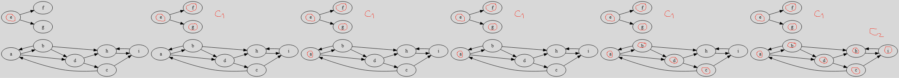

# Connected graphs

[Go back](..#advanced-terminology)

A graph is connected (`connexe`) if we only have
one connected component (`composante connexe`). Otherwise,
we are calling the graph disconnected (`non connexe`).

A connected component is subgraph of $G$ while all
vertex inside are connected. A strong component
(`composante connexe maximale`) is a connected component
in which we can't add more vertex inside.

**Algorithm**

* pick a vertex
* start with the first connected component $C_i$, $i=0$
* while there are vertex remaining
  * for each vertex
    * if $C_i$ is empty or this vertex is adjacent to a vertex
      inside $C_i$
    * then: we add it
    * else: we go to the next vertex
  * i++

When iterating the vertices, you should do it by looking
at the vertex in the edges that incident to a vertex inside
your connected component.

## Super-connectivity

A graph is super-connected ``Forte connexité/f-connexe``
if from any vertex, we can go to any other vertex.

**Algorithm**

* pick a vertex
* mark it "+" and "-"
* mark all vertex we can reach with "+"
* mark all vertex we can be reached from "-"
* you got a first super-connected component (all nodes with "+" and "-")
* if there are remaining edge, restart from one of them

Note: a complete graph is super-connected.

## Terminology

* ??? (``Graphe réduit``)

If $C_1, C_2, C_3$ are super-connected components, then
a graph having the nodes $C_1, C_2, C_3$
is called ``Graphe réduit``. If $A \in C_1$ was adjacent
to $B \in C_2$ then we have $C_1$ is adjacent to $C_2$.

* Bridge (`isthme`)

An edge that, once removed, will disconnect the graph.

* Articulation point (`Point d'articulation`)

A vertex that once removed, will disconnect the graph.

## Example 1 - Connected graph

Let G the graph

1. What are the connected components?
2. Is the graph connected?
3. Create a subgraph $G'$ with $\text{\{a,b,c,d\}}$.
4. Is $G'$ connected? And super-connected?

<blockquote class="spoiler">

1. $C_1=\{e,f,g\}$ and $C_2=\{a,b,c,d,h,i\}$.

Let's apply our connected algorithm

2. No, we got more than one connected component
3. simply extracting the vertex and their edges

4. We got only one component so the graph is connected.
The graph do seems to be super-connected.

Let's apply the super-connected algorithm

The graph is super-connected.

</blockquote>

## Example 2 - Transitive closure and Connectivity

Is the following graph $G$ super-connected?
Tip: use the transitive closure.

<blockquote class="spoiler">

Applying Roy-Warshall algorithm, we got

As you may notice, this is a complete graph
$K_{6}$. Since the transitive closure is a complete
graph, then $G$ is super-connected.

</blockquote>