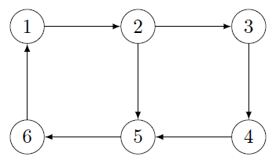
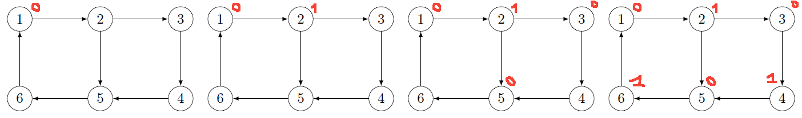
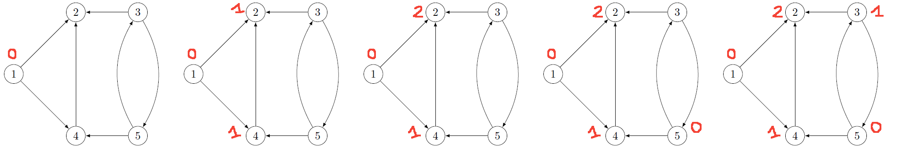

# Independent set

[Go back](..#advanced-terminology)

In French, we are mainly using the keywords
``Stable`` and `Stabilité`.
The independence set, also called
stable set/`ensemble stable` is a set $S$
in which we can't find two vertex that are adjacent.

* **maximal independent set**: not stable anymore if we add a vertex
* **maximum independent set**:
  * we can't make a set with more vertices
  * $\alpha (G) = Card(\text{maximum_stable_set})$
* let $h$ be the highest degree

@
|\text{maximum_stable_set}| \ge \lceil \frac{n}{h+1} \rceil
@

## Partitioning

A partition of $G$ is a set made by taking vertex
(and their edges) from $G. Each subgraph created
must be complete (=a clique). All vertex can only
be used in one clique.

As always

* **maximal partition**: we can't add one more vertex otherwise
this is not a partition anymore
* **maximum partition**: we can't find a greater clique
* **minimum partition**: we can't find a lesser clique
* **minimal partition**: we can't remove one more vertex otherwise
  this is not a partition anymore

And node

* $|S| \le |P|$
* $|S| = |P|$ (if $S$ is a maximum stable set and $P$ a minimum partition)

## Absorbing set

An Absorbing set (`Ensemble absorbant`) is a set where

* each vertex outside the set
* is linked to at least one vertex inside the set

## Kernel

A kernel is a set both stable and absorbing. A graph
can have $0$, $1$ or more kernels.

**Sprague–Grundy function** (`Fonction de Grundy`)

The function is returning the least value we
can give to a vertex. If this is $0$, then the
vertex is inside the Kernel.

* you should start with a kernel without predecessor (if you can)
* give the first vertex value 0
* it's predecessor will have the value 1
* then you should move to one of the predecessor
* if it's predecessor does not have a value
  * then it's 0
  * otherwise this is the least value we can give that is not
  already used by an adjacent vertex

The grundy function result is not unique, **unless** you applied
a topological sorting to sort
the vertex before applying the function.

## Example 1 - Independent set and grundy function

Given this graph $G$

Give

* a maximal independent set
* a maximum independent set
* a absorbing set
* the kernel(s) using grundy function

<blockquote class="spoiler">

You should consider the graph as non-oriented
for the independent sets.

* a maximal independent set: $(6,3)$
* a maximum independent set: $(1,5,3)$
* an absorbing set: $(1,2,3,4,5,6)$ :) 
* or $(2, 4, 5, 6)$ because
  * 4 is absorbing (3)
  * 5 is absorbing (2, 4)
  * 2 is absorbing (1)
  * 6 is absorbing (5)

An using **Grundy function**, starting from $1$, we have

* the first one is in the kernel so $g(1)=0$
* next is the successor $2$
  * the neighbors took the values $\text{\{0\}}$
  * the lowest value we can give is $1$
  * $g(2)=1$
* next are the successors $3,5$
  * ... $\text{\{1\}}$, the lowest ... $0$
  * $g(3)=0$ and $g(5)=0$
* next is the successor $4$
  * ... $\text{\{0\}}$, the lowest ... $1$
  * $g(4)=1$
* next is the successor $6$
  * ... $\text{\{0\}}$, the lowest ... $1$
  * $g(6)=1$

We got the kernel $(1,5,3)$. Starting from another
vertex like $4$, we would have found the other
kernel $(2,4,6)$.
</blockquote>

## Example 2 - Grundy function

Find a kernel for this graph using the grundy
function

<blockquote class="spoiler">
You should have noticed that $1$ do not have
any predecessors so we MUST start at $1$.

Then

* $g(2)=g(4)=1$ because $g(1)=0$
* $g(2)=2$ because we have the predecessors already have 
  * $g(1)=0$
  * $g(4)=1$
* then you got **a choice** (=two kernels)
  * $g(5)=0$ and $g(3)=1$
  * $g(3)=0$ and $g(5)=2$
</blockquote>