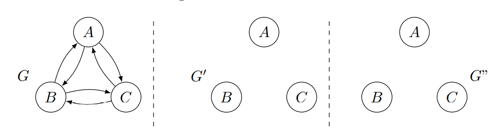
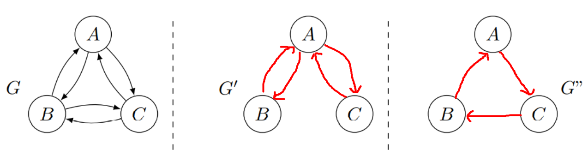
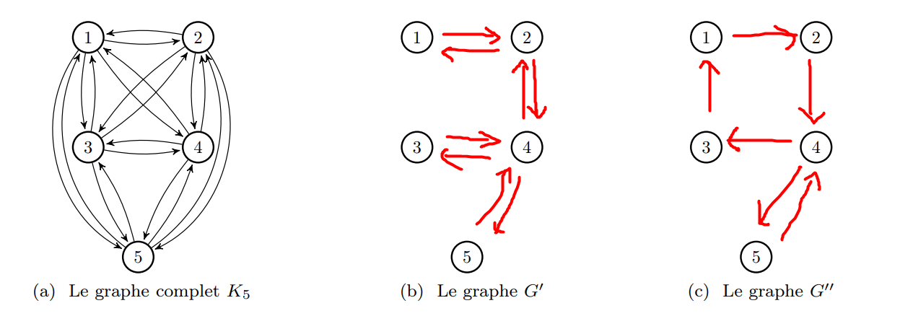

# Spanning subgraph

[Go back](..#advanced-terminology)

A spanning subgraph or `Graphe partiel/Sous-graphe couvrant` $G'$ of a graph $G$ is a graph 

* $V_{G'} = V_G$: having the same vertices
* $E_{G'}\ \subset\ E_G$: $G'$ edge set is a subset of $G$ edge set

## $\tau$-equivalent

$G$ and $G'$ are said to be $\tau$-equivalent (read as tau-equivalent) if

* they have the same transitive closure
* $G'$ is a subgraph of $G$

## $\tau$-minimal $\tau$-equivalent

Let $G'$ be a $\tau$-equivalent of $G$. $G'$ is $\tau$-minimal $\tau$-equivalent if removing one edge make it lose the $\tau$-equivalent property.

Note: you can replace minimal by maximal and removing by adding.

## $\tau$-minimum $\tau$-equivalent

Let graph $G'$ be $\tau$-equivalent$\tau$-minimal $\tau$-equivalent of $G$. If we can't find a graph $G'$ with a lesser number of edges while still being $\tau$-minimal $\tau$-equivalent, then $G'$ is $\tau$-minimum $\tau$-equivalent.

Note: you can replace minimum by maximum, minimal by maximal, and lesser by bigger.

## Example 1

Given the graph $G$, make it so that

* $G'$: $\tau$-minimal $\tau$-equivalent
* $G''$: $\tau$-minimum $\tau$-equivalent

<blockquote class="spoiler">

That isn't the only answer, but you should check that each of your answers

* is a subgraph of $G$
* the transitive closing is equals to $G$ (since G is complete)
</blockquote>

## Example 2

Same for

<blockquote class="spoiler">

</blockquote>
