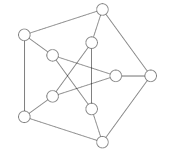
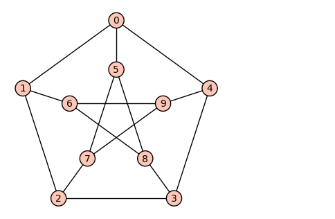

# Planar graph

[Go back](..#advanced-terminology)

A planar graph (`Graphe planaire`), is a graph that could be drawn without having two edges crossing each other. We are calling planar representation/``Graphe planaire topologique``, the planar representation of a planar graph.

When we are drawing a planar graph, we will have

## Face

Do you know the bucket tool in image editors? A face is something colored by the bucked tool in one go. You got at least one unbounded face, which is the one not colored after coloring all of your faces.

A face is a surface of the graph delimited by edges. It can be either a

* bounded face/``face finie``
* external, outer or unbounded face/``face infinie``

## Dual graph

We are calling Dual graph (`Graphe dual`), the graph made using the faces as vertices. If we have two faces $F_1$ and $F_2,$ and if $A \in F_1$ was adjacent to $B \in F_2$ then we have $F_1$ is adjacent to $F_2$.

## Bounds

Note that you can only use a vertex once inside the bounds (`Frontière/contour`) of a face. The bounds are a list of edges you used to delimit a face. The bounds are forming a cycle basis in a planar representation.

## Graph minor

You can get the minor of a graph by

* removing an edge
* contracting an edge (the vertex and their edges are merged)
* deleting an edge having a degree of one (isolated, $d(vertex) = 1$)

## Check if the graph is planar

Let $m=\\#edges=|E|$, $n=\\#vertices=|V|$ and $f=\\#faces$, then a graph is planar if

* **Euler's formula**: $n-m+f=2$ (you can find $f$ with $f=m-n+2$)
* if $m < 3n - 5$ in a connected graph
* **Kuratowski's theorem**
  * The graphs $K_{3,3}$ and $K_5$ are not planar
  * A subgraph of these is not planar
* **Robertson–Seymour theorem**
  * A graph minor of $K_{3,3}$ and $K_5$ is not planar

Other notes

* if the $\forall{i \in V},\ d(i) \gt 5$, the graph is NOT planar
* if a graph is planar, then $\exists{i \in V},\ d(i) \lt 6$
* According to the English wikipedia, a graph is planar if
  * $m \le 3n - 6$ (yeah it's 6 not 5)
  * $f \le 2n - 4$
  * if there are no cycles of length 3, $m \le 2n-4$

## Example 1

Are the following graphs planar?

<blockquote class="spoiler">

The first graph is planar because it's $K_5$.

The second one is planar, because I found a planar representation. Notice that we have $n + m = f = 2$ ($n=5$, $m=9$, $f=6$=five+the outer face)

The third graph has a subgraph $K_{3,3}$ so it's not planar.

The fourth graph $m=12 \le 6 * 3 - 5 \le 13$ so the graph is planar. Simply move the vertices "4" and "5".

All degrees are equals to $6$, so the graph is not planar. We could have used $m < 3n - 5$.

As for the sixth graph, it's not planar either. I used Robertson–Seymour theorem and found that the minor of the graph (by only merging vertices) is $K_6$ so if I remove one more vertex, it's $K_5$ and $K_5$ is not a planar graph.

</blockquote>

## Example 2

Use **Robertson–Seymour theorem** and demonstrate that the Petersen graph is not planar.

<blockquote class="spoiler">

This answer can be found on Wikipedia [source](https://en.wikipedia.org/wiki/Planar_graph). Here is a copy

</blockquote>