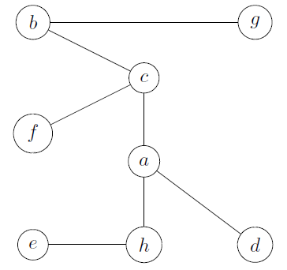

# Spanning tree

[Go back](..)

A spanning tree $T$ of a Graph $G$ is a partial graph of $G$ that is a tree, meaning we are removing edges until we have a tree.

* do not exist if $G$ is disconnected
* T is a partial connected and acyclic graph of G
* the edges removed are making a cycle basis (`base de cycles`)

## Exercise 1

Given this graph $G$, give a spanning tree $T$

<blockquote class="spoiler">

* we are randomly picking the edges (that we may remove)
  * (b,f) from b,c,f,b
  * (f,e) from f,c,a,h,e,f
  * (h,d) from a,d,h,a
  * (g,d) from a,d,g,b,c,a
* we are checking if this is a tree (acyclic and connected)
* we are good
* our spanning tree is

Another answer: $(b,f),(e,h),(h,d),(b,g)$.
</blockquote>