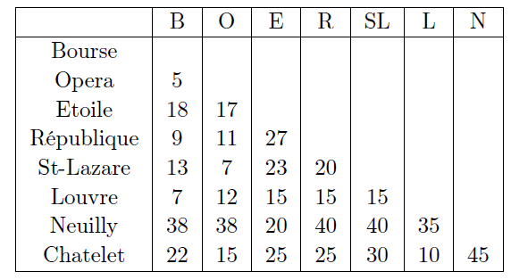
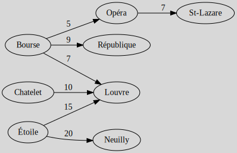

# Minimum weight spanning tree (MST)

[Go back](..)

You are usually given a non oriented graph
(if the graph is oriented, consider it as non oriented)
with a weight on your edges. Your job is to create
a Minimum weight spanning tree (`Arbre couvrant de poids minimum (ACM)`)
by minimizing the total weight.

**Kruskal's algorithm**

1. Draw all of your vertices
2. While we can add new edges (not a tree yet)
   1. take the edges with the least weight
   2. try adding it (if you are not making a cycle)

**Prim's algorithm**

1. Draw all of your vertices
2. While you are not done
    1. pick a vertex
    2. draw the edges from this vertex to others
    3. if an edge is creating a cycle, we remove the one
       with the biggest weight

## Exercise 1 (Kruskal)

Create a tree from this table. The value
at the line "Chatelet" and the column "N"
is the cost for constructing a road from "N" (Neuilly)
to "Chatelet".

<blockquote class="spoiler">

We are creating 8 vertex for our 8 destinations. Then
we are looking at least cost in the the whole table.
It's 5 so if adding B (Bourse) - Opera is creating a cycle

* then we do not add it
* otherwise we add it

And we are doing that until all the nodes are linked.

</blockquote>