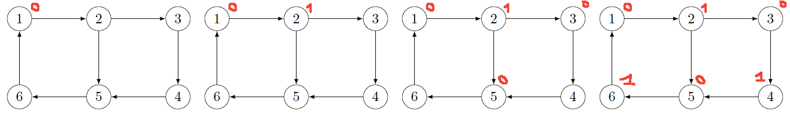

# Graph Coloring Problems Examples

## Vertex coloring Greedy Algorithm Example

Use the Welsh-Powell greedy algorithm and find the coloration for the following graph. Is it the optimal solution?

* $d(D)=7$
* $d(F)=6$
* $d(A)=d(C)=5$
* $d(B)=d(G)=d(H)=4$
* $d(E)=3$

Giving us the following table:

| Colors\Vertex | D | F | A | C | B | G | H | E |
|---------------|---|---|---|---|---|---|---|---|
| Red           | o | x | x | x | x | x | x | x |
| Yellow        |   | o | x | o | x | x | x | x |
| Green         |   |   | o |   | x | x | o | x |
| Blue          |   |   |   |   | o | o |   | o |

* o=colored
* x=not colored since neighbor to a colored
* "nothing"=already colored

The longest clique is $D-C-A-H$ (size=4) and we colored the graph in $4$ colors, so this is the optimal solution. We had the clique $F-D-G-E$ too.

## Vertex coloring Contraction Algorithm Example

Use the contraction algorithm to find a coloration for this graph:

We have 4 missing edges, so we will have up to $2^4=16$ subgraphs. We are missing the following edges: $[c,b], [d,b], [e,b], [c,f]$.

Let's apply the algorithm <small>(note: C=Contraction, L=Link=Connect)</small>:

The smallest clique among the **7** graphs with the symbol ✔️ is:

* $CF-DB-E-A$: 4 colors
* $CF-D-BE-A$: 4 colors

It means one way to color the graph is:

## Grundy Function Example 1

Use Grundy on the following graph $G$:

Using **Grundy function**, starting from $1$, we have:

* The first one is in the kernel, so $g(1)=0$
* Next is the successor $2$
    * the neighbors took the values $\text{\{0\}}$
    * the lowest value we can give is $1$
    * $g(2)=1$
* Next are the successors $3,5$
    * ... $\text{\{1\}}$, the lowest ... $0$
    * $g(3)=0$ and $g(5)=0$
* Next is the successor $4$
    * ... $\text{\{0\}}$, the lowest ... $1$
    * $g(4)=1$
* Next is the successor $6$
    * ... $\text{\{0\}}$, the lowest ... $1$
    * $g(6)=1$

We got the kernel $(1,5,3)$. Starting from another vertex like $4$, we would have found the other kernel $(2,4,6)$.

## Grundy Function Example 2

Find a kernel for this graph using the grundy function

Vertex $1$ does not have any predecessors, so we must start at $1$.

Then:

* $g(2)=g(4)=1$ because $g(1)=0$
* $g(2)=2$ because we have the predecessors already have:
    * $g(1)=0$
    * $g(4)=1$
* Then we have **a choice** (=two kernels)
    * $g(5)=0$ and $g(3)=1$
    * $g(3)=0$ and $g(5)=2$

## Grundy Function Example 3

Find a kernel for this graph using the Grundy function after sorting the vertices by successors.

Let's sort the vertices:

* $3$: 0 successor
* $5$: 1 successor
* $7$: 1 successor
* $8$: 1 successor
* $1$: 2 successors
* $2$: 2 successors
* $4$: 2 successors
* $6$: 4 successors

And the result is:

* $g(3)=0$ <small>(no successors $\to$ should be the start, inside the kernel)</small>
* $5$ is not a neighbor of $3$: $g(5)=0$
* $7$ is not a neighbor of $3,5$: $g(7)=0$
* $8$ is a neighbor of $g(3)=0$: $g(8)=1$
* $1$ is a neighbor of $g(3)=0, g(5)=0$: $g(1)=1$
* $4$ is a neighbor of $g(3)=0, g(8)=1$: $g(4)=2$
* $2$ is a neighbor of $g(5)=0, g(4)=2$: $g(2)=1$
* $6$ is a neighbor of $g(1)=g(2)=g(8)=1, g(7)=0$: $g(6)=2$

The kernel is $3,5,7$.

## Grundy Function Example 4

Given this adjacency matrix, calculate the Grundy function.

Let's sort the vertices

* $0$: 2 successor
* $1$: 3 successor
* $2$: 2 successor
* $3$: 1 successor
* $4$: 2 successor
* $5$: 1 successor
* $6$: 1 successor
* $7$: 1 successor
* $8$: 0 successor

Giving us $8-3-5-6-7-0-2-4-1$.

* $g(8)=0$ (no successors $\to$ should be the start, inside the kernel)
* $7$ is a neighbor of $g(8)=0$: $g(7)=1$
* $5$ is a neighbor of $g(7)=1$: $g(5)=0$
* $3$ is a neighbor of $g(5)=0$: $g(3)=1$
* $6$ is a neighbor of $g(7)=1$: $g(6)=0$
* $4$ is a neighbor of $g(8)=g(6)=0$: $g(4)=1$
* $2$ is a neighbor of $g(7)=1, g(5)=0$: $g(2)=2$
* $1$ is a neighbor of $g(2)=2, g(3)=g(4)=1$: $g(1)=0$
* $0$ is a neighbor of $g(1)=0, g(4)=1$: $g(0)=2$

The kernel is $1,5,6,8$.

**Note**: we processed $7$ before $3$/$5$ because both  depended on it.

