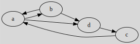
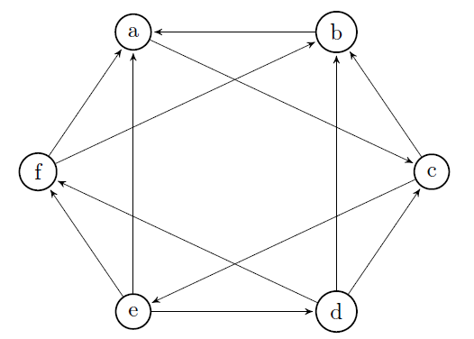
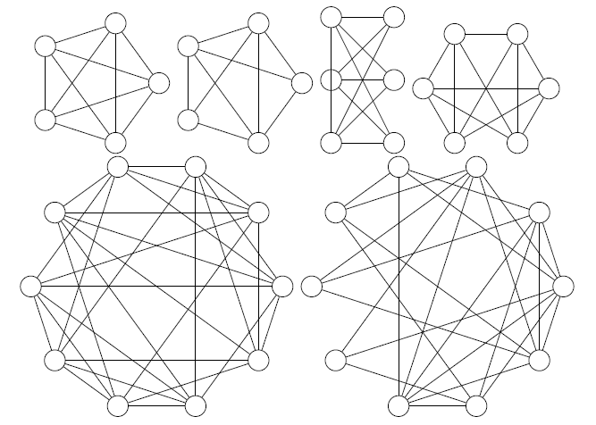

# Graph Properties and Concepts Examples

## Connected Graph Example

Given the following graph $G$:

#### What are the connected components?

We have $C_1=\{e,f,g\}$ and $C_2=\{a,b,c,d,h,i\}$ using the algorithm.

#### Is the graph connected?

No, we got more than one connected component.

#### Create a subgraph $G'$ with $\text{\{a,b,c,d\}}$.

We extract the vertices and their edges.

#### Is $G'$ connected? And super-connected?

We got only one component, so the graph is connected. The graph does seem to be super-connected. We apply the algorithm:

All vertices are marked with "+" and "-", the graph is super-connected.

## Transitive closure and Connectivity Example

Use the transitive closure to determine if $G$ is super-connected.

Using Roy-Warshall's algorithm, we got the transitive closure:

This is a complete graph $K_{6}$. Since the transitive closure is a complete graph, then $G$ is super-connected.

For reference, here is Roy-Warshall's algorithm:

The complete algorithm (text)

* **picking A**
* $s=C$, $p=B$, creating (B,C)? yes
* $s=C$, $p=E$, creating (E,C)? yes
* $s=C$, $p=F$, creating (F,C)? yes
* **picking B**
* $s=A$, $p=C$, creating (C,A)? yes
* $s=A$, $p=F$, creating (F,A)? no
* $s=A$, $p=D$, creating (D,A)? yes
* $s=C$, $p=F$, creating (F,C)? no
* $s=C$, $p=D$, creating (D,A)? no
* **picking C**
* $s=B$, $p=A$, creating (A,B)? yes
* $s=B$, $p=D$, creating (D,B)? no
* $s=B$, $p=E$, creating (E,B)? yes
* $s=B$, $p=F$, creating (F,B)? no
* $s=E$, $p=A$, creating (A,E)? yes
* $s=E$, $p=B$, creating (B,E)? yes
* $s=E$, $p=D$, creating (D,E)? yes
* $s=E$, $p=F$, creating (F,E)? yes
* **picking D**
* $s=A$, $p=E$, creating (E,A)? no
* $s=B$, $p=E$, creating (E,B)? no
* $s=C$, $p=E$, creating (E,C)? no
* $s=E$
* $s=F$, $p=E$, creating (E,F)? no
* **picking E**
* $s=A$, $p=B$, creating (B,A)? no
* $s=A$, $p=C$, creating (C,A) ? yes
* $s=A$, $p=D$, creating (D,A)? no
* $s=A$, $p=F$, creating (F,A)? no
* $s=B$, $p=A$, creating (A,B)? no
* $s=B$, $p=C$, creating (C,B)? no
* $s=B$, $p=D$, creating (D,B)? no
* $s=B$, $p=F$, creating (F,B)? no
* $s=C$, $p=A$, creating (A,C)? no
* $s=C$, $p=B$, creating (B,C)? no
* $s=C$, $p=D$, creating (D,C)? no
* $s=C$, $p=F$, creating (F,C)? no
* $s=D$, $p=A$, creating (A,D)? yes
* $s=D$, $p=B$, creating (B,D)? yes
* $s=D$, $p=C$, creating (C,D)? yes
* $s=D$, $p=F$, creating (F,D)? yes
* $s=F$, $p=A$, creating (A,F)? yes
* $s=F$, $p=B$, creating (B,F)? yes
* $s=F$, $p=C$, creating (C,F)? yes
* $s=F$, $p=D$, creating (D,F)? no
* $s=F$
* **picking F**
* done

## Planar Graph Example

Are the following graphs planar?

##### Planar Graph Example Graph 1

The first graph is planar because it's $K_5$.

##### Planar Graph Example Graph 2

The second one is planar as it as at least one planar representation.

✅ $n + m = f = 2$ <small>($n=5$, $m=9$, $f=6$=five+the outer face)</small>.

##### Planar Graph Example Graph 3

A subgraph of the third graph is $K_{3,3}$ so it's not a planar graph.

##### Planar Graph Example Graph 4

The fourth graph $m=12 \le 6 * 3 - 5 \le 13$, so the graph is planar. Simply move the vertices "4" and "5" to the locations I marked.

##### Planar Graph Example Graph 5

All degrees are equals to $6$, so the graph is not planar. Alternatively, we could have used the formula $m < 3n - 5$.

##### Planar Graph Example Graph 6

We can merge vertices and get the minor of the graph which is $K_6$. If we remove any vertex, we got the subgraph $K_5$. As per Robertson–Seymour theorem, it's not a planar graph.

## Cycle basis Example

Given the following graph:

We will use the following ordered edges:

@
E = \\{(a,b),(a,c),(a,d),(b,c),(b,f),(c,e),(c,f),(d,e),(e,f)\\}
@

##### What's the vector for $(bcfb)$?

$(bcfb) \to (0,0,0,1,-1,0,1,0,0)$.

* ...
* the 4th value is $1$ since $bc$ is in $bcfb$ in the same order
* the 5th value is $-1$ since $bf$ is in $bcfb$ ($fb$) in another order
* ...

##### What's the vector for $(abfeda)$?

$(abfeda) \to (1,0,-1,0,1,0,0,-1,-1)$.

##### $(bcfb)$ is a linear combination of 2 cycles. Which ones?

One answer would be $(bcfb) = (bcefb) + (ecfe)$.

\[
\begin{split}
(bcfb) \to (0,0,0,1,-1,0,1,0,0) =\\
(0,0,0,1,-1,1,0,0,1) + (0,0,0,0,0,-1,1,0,-1) =\\
(bcefb) + (ecfe)
\end{split}
\]

##### What's $\mu(G)$?

$\mu(G) = m - n + p \Leftrightarrow 9-6+1 = 4$

##### Give a cycle basis $B$ which doesn't include both $(bcfb)$ and $(abfeda)$.

$B = \\{(abca), (cfec), (acefba), (adeca)\\}$

You must look for cycles that have an arc that is not in a cycle you already created, so that you are sure that can't get it by linear combination. Notice that we got $4$ cycles inside $B$, as calculated.

## Co-cycle basis Exercise

Given the following graph:

We will use the following ordered edges:

@
E = \\{(a,b),(a,c),(a,d),(b,c),(b,f),(c,e),(c,f),(d,e),(e,f)\\}
@

##### What's the vector for $(abf)$?

$(abf) \to (0,1,1,1,0,0,-1,0,-1)$

* ...
* the $2^{nd}$ value $(a,c)$, $a$ is inside, $c$ outside so $1$
* ...
* the $7^{th}$ value $(c,f)$, $c$ is outside, $f$ inside so $-1$
* ...

##### What's the vector for $(ae)$?

$(ae) \to (1, 1, 1, 0, 0, -1, 0, -1, 1)$.

##### $(ae)$ is a linear combination of 2 co-cycles. Which ones?

Possible answer: $(ae) = (a) + (e)$ <small>(because they are a stable set)</small>

##### What's $\gamma(G)$?

$\gamma(G) = n - p \Leftrightarrow 6-1 = 5$

##### Give a cycle basis $B$ which doesn't include co-cycles of one vertex.

$B' = \\{(abc), (bcf), (cfe), (aced), (abfed)\\}$

Notice that we got $5$ co-cycles inside $B$, as calculated.

