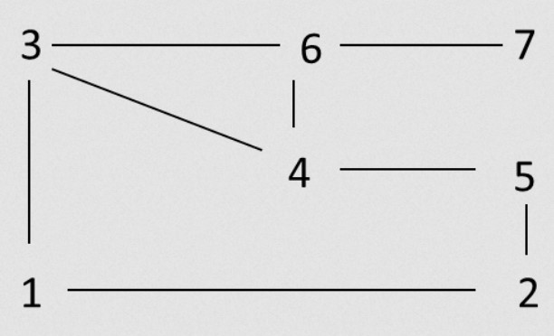
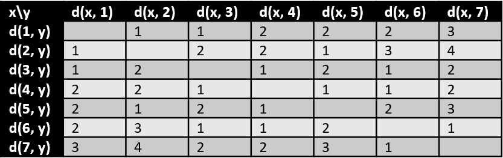
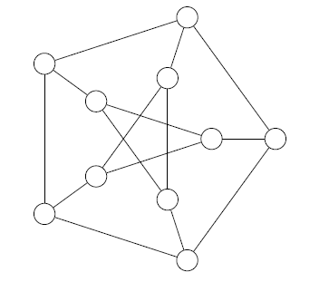

# Random Graph Examples

## Distance and Diameter Example

Given the following graph:

We would have the following table:

The value for $d(x, 2) * d(1, y) = 1$ means that when the starting vertex is $1$ and the ending vertex is $2$, then the distance is $1$.

You could read that the diameter is $4$ because the longest path is $7-6-4-5-2$ (4 edges) (or $2-5-4-6-7$).

## Graph Matching Example

Give a maximal matching, maximum matching, and perfect matching of the graph $G$.

Note: this graph is called the Petersen graph.

<blockquote class="spoiler">
Note

* red: picked
* blue: removed

Using the algorithm, I could get the following maximal matching

I found this perfect matching, which means that I also found a maximal and a maximum matching

</blockquote>