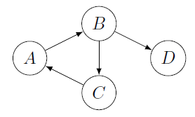

# Graph Representations Examples

## Adjacency Matrix Examples

Given the following graph:

The adjacency matrix is:

\[
\displaylines{
\hspace{0.7cm}\begin{array}{} a&b&c&d&h&i \end{array} \ \ \
\\
\begin{array}{} a\\b\\c\\d\\h\\i \end{array}
\begin{pmatrix}
0 & 1 & 0 & 1 & 0 & 0  \\
1 & 0 & 0 & 1 & 1 & 0  \\
1 & 0 & 0 & 0 & 0 & 1  \\
0 & 0 & 1 & 0 & 1 & 0  \\
0 & 0 & 0 & 0 & 0 & 1  \\
0 & 0 & 0 & 0 & 1 & 0  \\
\end{pmatrix}
}
\]

Given the following graph:

The adjacency matrix is:

\[
\displaylines{
\hspace{0.7cm}\begin{array}{} a&b&c&d&h&i \end{array} \ \ \
\\
\begin{array}{} a\\b\\c\\d\\h\\i \end{array}
\begin{pmatrix}
0 & 1 & 1 & 1 & 0 & 0  \\
1 & 0 & 0 & 1 & 1 & 0  \\
1 & 0 & 0 & 1 & 0 & 1  \\
1 & 1 & 1 & 0 & 1 & 0  \\
0 & 1 & 0 & 1 & 0 & 1  \\
0 & 0 & 1 & 0 & 1 & 0  \\
\end{pmatrix}
}
\]

## Incidence Matrix Example

Given the following graph:

The incidence matrix is:

\[
\displaylines{
\hspace{0.7cm}\begin{array}{}\ a&\ \ \ b&\ \ \ c&\ \ \ d&\ \ \ h&i \end{array} \ \ \
\\
\begin{array}{} a\\b\\c\\d\\h\\i \end{array}
\begin{pmatrix}
0 & 1 & -1 & 1 & 0 & 0  \\
1 & 0 & 0 & 1 & 1 & 0  \\
1 & 0 & 0 & -1 & 0 & 1  \\
-1 & -1 & 1 & 0 & 1 & 0  \\
0 & -1 & 0 & -1 & 0 & 1  \\
0 & 0 & -1 & 0 & 1 & 0  \\
\end{pmatrix}
}
\]

## Transitive closure Example

#### Example 1 (Roy-Warshall algorithm)

Given the following graph:

Apply the Roy-Warshall algorithm.

<blockquote class="spoiler">

* **picking** A
* $p=C$, $s=B$, creating (C, B)? yes
* **picking** B
* $p=A$, $s=D$, creating (A, D)? yes
* $p=A$, $s=C$, creating (A, C)? yes
* $p=C$, $s=D$, creating (C, D)? yes
* **picking** C
* $p=B$, $s=A$, creating (B, A)? yes
* $p=A$, $s=B$, creating (A, B)? no
* **picking** D
* done
</blockquote>

#### Example 2 (Roy-Warshall algorithm)

Given the following adjacency matrix with $V=\lbrace A, B, C, D\rbrace$:

\[
\begin{pmatrix}
0&1&1&0\\
1&0&0&1\\
0&0&0&1\\
0&1&0&0
\end{pmatrix}
\]

Apply the Roy-Warshall algorithm. 💡 Predecessors are in the column and successors are in the line of the vertex we picked.

<blockquote class="spoiler">

* **picking** A
* $s=B$, $p=B$? creating (B, B)? no
* $s=C$, $p=B$? creating (B, C)? yes
* **picking** B
* $s=A$
    * $p=A$? creating (A, A)? no
    * $p=D$? creating (D, A)? yes
* $s=C$
    * $p=A$? creating (A, C)? no
    * $p=D$? creating (D, C)? yes
* $s=D$
    * $p=A$? creating (A, D)? yes
    * $p=D$? creating (D, D)? no
* **picking** C
* $s=D$
    * $p=A$? creating (A, D)? no
    * $p=B$? creating (B, D)? no
    * $p=D$? creating (C, D)? no
* **picking** D
* $s=A$, $p=C$? creating (C, A)? yes
* $s=B$, $p=C$? creating (C, B)? yes
* $s=B$, $p=C$? creating (C, B)? yes
</blockquote>

