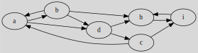

# Graph Representations Examples

$$

## Adjacency Matrix Examples

Given the following graph:

The adjacency matrix is:

\[
\displaylines{
\hspace{0.7cm}\begin{array}{} a&b&c&d&h&i \end{array} \ \ \
\\
\begin{array}{} a\\b\\c\\d\\h\\i \end{array}
\begin{pmatrix}
0 & 1 & 0 & 1 & 0 & 0  \\
1 & 0 & 0 & 1 & 1 & 0  \\
1 & 0 & 0 & 0 & 0 & 1  \\
0 & 0 & 1 & 0 & 1 & 0  \\
0 & 0 & 0 & 0 & 0 & 1  \\
0 & 0 & 0 & 0 & 1 & 0  \\
\end{pmatrix}
}
\]

Given the following graph:

The adjacency matrix is:

\[
\displaylines{
\hspace{0.7cm}\begin{array}{} a&b&c&d&h&i \end{array} \ \ \
\\
\begin{array}{} a\\b\\c\\d\\h\\i \end{array}
\begin{pmatrix}
0 & 1 & 1 & 1 & 0 & 0  \\
1 & 0 & 0 & 1 & 1 & 0  \\
1 & 0 & 0 & 1 & 0 & 1  \\
1 & 1 & 1 & 0 & 1 & 0  \\
0 & 1 & 0 & 1 & 0 & 1  \\
0 & 0 & 1 & 0 & 1 & 0  \\
\end{pmatrix}
}
\]

