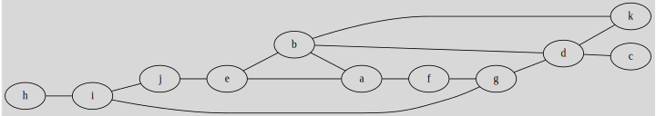
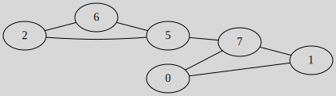

# Sorting and search Examples

## Depth-first search Example

Use the Depth-first search to explore the following graph:

The starting point is **h** (arbitrarily).

Below, $\text{a, b, c} \to \text{a}$, means that among the vertices, I picked the vertex $a$, according to the algorithm after examining "marked" and "done".

<table class="table table-bordered border-dark table-dark bg-transparent">
    <thead>
        <tr>
            <th>Current</th>
            <th>Next?</th>
            <th>Marked</th>
            <th>Done</th>
        </tr>
    </thead>
    <tbody>
        <tr>
            <td>$\text{h}$</td>
            <td>$\text{i} \to \text{i}$</td>
            <td>$\text{\{h\}}$</td>
            <td>$\text{\{\}}$</td>
        </tr>
        <tr>
            <td>$\text{i}$</td>
            <td>$\text{h, j, g} \to \text{j}$</td>
            <td>$\text{\{h, i\}}$</td>
            <td>$\text{\{\}}$</td>
        </tr>
        <tr>
            <td>$\text{j}$</td>
            <td>$\text{i, e} \to \text{e}$</td>
            <td>$\text{\{h, i, j\}}$</td>
            <td>$\text{\{\}}$</td>
        </tr>
        <tr>
            <td>$\text{e}$</td>
            <td>$\text{j, b, a} \to \text{b}$</td>
            <td>$\text{\{h, i, j, e\}}$</td>
            <td>$\text{\{\}}$</td>
        </tr>
        <tr>
            <td>$\text{b}$</td>
            <td>$\text{e, a, d, k} \to \text{a}$</td>
            <td>$\text{\{h, i, j, e, b\}}$</td>
            <td>$\text{\{\}}$</td>
        </tr>
        <tr>
            <td>$\text{a}$</td>
            <td>$\text{e, b, f} \to \text{f}$</td>
            <td>$\text{\{h, i, j, e, b, a\}}$</td>
            <td>$\text{\{\}}$</td>
        </tr>
        <tr>
            <td>$\text{f}$</td>
            <td>$\text{a, g} \to \text{g}$</td>
            <td>$\text{\{h, i, j, e, b, a, f\}}$</td>
            <td>$\text{\{\}}$</td>
        </tr>
        <tr>
            <td>$\text{g}$</td>
            <td>$\text{i, f, d} \to \text{d}$</td>
            <td>$\text{\{h, i, j, e, b, a, f, g\}}$</td>
            <td>$\text{\{\}}$</td>
        </tr>
        <tr>
            <td>$\text{d}$</td>
            <td>$\text{b, g, c, k} \to \text{c}$</td>
            <td>$\text{\{h, i, j, e, b, a, f, g, d\}}$</td>
            <td>$\text{\{\}}$</td>
        </tr>
        <tr>
            <td>$\text{c}$</td>
            <td>$\text{d} \to \text{???}$</td>
            <td>$\text{\{h, i, j, e, b, a, f, g, d, c\}}$</td>
            <td>$\text{\{\}}$</td>
        </tr>
        <tr>
            <td colspan="4">
                Notice that $\text{d}$, the only neighbor
                of $c$, is inside
                "Marked", meaning that $c$ is a <b>dead end</b>.
                We mark $c$ as "done" and go back to $d$.
            </td>
        </tr>
        <tr>
            <td>$\text{c}$</td>
            <td>$\text{d} \to \text{d}$</td>
            <td>$\text{\{h, i, j, e, b, a, f, g, d, c\}}$</td>
            <td>$\text{\{c\}}$</td>
        </tr>
        <tr>
            <td>$\text{d}$</td>
            <td>$\text{b, g, k} \to \text{k}$</td>
            <td>$\text{\{h, i, j, e, b, a, f, g, d, c, d\}}$</td>
            <td>$\text{\{c\}}$</td>
        </tr>
        <tr>
            <td>$\text{k}$</td>
            <td>$\text{b, d} \to^{done} \text{d}$</td>
            <td>$\text{\{h, i, j, e, b, a, f, g, d, c, d, k\}}$</td>
            <td>$\text{\{c, k\}}$</td>
        </tr>
        <tr>
            <td>$\text{d}$</td>
            <td>$\text{b, g, k} \to^{done} \text{g}$</td>
            <td>$\text{\{h, i, j, e, b, a, f, g, d, c, d, k, d\}}$</td>
            <td>$\text{\{c, k, d\}}$</td>
        </tr>
        <tr>
            <td>$\text{g}$</td>
            <td>$\text{i, f} \to^{done} \text{f}$</td>
            <td>$\text{\{h, i, j, e, b, a, f, g, d, c, d, k, d, g\}}$</td>
            <td>$\text{\{c, k, d, g\}}$</td>
        </tr>
        <tr>
            <td>$\text{f}$</td>
            <td>$\text{a} \to^{done} \text{a}$</td>
            <td>$\text{\{h, i, j, e, b, a, f, g, d, c, d, k, d, g, f\}}$</td>
            <td>$\text{\{c, k, d, g, f\}}$</td>
        </tr>
        <tr>
            <td>$\text{a}$</td>
            <td>$\text{e, b} \to^{done} \text{b}$</td>
            <td>$\text{\{h, i, j, e, b, a, f, g, d, c, d, k, d, g, f, a\}}$</td>
            <td>$\text{\{c, k, d, g, f, a\}}$</td>
        </tr>
        <tr>
            <td>$\text{a}$</td>
            <td>$\text{e} \to^{done} \text{e}$</td>
            <td>$\text{\{h, i, j, e, b, a, f, g, d, c, d, k, d, g, f, a, b\}}$</td>
            <td>$\text{\{c, k, d, g, f, a, b\}}$</td>
        </tr>
        <tr>
            <td>$\text{e}$</td>
            <td>$\text{j} \to^{done} \text{j}$</td>
            <td>$\text{\{h, i, j, e, b, a, f, g, d, c, d, k, d, g, f, a, b, e\}}$</td>
            <td>$\text{\{c, k, d, g, f, a, b, e\}}$</td>
        </tr>
        <tr>
            <td>$\text{j}$</td>
            <td>$\text{i} \to^{done} \text{i}$</td>
            <td>$\text{\{h, i, j, e, b, a, f, g, d, c, d, k, d, g, f, a, b, e, i\}}$</td>
            <td>$\text{\{c, k, d, g, f, a, b, e, i\}}$</td>
        </tr>
        <tr>
            <td>$\text{i}$</td>
            <td>$\text{h} \to^{done} \text{h}$</td>
            <td>$\text{\{h, i, j, e, b, a, f, g, d, c, d, k, d, g, f, a, b, e, i\}}$</td>
            <td>$\text{\{c, k, d, g, f, a, b, e, i\}}$</td>
        </tr>
        <tr>
            <td>$\text{h}$</td>
            <td>$\text{done}$</td>
            <td>$\text{\{h, i, j, e, b, a, f, g, d, c, d, k, d, g, f, a, b, e, i, h\}}$</td>
            <td>$\text{\{c, k, d, g, f, a, b, e, i, h\}}$</td>
        </tr>
    </tbody>
</table>

## Breadth-first search Example

Use the Breadth-first search to explore the following graph:

The starting point is **h** (arbitrarily).

* h
  * $n(\text{h}) = \text{i}$
  * $\text{list} = \text{( i )}$
* i
  * $n(\text{i}) = \text{j, g}$
  * $\text{list} = \text{( j, g )}$
* j
  * $n(\text{j}) = \text{e}$
  * $\text{list} = \text{( g, e )}$
* g
  * $n(\text{j}) = \text{f, d}$
  * $\text{list} = \text{( e, f, d )}$

* e
  * $n(\text{e}) = \text{b, a}$
  * $\text{list} = \text{( f, d, b, a )}$
* f
  * $\text{list} = \text{( d, b, b, a )}$
* d
  * $n(\text{d}) = \text{k, c}$
  * $\text{list} = \text{( b, a, k, c )}$
* b
  * $\text{list} = \text{( a, k, c )}$
* a
  * $\text{list} = \text{( k, c )}$
* k
  * $\text{list} = \text{( c )}$
* c
  * $\text{list} = \text{empty}$

We found the vertices: $h-i-j-g-e-f-d-b-a-k-c$.

## Eulerian Graph Example

Is the following graph Eulerian? Give an Eulerian path.

All degrees aside from $d(5)$ and $d(7)$ are even, so we may have a semi-Eulerian graph. We can only start at 5 or 7 as $(5,7)$ is a bridge.

* Starting: 7
* We can traverse (7,0), (7,1), or (7,5: bridge)
* Go to 0: (7,0)
* no choice, go to 1: (0,1)
* no choice, go to 7: (1,7)
* no choice, we are destroying the bridge, go to 5: (7,5)
* we can traverse (5,6) or (5,2): (5,2)
* Go to 2: (5,2)
* no choice, go to 6: (2,6)
* no choice, go to 5: (6,5)

So we got the Eulerian path $7-0-1-7-5-2-6-5$ or $(7,0)-(0,1)-(1,7)-(7,5)-(5,2)-(2,6)-(6,5)$.

## Hamiltonian Graph Example

Find a Hamiltonian path.

There is the path $(b,a,c,e,d,f)$. 

We have $(f,b,a,c,e,d)$ too. 

And we have $(a,c,e,d,f,b)$ too. 

Did you notice? That's the same path, but we are starting at a different vertex. It seems that we only have one answer.

