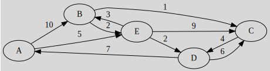
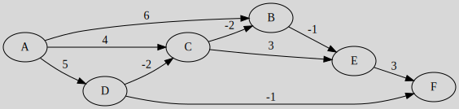

# Shortest Path Problem Examples

## Dijkstra's Algorithm Example

Given the following graph, use Dijkstra's Algorithm from $A$.

| Step |   A  |   B  |   C  |   D  |   E  | Done |
|------|------|------|------|------|------|------|
| $0$  | $0$  | $+\infty$ | $+\infty$ | $+\infty$ | $+\infty$ | $A$ |

$A$ is connected to $B$ by 10 and to $E$ by 5. We replaced both $+\infty$ since the new weights are smaller ($0+10$ and $0+5$). We are writing $A(10)$ to remember what value was used for B sum ($0+10$, the $0$ is A value).

| Step |   A  |   B  |   C  |   D  |   E  | Done |
|------|------|------|------|------|------|------|
| $0$  | $0$  | $+\infty$ | $+\infty$ | $+\infty$ | $+\infty$ | $A$ |
| $1$  | $0$  |$A(10)$|$+\infty$|$+\infty$|$A(5)$|$E$|

For the third line, $E(8)$ in $B$ column means that we added the value of $E=5$ plus the weight for $weight(E \to B)=3$. The idea is the same for the rest.

| Step |   A  |   B  |   C  |   D  |   E  | Done |
|------|------|------|------|------|------|------|
| $0$  | $0$  | $+\infty$ | $+\infty$ | $+\infty$ | $+\infty$ | $A$ |
| $1$  |      |$A(10)$|$+\infty$|$+\infty$|$A(5)$|$E$|
| $2$  |      |$E(8)$|$E(14)$|$E(7)$|     |  $D$ |
| $3$  |      |$E(8)$|$D(13)$|      |     |  $B$ |
| $4$  |      |      |$B(9)$|      |      |  $C$ |

For the interpretation, the shortest path from:

* A to B is $[A-E-B]$ (weight=8)
* A to C is $[A-E-B-C]$ (weight=9)
* A to D is $[A-E-D]$ (weight=7)
* A to D is $[A-E]$ (weight=5)

Explanation: forr $A\ to\ B$, in B's column, we can read the path:

* We are in B column
* We go back to E column (since $E(8)$)
* We go back to A column (since $A(5)$)
* Giving us $[A-E-B]$

## Bellman–Ford Algorithm

Given the following graph, use the Bellman–Ford Algorithm from $A$.

| Step |   A  |   B  |   C  |   D  |   E  |   F  |
|------|------|------|------|------|------|------|
|  $0$ | $0$  |$+\infty$|$+\infty$|$+\infty$|$+\infty$|$+\infty$|
|  $1$ |      |$A(6)$|$A(4)$|$A(5)$|$+\infty$ $B(5)$ $\xcancel{C(7)}$|$+\infty$ $D(4)$ $\xcancel{E(8)}$|
|  $2$ |      |$C(2)$|$D(3)$|      |$B(1)$|      |
|  $3$ |      |$C(1)$|      |      |$B(0)$|$E(3)$|
|  $4$ |      |      |      |      |      |      |

