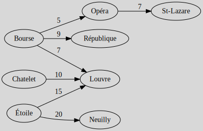

# Trees Example

## Spanning Tree Example

Given this graph $G$, give a spanning tree $T$

* we are randomly picking the edges (that we may remove)
    * (b,f) from b,c,f,b
    * (f,e) from f,c,a,h,e,f
    * (h,d) from a,d,h,a
    * (g,d) from a,d,g,b,c,a

* we are checking if this is a tree (acyclic and connected)
* we are good
* our spanning tree is

Another answer: $(b,f),(e,h),(h,d),(b,g)$.

## Minimum Weight Spanning Tree Kruskal Example

The cost for constructing a road from "N" (Neuilly) to "Châtelet" is represented by the value located at the intersection of the "Châtelet" row and the "N" column. Create a tree from this table.

We are creating eight vertices for our eight destinations. We create the smallest cost. It's 5. If adding B (Bourse) - Opera is creating a cycle,

* then we do not add it to the graph
* otherwise, we add it to the graph

We repeat this process until all nodes are connected.

## Minimum Weight Spanning Tree Prim Example

Apply Prim's algorithm on this graph, **starting from a**.

I colored in red the edges we may pick. Then, among the ones in red, I try to add one with the least weight. I colored in blue the one I picked. If I can't pick an edge, I colored it in grey.

Some may pick $b-c$ instead of $a-h$, since both weights are $8$. I picked $a-h$ and it doesn't matter. The rest of the graph would be the same aside from this one edge.

The GIF frame by frame:

