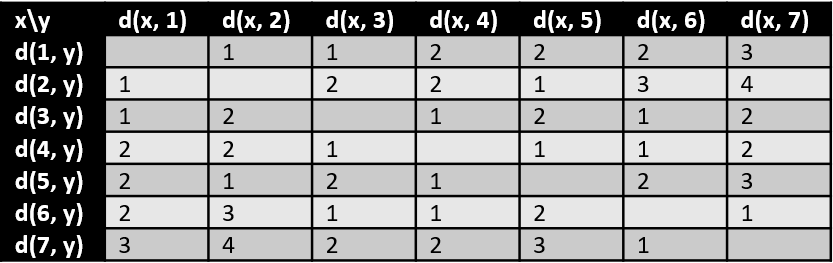

# Distance and Diameter

[Go back](..)

The **distance** $d(A, B)$ is the length of the minimal path linking $A$ and $B$.

The **Diameter** $diam(G)$, is the greatest of the minimal distances for a graph $G$. We could define the diameter as "Starting from any vertex, I can go to any other vertex in less than diameter edges".

## Example

We would create the following table

The value for $d(x, 2) * d(1, y) = 1$ means that when the starting vertex is $1$ and the ending vertex is $2$, then the distance is $1$.

You could see that the diameter is $4$ because the longest path is $7-6-4-5-2$ (4 edges) (or $2-5-4-6-7$).

