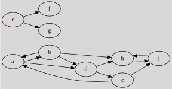
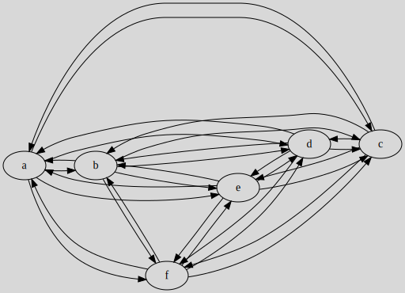

# Connected graphs

## Terminology

* reduced graph (``Graphe réduit``)

If $C_1, C_2, C_3$ are super-connected components, then a graph having the nodes $C_1, C_2, C_3$ is called ``Graphe réduit``. If $A \in C_1$ was adjacent to $B \in C_2$ then we have $C_1$ is adjacent to $C_2$.

* Bridge (`isthme`)

An edge that, once removed, will disconnect the graph.

* Articulation point (`Point d'articulation`)

A vertex that, once removed, will disconnect the graph.

## Example 1 - Connected graph

Let $G$, the following graph

1. What are the connected components?
2. Is the graph connected?
3. Create a subgraph $G'$ with $\text{\{a,b,c,d\}}$.
4. Is $G'$ connected? And super-connected?

<blockquote class="spoiler">

1. $C_1=\{e,f,g\}$ and $C_2=\{a,b,c,d,h,i\}$.

Let's apply our connected algorithm

2. No, we got more than one connected component
3. simply extracting the vertex and their edges

4. We got only one component, so the graph is connected. The graph does seem to be super-connected.

Let's apply the super-connected algorithm

The graph is super-connected.

</blockquote>

## Example 2 - Transitive closure and Connectivity

Is the following graph $G$ super-connected? Tip: use the transitive closure.

<blockquote class="spoiler">

Using Roy-Warshall's algorithm, we got

As you may notice, this is a complete graph $K_{6}$. Since the transitive closure is a complete graph, then $G$ is super-connected.

This wasn't the goal of this example, but here is Roy-Warshall's algorithm

The complete algorithm (text)

* **picking A**
* $s=C$
  * $p=B$, creating (B,C)? yes
  * $p=E$, creating (E,C)? yes
  * $p=F$, creating (F,C)? yes
* **picking B**
* $s=A$
  * $p=C$, creating (C,A)? yes
  * $p=F$, creating (F,A)? no
  * $p=D$, creating (D,A)? yes
* $s=C$
  * $p=F$, creating (F,C)? no
  * $p=D$, creating (D,A)? no
* **picking C**
* $s=B$
  * $p=A$, creating (A,B)? yes
  * $p=D$, creating (D,B)? no
  * $p=E$, creating (E,B)? yes
  * $p=F$, creating (F,B)? no
* $s=E$
  * $p=A$, creating (A,E)? yes
  * $p=B$, creating (B,E)? yes
  * $p=D$, creating (D,E)? yes
  * $p=F$, creating (F,E)? yes
* **picking D**
* $s=A$
  * $p=E$, creating (E,A)? no
* $s=B$
  * $p=E$, creating (E,B)? no
* $s=C$
  * $p=E$, creating (E,C)? no
* $s=E$
* $s=F$
  * $p=E$, creating (E,F)? no
* **picking E**
* $s=A$
* $s=A$
  * $p=B$, creating (B,A)? no
  * $p=C$, creating (C,A) ? yes
  * $p=D$, creating (D,A)? no
  * $p=F$, creating (F,A)? no
* $s=B$
  * $p=A$, creating (A,B)? no
* $s=B$
  * $p=C$, creating (C,B)? no
  * $p=D$, creating (D,B)? no
  * $p=F$, creating (F,B)? no
* $s=C$
  * $p=A$, creating (A,C)? no
  * $p=B$, creating (B,C)? no
* $s=C$
  * $p=D$, creating (D,C)? no
  * $p=F$, creating (F,C)? no
* $s=D$
  * $p=A$, creating (A,D)? yes
  * $p=B$, creating (B,D)? yes
  * $p=C$, creating (C,D)? yes
* $s=D$
  * $p=F$, creating (F,D)? yes
* $s=F$
  * $p=A$, creating (A,F)? yes
  * $p=B$, creating (B,F)? yes
  * $p=C$, creating (C,F)? yes
  * $p=D$, creating (D,F)? no
* $s=F$
* **picking F**
  * done
</blockquote>