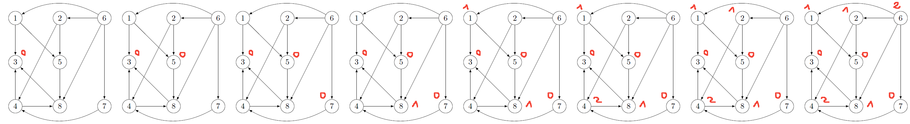
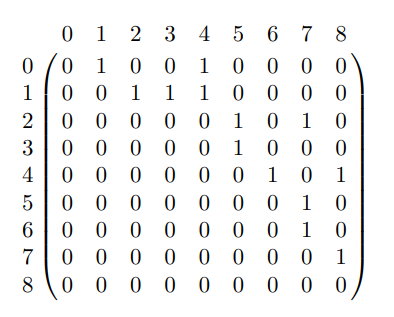

# XXX

## Example 1 - Independent set and Grundy function

Given this graph $G$,

Give

* a maximal independent set
* a maximum independent set
* an absorbing set
* the kernel(s) using Grundy function

<blockquote class="spoiler">

You should consider the graph as non-oriented for the independent sets.

* a maximal independent set: $(6,3)$
* a maximum independent set: $(1,5,3)$
* an absorbing set: $(1,2,3,4,5,6)$ :) 
* or $(2, 4, 5, 6)$ because
  * 4 is absorbing (3)
  * 5 is absorbing (2, 4)
  * 2 is absorbing (1)
  * 6 is absorbing (5)

Using **Grundy function**, starting from $1$, we have

* the first one is in the kernel, so $g(1)=0$
* next is the successor $2$
  * the neighbors took the values $\text{\{0\}}$
  * the lowest value we can give is $1$
  * $g(2)=1$
* next are the successors $3,5$
  * ... $\text{\{1\}}$, the lowest ... $0$
  * $g(3)=0$ and $g(5)=0$
* next is the successor $4$
  * ... $\text{\{0\}}$, the lowest ... $1$
  * $g(4)=1$
* next is the successor $6$
  * ... $\text{\{0\}}$, the lowest ... $1$
  * $g(6)=1$

We got the kernel $(1,5,3)$. Starting from another vertex like $4$, we would have found the other kernel $(2,4,6)$.
</blockquote>

## Example 2 - Grundy function

Find a kernel for this graph using the grundy function

<blockquote class="spoiler">
You should have noticed that $1$ does not have any predecessors, so we MUST start at $1$.

Then

* $g(2)=g(4)=1$ because $g(1)=0$
* $g(2)=2$ because we have the predecessors already have 
  * $g(1)=0$
  * $g(4)=1$
* then you got **a choice** (=two kernels)
  * $g(5)=0$ and $g(3)=1$
  * $g(3)=0$ and $g(5)=2$
</blockquote>

## Example 3 - Unique Grundy function

Find a kernel for this graph using the Grundy function, after sorting the vertices by successors.

**Tip**: this is **NOT** a normal Grundy function. The result is unique and immediate because you got no choice since we ordered the vertices.

<blockquote class="spoiler">

Let's sort the vertices

* $3$: 0 successor
* $5$: 1 successor
* $7$: 1 successor
* $8$: 1 successor
* $1$: 2 successors
* $2$: 2 successors
* $4$: 2 successors
* $6$: 4 successors

And the Grundy function is

with

* $g(3)=0$ (no successors $\to$ should be the start, inside the kernel)
* $5$ is not a neighbor of $3$: $g(5)=0$
* $7$ is not a neighbor of $3,5$: $g(7)=0$
* $8$ is a neighbor of $g(3)=0$: $g(8)=1$
* $1$ is a neighbor of $g(3)=0, g(5)=0$: $g(1)=1$
* $4$ is a neighbor of $g(3)=0, g(8)=1$: $g(4)=2$
* $2$ is a neighbor of $g(5)=0, g(4)=2$: $g(2)=1$
* $6$ is a neighbor of $g(1)=g(2)=g(8)=1, g(7)=0$: $g(6)=2$

The kernel is $3,5,7$.

</blockquote>

## Example 4 - Grundy function

Given this adjacency matrix, calculate the Grundy function. Is it unique?

<blockquote class="spoiler">

Let's sort the vertices

* $0$: 2 successor
* $1$: 3 successor
* $2$: 2 successor
* $3$: 1 successor
* $4$: 2 successor
* $5$: 1 successor
* $6$: 1 successor
* $7$: 1 successor
* $8$: 0 successor

Giving us $8-3-5-6-7-0-2-4-1$. Since we ordered the vertex, the grundy function is unique :3.

* $g(8)=0$ (no successors $\to$ should be the start, inside the kernel)
* $7$ is a neighbor of $g(8)=0$: $g(7)=1$
* $5$ is a neighbor of $g(7)=1$: $g(5)=0$
* $3$ is a neighbor of $g(5)=0$: $g(3)=1$
* $6$ is a neighbor of $g(7)=1$: $g(6)=0$
* $4$ is a neighbor of $g(8)=g(6)=0$: $g(4)=1$
* $2$ is a neighbor of $g(7)=1, g(5)=0$: $g(2)=2$
* $1$ is a neighbor of $g(2)=2, g(3)=g(4)=1$: $g(1)=0$
* $0$ is a neighbor of $g(1)=0, g(4)=1$: $g(0)=2$

The kernel is $1,5,6,8$.

**Note**: if you are wondering why after $8$, we dealt with $7$, this is because of the dependencies. We need $g(5)$ for $g(3)$ and $g(5)$ needs $g(7)$.
</blockquote>