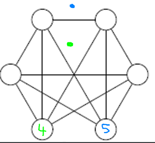

# Planar graph

## Example 1

Are the following graphs planar?

<blockquote class="spoiler">

The first graph is planar because it's $K_5$.

The second one is planar, because I found a planar representation. Notice that we have $n + m = f = 2$ ($n=5$, $m=9$, $f=6$=five+the outer face)

The third graph has a subgraph $K_{3,3}$ so it's not planar.

The fourth graph $m=12 \le 6 * 3 - 5 \le 13$ so the graph is planar. Simply move the vertices "4" and "5".

All degrees are equals to $6$, so the graph is not planar. We could have used $m < 3n - 5$.

As for the sixth graph, it's not planar either. I used Robertson–Seymour theorem and found that the minor of the graph (by only merging vertices) is $K_6$ so if I remove one more vertex, it's $K_5$ and $K_5$ is not a planar graph.

</blockquote>

## Example 2

Use **Robertson–Seymour theorem** and demonstrate that the Petersen graph is not planar.

<blockquote class="spoiler">

This answer can be found on Wikipedia [source](https://en.wikipedia.org/wiki/Planar_graph). Here is a copy

</blockquote>