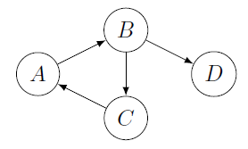

# Transitive closure

[Go back](..#advanced-terminology)

The transitive closure or `Fermeture transitive` noted $\tau$ (tau) is made by adding all the edges that can be deduced by transitivity.

For instance, if we have $(a,b)$ and $(b,c)$, then we will create $(a,c)$ if $(a,c)$ does not exist. This is a simple example, but sometimes it could be like $(a,b)-(b,c)-(c,d)-...-(y-,z)$ then we create $(a,z)$ ...

**Roy–Warshall algorithm** (also called Floyd–Warshall)

* for each vertex $V$
  * for each predecessor of $V$, $p$
    * for each successor of $V$, $s$
      * if $p \neq s$ 
      * create $(p,s)$ if $(p,s)$ does not exist

Complexity; $O(n * n * n)$

## Example 1 (Roy-Warshall algorithm)

Apply Roy-Warshall algorithm on

<blockquote class="spoiler">

* **picking** A
* $p=C$, $s=B$, creating (C, B)? yes 
* **picking** B
* $p=A$, $s=D$, creating (A, D)? yes
* $p=A$, $s=C$, creating (A, C)? yes
* $p=C$, $s=D$, creating (C, D)? yes
* **picking** C
* $p=B$, $s=A$, creating (B, A)? yes
* $p=A$, $s=B$, creating (A, B)? no
* **picking** D
* done
</blockquote>

## Example 2 (Roy-Warshall algorithm)

Apply Roy-Warshall algorithm on

\[
\begin{pmatrix}
0&1&1&0\\
1&0&0&1\\
0&0&0&1\\
0&1&0&0
\end{pmatrix}
\]

We are considering the vertices $A, B, C, D$.

<blockquote class="spoiler">

Drawing the graph would be the easier way, but let's give it a try

I'm picking $A$ successor reading the column vertex name where there are ones on $A$ line. I'm picking $A$ predecessor reading the column $A$, the vertex's names on the lines having a $1$.

* **picking** A
* $s=B$ 
  * $p=B$? creating (B, B)? no
* $s=C$
  * $p=B$? creating (B, C)? yes

\[
\begin{pmatrix}
0&1&1&0\\
1&0&1&1\\
0&0&0&1\\
0&1&0&0
\end{pmatrix}
\]

* **picking** B
* $s=A$
  * $p=A$? creating (A, A)? no
  * $p=D$? creating (D, A)? yes
* $s=C$
  * $p=A$? creating (A, C)? no
  * $p=D$? creating (D, C)? yes
* $s=D$
  * $p=A$? creating (A, D)? yes
  * $p=D$? creating (D, D)? no

\[
\begin{pmatrix}
0&1&1&1\\
1&0&1&1\\
0&0&0&1\\
1&1&1&0
\end{pmatrix}
\]

* **picking** C
* $s=D$
  * $p=A$? creating (A, D)? no
  * $p=B$? creating (B, D)? no
  * $p=D$? creating (C, D)? no
* **picking** D
* $s=A$
  * $p=C$? creating (C, A)? yes
* $s=B$
  * $p=C$? creating (C, B)? yes
* $s=B$
  * $p=C$? creating (C, B)? yes

\[
\begin{pmatrix}
0&1&1&1\\
1&0&1&1\\
1&1&0&1\\
1&1&1&0
\end{pmatrix}
\]

You should notice that the graph is complete.
</blockquote>