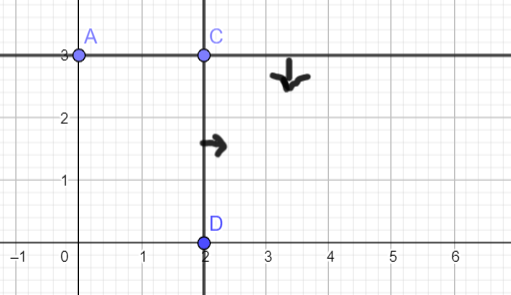

# Constrained polygon

[Go back](..)

It's most likely the easiest method, but it won't work if you got more than 2 parameters. Rewrite all of your constraints to have constraints like these

\[
\begin{split}
x \le 10\\
y \le 15\\
y \le 3/5 * x + 7\\
\end{split}
\]

You may use greater, greater equals, or lesser/lesser equals, but you can't have something like `x + y < 5` since we want only one variable on the left side.

## constrained space

On you have all of your inequalities, simply trace the lines corresponding to each one. Remember to add a small arrow to visualize the constrained space.

If you have a constraint `y < 3` and `x > 2` it would look like this

You should remember that something like that `y <= 3/5 * x + 7` means that

* you got a point at x=0, y=7
* if x increase by 5, then y increase by 3
* so you can guess the next point (x=5, y=10)

## Minimum / Maximum

The critical points are the edges of our `constrained space` like `C` in the screenshot.

You had a function `f(x,y)=...`, and since each point is got `(x,y)`, then replace each critical point in the function. Take the highest (maximum) or the lowest (minimum) value, and you're done.

## Translation

If you don't want to test all the points, trace your function then translate it, the last point touching it is the point you are looking for.