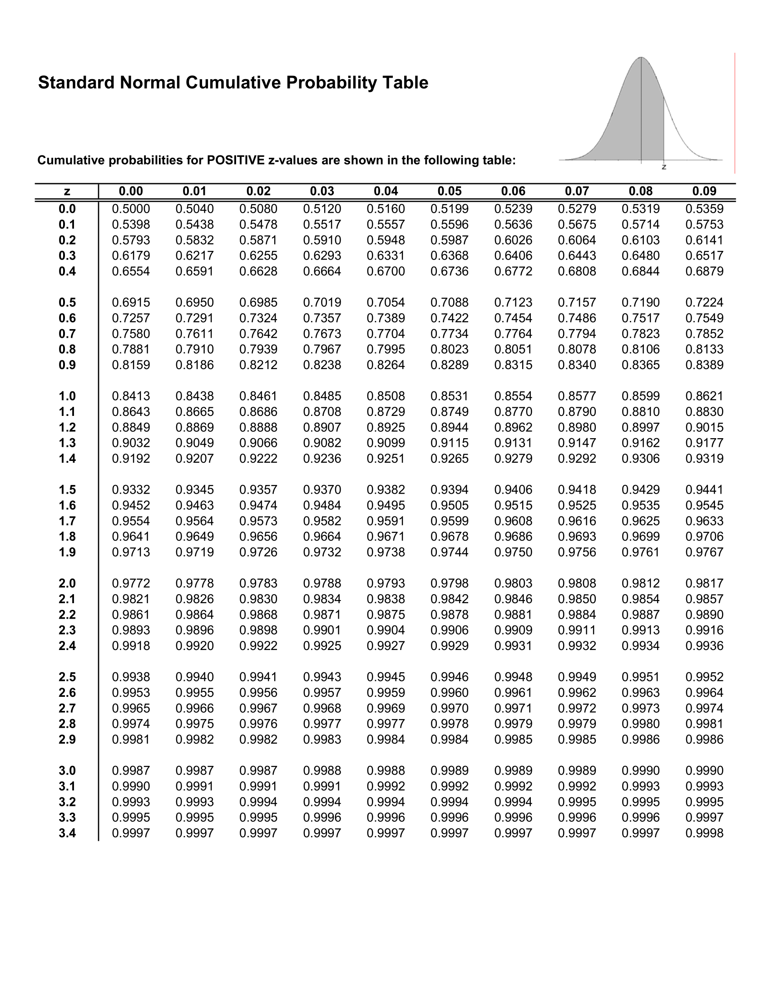

# Normal distribution

[Go back](..#distributions)

The distribution is the most important one, also called **Normal** distribution/`Loi normale`, **Gaussian** distribution/`Loi gaussienne` and Laplace–Gauss distribution/`Loi de Laplace-Gauss`. The short name is $N(\mu, \sigma^2)$.

* $\mu$ (mu) is the mean ($\mathbb{E}(X)$)
* $\sigma$ (sigma) is the deviation around the mean,
  known as Standard deviation/`écart-type`.
* $\sigma^2$ (sigma-square) is the variance ($\mathbb{V}(X)$)

So we have

* The density function is $f_X(x) = {\frac {1}{\sigma {\sqrt {2\pi }}}}e^{-{\frac {1}{2}}\left({\frac {x-\mu }{\sigma }}\right)^{2}}$
* $\mathbb{E}(X) = \ \mu$
* $\mathbb{V}(X) = \ \sigma^2$

## Standard normal distribution

The standard normal distribution/`loi normale centrée réduite` is a normal distribution with $\mu=0$ and $\sigma=1$ giving us $N(0,\ 1)$.

We can create a new variable $Y \sim N(0,\ 1)$ from X with the following formula ()

@
Y \sim \frac{X-\mu}{\sigma}
@

* the density function is noted $\phi_X(x)$ (phi) instead of $f_X(x)$
* the cumulative distribution function is noted $\Phi_X(x)$ (Phi) instead of $F_X(x)$

## Standard normal table

If you have $X \sim N(\mu,\ \sigma^2)$, then

\[
F_X(c) = \mathbb{P}(X \le c)
= \mathbb{P}(\frac{X-\mu}{\sigma} \le \frac{c-\mu}{\sigma})
= \phi(\frac{c-\mu}{\sigma})
\]

You already know some of them, but here is a recap

* $\mathbb{P}(X \le c) \Leftrightarrow \mathbb{P}(X \lt c)$
* $\mathbb{P}(X \ge c) \Leftrightarrow \mathbb{P}(X \gt c)$
* $\mathbb{P}(X \ge c) = 1 - \mathbb{P}(X \le c)$
* $\phi(0.5) = 0$
* $\phi(-x) = 1 - \phi(x)$ (**note that even if you can find is a table for $x \lt 0$, you are only given the table with $x \ge 0$** so use this)

And now, you need to use this table to calculate $\phi(x)$. Note that the value at the first line (ex: 0.0) and the first column (ex: 0.00) is the result for $\phi(0.0 + 0.00)$.

* [Wikipedia](https://en.wikipedia.org/wiki/Standard_normal_table)
* [another one as PDF here](https://www.math.arizona.edu/~jwatkins/normal-table.pdf)

This image is an image from the second link

## Inverse cumulative distribution function

We know that

@
\alpha = \mathbb{P}(X \le k) = F_X^{-1}(\alpha)
@

so given an alpha, we need to evaluate $F_X^{-1}(\alpha)$ to find the k giving this alpha. For a normal distribution, it's easier since we have

@
F_X^{-1}(\alpha) = \mu + \sigma * \phi^{-1}(\alpha)
@

As for $\phi^{-1}(\alpha)$

* if $\alpha \ge 0.5$, you simply need to find the z (sum of line+column) in the table associated with the closest value of $\alpha$
* else $\phi^{-1}(\alpha) = -\phi(1-\alpha)$

For instance, if $\alpha = 0.95$, then you need to search the closest value in the table. We got $\phi(1.64)=0.9495$ and $1.65=0.9505$ giving us $k \in [1.64,1.65]$.

If $\alpha = 0.05$, then we have $\phi^{-1}(0.05) = -\phi(1-0.05) = -\phi(0.95)$ so $k \in [-1.65,-1.64]$.