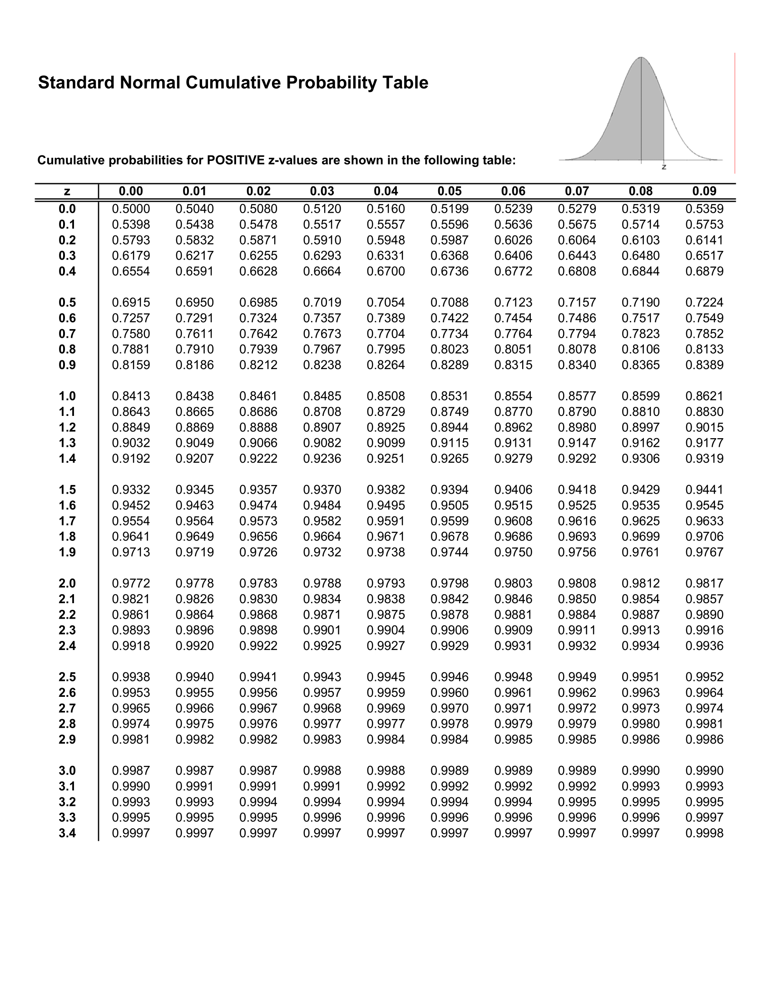

# Probabilities

A probability is a value between zero and one characterizing how likely an event may occur.

* 🛣️ $\omega$ (small-omega) is an outcome possible
* 🗺️ $\Omega$ (big-omega) is a set of all possible outcomes, also called sample/probability space
* 📌 $A$ is an event included in $\Omega$. It's often  defined by a sentence. If it has only one outcome, it's called an elementary event.
* 🌍 $\overline{A}$ or $A^c$ is opposite/complementary event of A <small>(read as "not A")</small>.
* ⛔ $\emptyset$ (empty set) means an impossible event.

👉 Events "incompatible/disjoints/mutually exclusive events" are events that can't happen simultaneously.

We write $\mathbb{P}(A)$ the probability of A occuring. It's a value in $[0,1]$.

* $\mathbb{P}(\Omega) = 1$ and $\mathbb{P}(\emptyset) = 0$
* $\mathbb{P}(\overline{A}) = 1 - \mathbb{P}(A)$

For instance, we are rolling a die 3 times in a row 🎲.

* An outcome is 🛣️: $(6, 1, 2)$
* The probability space 🗺️: $\lbrace\ (x, y, z) \mid x y z \in [1,6]\ \rbrace$
* An event $A$ 📌: having 3 times 6, e.g., $(6, 6, 6)$
* Complementary event $\overline{A}$ 🌍: not having 3 times 6
* An impossible event ⛔: ...
* $P(A) = \frac{1}{6^3}$

## Combinatorics

The cardinal of $E$ means the number of elements of $E$. We use these notations: $card(E) \Leftrightarrow |E| \Leftrightarrow \\#E$. We will need to know the cardinal of $\Omega$ or an event to use most formulas.

For instance, let's say you have a sample space `"rolling a die 9 times"` and an event $A=$`"having a sum > 50"`. What is $card(A)$?

We have a few techniques we can use. Assuming $card(E) = k$, according to the event $A$, we will pick $n$ outcomes from $E$.

* `without replacement`: we can take an element only once
* `ordered`: we consider $(1, 2)$ and $(2, 1)$ to be different

📚 We use `{...}` for unordered outcomes, and `(...)` for ordered outcomes: `{(5,1),(1,5)}` <small>(ordered)</small> vs `{{1,5}}` <small>(unordered)</small>.

➡️ See also: [Counting Examples](_examples/counting.md).

 

#### Ordered sampling with replacement

It means each value can be picked $n$ times.

@
k^n
@

⚠️ You must make sure that you are not inverting $k$ and $n$.

#### Ordered sampling without replacement

Since k is decreasing by 1 after each pick, it's a factorial: $n! = n * (n-1)!$ and $1! = 1$. For example, $5!=5\*4\*3\*2\*1$.

@
A^k_n = \frac{k!}{(k-n)!}
@

When $k = n$, $A^k_n = k!$, we call it a permutation. When the elements are not unique, we use:

@
\frac{n!}{\prod_i o_i!}
@

➡️ $A^k_n$ is called an Arrangement.

#### Unordered sampling without replacement

@
\frac{k!}{(k-n)! * n!}
\Leftrightarrow
\frac{A^k_n}{n!}
@

#### Unordered sampling with replacement

@
C^{k-1}_{n+k-1} = \frac{(n+k-1)!}{(k-1)! * n!}
@

➡️ $C^k_n$ is called a Combination.

## Discrete probability

Discrete probability refers to the branch of probability theory that deals with finite random variables, e.g., in $\mathbb{N}$ or $\mathbb{Z}$.

We are defining $\mathbb{P}(X=k)$ the probability that a discrete random variable $X$ is taking the value $k$. We are calling mass function the function giving us the result of $\mathbb{P}(X=k)$. This function is valid if:

* The sum of all probabilities is 1
* $\forall{x},\ f(x) \ge 0$

➡️ See also: [Discrete Probability Examples](_examples/discrete.md).

#### Discrete Formulas

Using combinatorics to get the cardinal:

@
\mathbb{P}(A) = \frac{card(A)}{card(\Omega)} = \frac{|A|}{|\Omega|}
@

When each event has the same probability of occuring, it's called an uniform probability and the formula is simpler:

@
\forall{w} \in \Omega\quad \text{then}\quad \mathbb{P}(w) = \frac{1}{card(\Omega)}
@

A conditional probability is when, knowing that another event $B$ occured, we want to know of probability of $A$ occurring.

@
\mathbb{P}(A|B) = P_B(A) = P(B \wedge A) := \frac{\mathbb{P}(A \cap B)}{\mathbb{P}(B)}
@

* $\mathbb{P}(\overline{A}|B) = 1 - \mathbb{P}(A|B)$
* $\mathbb{P} (B \cup C|A) = \mathbb{P}(B|A) + \mathbb{P}(C|A) − \mathbb{P}(B ∩ C|A)$
* You may be able to compute $\mathbb{P}(A|B)$ with the first formula

#### Discrete Transformations

We can use Bayes theorem:

@
\mathbb{P}(A \cap B) = \mathbb{P}(B) * \mathbb{P}(A|B)
\equiv \mathbb{P}(A) * \mathbb{P}(B|A)
@

We can use the law of total probability:

\[
\begin{split}
\mathbb{P}(B) = \mathbb{P}(B \cap \Omega)
= \mathbb{P}((A_1 \cap B) \cup (A_2 \cap B) \cup \ldots) 
\\ = \mathbb{P}(A_1 \cap B) + \mathbb{P}(A_2 \cap B) + \ldots \\
= \mathbb{P}(A_1) * \mathbb{P}(B|A_1) + \mathbb{P}(A_2) * \mathbb{P}(B|A_2) + \ldots
\end{split}
\]

We can use the probability chain rule:

\[
\prod_{i=1}^n \mathbb{P}(A_i | \bigcap_{j=1}^{i-1} A_j)
\]

For instance, if $n=4$, we got

\[
\begin{split}
\mathbb{P}(A_4 \cap A_3 \cap A_2 \cap A_1) 
= \\
\mathbb{P}(A_1) *
\mathbb{P}(A_2|\ A_1) *
\mathbb{P}(A_3|\ A_2 \cap A_1) *
\mathbb{P}(A_4|\ A_3 \cap A_2 \cap A_1)
\end{split}
\]

A few other formulas that may be handy:

* $\mathbb{P}(A \cup B) = \mathbb{P}(A) + \mathbb{P}(B) - \mathbb{P}(A \cap B)$
* $A \subset B \to \mathbb{P}(A) \le \mathbb{P}(B)$ <small>(A included in B)</small>
* $A \subset B \to \mathbb{P}(A \cap B) = \mathbb{P}(A)$
* $A \subset B \to \mathbb{P}(A \cup B) = \mathbb{P}(B)$

#### Discrete Expected value

The expected value noted $\mathbb{E}(X)$, $\mathbb{E}X$, or $\mathbb{E}[X]$ is defined by:

\[
\sum_{x_i \in \Omega}^{} x_i \mathbb{P}{(X_w = x_i )}
\]

* $\mathbb{E}(X)$ is also called the (weighted) mean
* $\mathbb{E}(X)$ is also called [the first moment](https://en.wikipedia.org/wiki/Moment_(mathematics)#Mean)
* $\mathbb{E}[X, \lambda Y] = \mathbb{E}[Y] + \lambda \mathbb{E}[Y]$
* $\mathbb{E}(X) \ge 0$ and if $X \ge Y$ then $\mathbb{E}(X) \ge \mathbb{E}(Y)$
* $\mathbb{E}[X * Y] = \mathbb{E}[X] * \mathbb{E}[Y]$ if both are independant, otherwise $\mathbb{E}[X * Y] = \sum_{i,j} x_i * y_i * p_{ij}$.
* $\mathbb{E}(X) = \frac{n+1}{2}$ for an uniform probability
* Cauchy-Schwarz: $\mathbb{E}[XY]^2 \le \mathbb{E}[X^2] * \mathbb{E}[Y^2]$

#### Discrete Variance

The variance is the square deviation around the expected value.

\[
\begin{align}\begin{aligned}V(X) = \mathbb{E}[(X - \mathbb{E}[X])^2]\\V(X) = \mathbb{E}[X^2] - \mathbb{E}[X]^2\end{aligned}\end{align}
\]

* $V(X) = \sigma^2$ with sigma the standard deviation
* $V(\lambda X^2) = \lambda^2 V(X)$
* $V(a + \lambda X^2) = \lambda^2 V(X)$
* $V(X + Y) = V(X) + V(Y) - 2cov(XY)$
* $V(X)$ is also called [the second central moment](https://en.wikipedia.org/wiki/Moment_(mathematics)#Variance)

#### Discrete Covariance/co-variance (cov)

It's used to evaluate the conjoint variance of two
random variables.

\[
\begin{align}\begin{aligned}cov(x,y) = \mathbb{E}[ ( X - \mathbb{E}[X]) (Y - \mathbb{E}[Y]) ]\\cov(x,y) = \mathbb{E}[XY] - \mathbb{E}[X] \mathbb{E}[Y]\end{aligned}\end{align}
\]

* $cov(X,X) = V(X)$
* $cov(X,Y) = cov(Y,X)$
* $cov(\lambda * X,Y) =  \lambda *cov(Y,X)$
* $cov(\lambda * X) =  \lambda^2 *cov(X)$
* $cov(A+B,C) = cov(A,C) + cov(B,C)$
* if $X \perp Y$ then $cov(XY) = 0$
* $\mathbb{P}(X, Y) = \frac{cov(X,Y)}{\sqrt{V(X)*V(Y)}}$

#### Discrete Independence

Random variables are independent ($\perp$ perp) if the product of the probabilities is equals to the probability of the events  $X_1, ..., X_n$.

\[
\mathbb{P}(X_1 = x_1\ \cap\ \ldots\ \cap\ X_n = x_n) = \prod_{i=1}^n \mathbb{P}(X_i = x_i)
\]

➡️ Alternative way: checking $\mathbb{P}(A|B) = \mathbb{P}(A)$ or $\mathbb{P}(B|A) = \mathbb{P}(B)$.

#### Discrete Cumulative distribution function

The cumulative distribution function (CDF) $F_X(k)$ is the primitive of the mass function, meaning that deriving the CDF will give you the mass function. $F_X(k)$ is the probability of $\mathbb{P}(X \le k)$.

\[
\mathbb{P}(X \le k) = \sum_{i=0}^{k} \mathbb{P}(X=i)
\]

For instance, $P(X\le3) = P(X=0) + P(X=1) + P(X=2) + P(X=3)$.

## Continuous probability

Continuous probability refers to the branch of probability theory that deals with non-finite random variables, e.g., in $\mathbb{R}$.

The probability of taking a value is 0: $P(X=k)=0$ because the probability of each elementary event is converging to 0, while the sum of all elementary events is converging to 1.

➡️ See also: [Continuous Probability Examples](_examples/continuous.md).

#### Probability Density Function

The probability density function $f_X(x)$ (or $f(x)$) is defined as:

* $\int_{-\infty}^{+\infty} f_X(x)dx = 1$ <small>(we can reduce the interval if we have constraints)</small>
* $\forall{x},\ f_X(x) \ge 0$
* $f_X$ is continuous

We can use it to compute probabilities:

\[
\begin{split}
\mathbb{P}(x \in X) = \int_{x \in \Delta X}^{} f_X(x)dx \\
or\ \mathbb{P}(a \le X \le b) = \int_{a}^{b} f_X(x)dx \\
or\ \mathbb{P}(x \le a) = \mathbb{P}(x \lt a) = \int_{a}^{+\infty} f_X(x)dx \\
or\ \mathbb{P}(x \ge b) = \mathbb{P}(x \gt b) = \int_{-\infty}^{b} f_X(x)dx
\\
or\ \mathbb{P}(X \ge a) = 1 - \mathbb{P}(X \le a)
\end{split}
\]

📚 The support of X $\bigtriangleup_X$ or $X(\Omega)$ is the domain of the density function. It means a probability outside of the support is $0$.

#### Continuous Cumulative distribution function

The cumulative distribution function (CDF) $F_X(k)$ is the primitive of the density function, meaning that deriving the CDF will give you the density function. $F_X(k)$ is the probability of $\mathbb{P}(X \le k)$.

* $0 \le F_X(x) \le 1$
* F is increasing and continue
* $\mathbb{P}(a \le X \le b) = F_X(b) - F_X(a) = \int_{a}^{b} f_X(x)dx$

#### Continuous Inverse cumulative distribution function

The Inverse cumulative distribution function or Quantile function is used when given the result $\alpha$, we are trying to find $k$.

@
\alpha = \mathbb{P}(X \le k)
@

It's written $F_X^{-1}(\alpha)$ or $Q_\alpha$.

#### Continuous Transformations

If we can express $Y$ as $Y=aX+b$, we can find $F_Y(x)$ from $F_X(x)$.

@
F_Y(y) = F_X(\frac{y-b}{a})
@

With an increasing monotone function, we can use the formula $Y = \varphi(X)$. For example, $Y = \exp(X)$ and $\varphi^{-1}(y) = ln(y)$.

@
F_Y(y) = F_X(\varphi^{-1}(y))
@

#### Continuous Expected Value

The expected value $\mathbb{E}(X)$ is defined by:

@
\mathbb{E}[X] = \int_{-\infty}^{+\infty} xf_X(x)dx
@

* The density function must be integrable <small>(or the EV doesn't exist)</small>
* if $\mathbb{E}(X) = 0$ then $X$ is centered
* if $\mathbb{E}(X)$ is finite, then $X$ may be centered
* $\mathbb{E}[X * Y] = \int_{-\infty}^{+\infty}\int_{-\infty}^{+\infty} x * y * f_{XY}(x , y)\ dx dy$

#### Continuous Variance

The variance $V(X)$ is defined by

@
V[X] = \int_{-\infty}^{+\infty} (x-\mathbb{E}[X])^2\ f_X(x)\ dx
@

#### Moment-Generating Function (MGF)

The Moment-generating function helps in finding the expected value, the variance, and other moments.

\[
M_X(t) = \mathbb{E}(\exp(tX)) =
\int \exp(tx)\ f_X(x)\ dx
\]

\[
\mathbb{E}(X) = \frac{\delta M_X (t)}{\delta t}
= M'_X(0)
\]
\[
V(X) = \frac{\delta^2 M_X (t)}{\delta t^2} - \mathbb{E}(X)^2
= M''_X(0) - \mathbb{E}(X)^2
\]

## Probability distributions

We write $X \sim L$ a random variable $X$ following a distribution $L$.

#### Bernoulli distribution (discrete)

Bernoulli is used for binary random variables, e.g., either 0 or 1. $B(p)$ represents the probability of $k$ successes with a probability of $p$.

* The mass function is $\mathbb{P}(X=k) = p^k * (1-p)^{1-k}$
* $\mathbb{E}(X) = \ p$
* $\mathbb{V}(X) = \ p * (1-p)$

👉 Ex: flipping a coin.

#### Binomial distribution (discrete)

The binomial distribution $B(n,p)$ represents the probability of $k$ success on $n$ trials with a probability of $p$.

* The mass function is

\[
\begin{split}\begin{cases}
\mathbb{P}(X=k) = 0 & if & k > n  \\
\mathbb{P}(X=k) =  C_n^k * p^k * (1-p)^{n-k}  & else  \\
\end{cases}\end{split}
\]

* $\mathbb{E}(X) = \ n * p$
* $\mathbb{V}(X) = \ n * p * (1-p)$

📚 A binomial distribution is a repetition of Bernoulli distributions.

#### Discrete Uniform distribution

A distribution, on an interval $[a,b]$, in which each value has the same probability, is a uniform distribution $U([a,b])$.

* The mass function is $\mathbb{P}(X=k) = \frac{1}{b-a+1}$
* $\mathbb{E}(X) = \ \frac{a+b}{2}$
* $\mathbb{V}(X) = \ \frac{(b-a)(b-a+2)}{12}$

Considering $[1,n]$, we would have

* The mass function is $\mathbb{P}(X=k) = \frac{1}{n}$
* $\mathbb{E}(X) = \ \frac{n+1}{2}$
* $\mathbb{V}(X) = \ \frac{n^2 - 1}{12}$

#### Geometric distribution (discrete)

This distribution $\mathbb{G}(p)$ answers the question "If I have a probability of success $p$, what's the probability of the trial $k$ being the first success?"

* The mass function is $\mathbb{P}(X=k) = (1-p)^{k-1} * p$
* $\mathbb{E}(X) = \ \frac{1}{p}$
* $\mathbb{V}(X) = \ \frac{1-p}{p^2}$

#### HyperGeometric distribution (discrete)

The HyperGeometric distribution $H(N, K, n)$ is representing the probability of having a number of successes $K$ in a finite set of size $N$, given that we made $n$ trials without replacement.

* The mass function is $\mathbb{P}(X=k) = {{{K \choose k}{{N-K} \choose {n-k}}} \over {N \choose n}}$
* $\mathbb{E}(X) = \ n * \frac{K}{N}$
* $\mathbb{V}(X) = \ \mathbb{E}(X) * (1 - \frac{K}{N}) * \frac{N-n}{N-1}$

#### Poisson distribution (discrete)

The Poisson distribution $\mathbb{P}(\lambda)$ require that the probability $p$ is relatively smaller than $n$, while the parameter $\lambda$ is equals to $n*p$.

* The mass function is $\mathbb{P}(X=k) = \frac{\lambda^k *  e^{-\lambda}}{k!}$
* $E(X) = \lambda$
* $V(X) = \lambda$

#### Exponential distribution (continuous)

The exponential distribution is $E(\lambda)$.

* The density function is $f_X(x) = \lambda e^{-\lambda{x}}$
* $\mathbb{E}(X) = \ \frac{1}{\lambda}$
* $\mathbb{V}(X) = \ \frac{1}{\lambda^2}$

#### Normal distribution (continuous)

Also called the Gaussian distribution and noted $N(\mu, \sigma^2)$.

* $\mu$ (mu) is the mean ($\mathbb{E}(X)$)
* $\sigma$ (sigma) is the standard deviation
* $\sigma^2$ (sigma-square) is the variance ($\mathbb{V}(X)$)

The key formulas are:

* The density function is $f_X(x) = {\frac {1}{\sigma {\sqrt {2\pi }}}}e^{-{\frac {1}{2}}\left({\frac {x-\mu }{\sigma }}\right)^{2}}$
* $\mathbb{E}(X) = \ \mu$
* $\mathbb{V}(X) = \ \sigma^2$

#### Standard Normal distribution (continuous)

The standard normal distribution is a normal distribution with $\mu=0$ and $\sigma=1$ giving us $N(0,\ 1)$. We can define $Y \sim N(0,\ 1)$ from X:

@
Y \sim \frac{X-\mu}{\sigma}
@

* The density function is now noted $\phi_X(x)$ (phi)
* The cumulative distribution function is now noted $\Phi_X(x)$ (Phi)

If you have $X \sim N(\mu,\ \sigma^2)$, then we have:

\[
F_X(c) = \mathbb{P}(X \le c)
= \mathbb{P}(\frac{X-\mu}{\sigma} \le \frac{c-\mu}{\sigma})
= \phi(\frac{c-\mu}{\sigma})
\]

* $\phi(0.5) = 0$
* $\phi(-x) = 1 - \phi(x)$

Using, the [Standard normal table](https://en.wikipedia.org/wiki/Standard_normal_table), we can get $\phi(x)$. To use it, simply split $x$ in $a+b$ where $a$ is the line and $b$ is the column of the table.

We have a simplified formula to calculate $F_X^{-1}(\alpha)$:

@
F_X^{-1}(\alpha) = \mu + \sigma * \phi^{-1}(\alpha)
@

To find $\phi^{-1}(\alpha)$: Is $\alpha \ge 0.5$?

* ✅: Find the $z$ <small>(sum of a+b, e.g., line+column)</small> in the table that is associated with the closest value of $\alpha$
* ❌: Calculate $\phi^{-1}(\alpha) = -\phi(1-\alpha)$

Ex: if $\alpha = 0.95$, we search in the table. We got $\phi(1.64)=0.9495$ and $1.65=0.9505$ giving us $k \in [1.64,1.65]$. If $\alpha = 0.05$, then we have $\phi^{-1}(0.05) = -\phi(1-0.05) = -\phi(0.95)$ so $k \in [-1.65,-1.64]$.

#### Continuous uniform distribution

A distribution, on an interval $[a,b]$, in which each value has the same probability, is a uniform distribution $U([a,b])$.

* The density function is $f_X(x) = \frac{1}{b-a}$
* $\mathbb{E}(X) = \ \frac{a+b}{2}$
* $\mathbb{V}(X) = \ \frac{(b-a)^2}{12}$

#### Standard uniform distribution (continuous)

A continuous uniform distribution where $a=0$ and $b=1$.

Let $F_Y(y)$ be the cumulative distribution function of the continuous random variable Y. Then $X = F_Y(y)$ can follow a standard uniform distribution

@
X = F_Y(Y) \sim U([0,1])
@

Using the [Probability integral transform (PIP)](https://en.wikipedia.org/wiki/Probability_integral_transform).

## Random Notes

#### Generating function

Generating functions are handy when doing combinatorics. If we got $k$ issues and $m$ experiments, we perform the following product:

\[
G(x) = \prod_{j=1}^{m} \sum_{i=k_j}^{n_j} x^i
\]

Once you develop the expression, each $a$ in $a * x^i$ is the number of distributions for $n=i$.

➡️ See also: [Generating Function Examples](_examples/gen.md)

 

#### Indicator Function

The indicator function, also sometimes called characteristic function, of a set B is represented as $\mathbb{1}_{ B }(x)$ and defined as:

* $1$ if $x \in B$
* $0$ else

It means we can shorten an expression like that:

\[
\begin{split}\begin{cases}
\mathbb{P}(X=k) = 0 & if & k > n  \\
\mathbb{P}(X=k) =  C_n^k * p^k * (1-p)^{n-k}  & else  \\
\end{cases}\end{split}
\]

To this expression:

\[
\mathbb{P}(X=k) =  C_n^k * p^k * (1-p)^{n-k} *  \mathbb{1}_{ [[0,n]] }(k)
\]

#### Transfer Theorem

For a discrete variable, we will have:

@
\mathbb{E}(g(X)) = \sum_{i} g(x_i) \mathbb{P}(X = x_i)
@

For continuous variables, we will have:

@
\mathbb{E}[g(X)] = \int_{-\infty}^{+\infty} g(x) * f_X(x)\ dx
@

