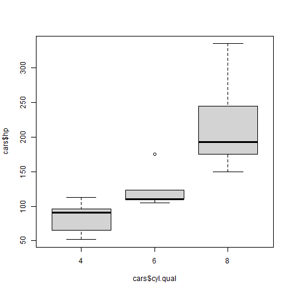

# Plots

[Go back](../index.md)

Learn about devices, and the most well-known plots such as histograms, bar charts, pie charts, and box plots.

<hr class="sl">

Almost all the plots' functions have these arguments

* `main = "title"`: plot title
* `xlab = "title x"`: x-axis title
* `ylab = "title y"`: y-axis title
* `xlim = lim`: x's values goes up to lim
* `ylim = lim`: y's values goes up to lim
* `col = 'color'`: set the color (ex: `'red'` or `red(1.0)` in `crayon`)

<hr class="sl">

## Utilities

Before starting, you may use these functions to add some lines, ... to a plot

* `points`: draw points
* `line`: draw points
* `abline` : draw a line $y=ax+b$ (you may use h=x or v=y)
* `legend`: add a legend
* `title`: add a title
* others: `rect`, `segments`, `polygon`, `box`, `grid`

You may add a background or save some settings before drawing using `par` function like `par(bg="...")`.

<hr class="sr">

## Devices

Sometimes you may want to export a plot (without using Rmd). You can do that by changing the device. Create a device with 

* `pdf(path)` (PDF)
* `jpeg(path)` (JPG)
* `png(path)` (PNG)

Then you should get a number, keep it in mind. Every plot will be rendered in the device you opened. Then use `dev.off()` or `dev.off(number)` to close the device. You should be able to open/see the resulting file. You can also use `dev.copy(device=format, "path")`.

<hr class="sl">

## Plot

* **French**: `Diagramme de points`
* **Function**: `plot(x)`

If you have more than one point at a position, you won't see it using plot, so you will have to use `plot(jitter(x))` to move the points a bit before rendering them.

You may use the argument `type` to change the type of plot, like `type = "l"` (l=line, b=line with dots).

<hr class="sr">

## Histogram

* **French**: `Histogramme`
* **Function**: `hist(x)`

New arguments

* `border = color`
* `breaks = seq(...)`: make more columns, smaller intervals
* `nclass = v`: make $v$ intervals

Notes

We are adding the argument `prob = TRUE` sometimes in statistics to make a histogram of the frequencies instead of the quantities.

<hr class="sl">

## Bar chart

* **French**: `Diagramme en batons/barres`
* **Function**: `barplot(table(qual))`

Let's say you got a qualitative variable (a variable taking finite values like Men/Women/Other) then you can see using this graph how many persons are taking each value.

<hr class="sr">

## Pie chart

* **French**: `Camembert`
* **Function**: `pie(table(qual))`

Same as Bar chart, but represented using the traditional pie chart.

<hr class="sl">

## Box plot

* **French**: `Boite à moustache`
* **Function**: `boxplot(???)`

My favorite one. You can

* see the distribution (quantiles, ...) of a variable (`boxplot(x)`)
* ... by a criterion (`boxplot(quant ~ qual)`)

```r
data('mtcars'); cars <- mtcars
cars$cyl.qual <- factor(cars$cyl)
# you will see for each value
# or cyl=the number of cylinders
# the repartition of
# hp=the horse power
boxplot(cars$hp ~ cars$cyl.qual)
```



The highest bar is the 3rd quantile, the lowest one is the first quantile and the black bar is the median (2nd quantile).

<hr class="sr">

## ???

* **French**: `Diagramme temporel/de températures`
* **Function**: `plotmeans(quant~qual)` (from `gplots`)

If you want to see the evolution of a quantitative variable with a temporal qualitative variable, then use this. The value at a time $t$ is the mean of the values observed at the time $t$.

<hr class="sl">

## ???

* **French**: `Diagramme en fagot`
* **Function**: `interaction.plot(qual, quant, quant, lty=1, legend=FALSE)`

Same as the diagram above, but this time we are not taking the mean and representing all values.

<hr class="sr">

## Contingency table

* **French**: `Tableau de contingence`
* **Function**: `balloonplot(table(x))`

Remember, that table is making a contingency table. You can visualize a contingency table using `balloonplot`.

<hr class="sl">

## Pivot table

* **French**: `Tableaux croisés`
* **Function**: `qhpvt(data, rows = ..., columns = ..., calculations = "...")`
* **Library**: `pivottabler`

You can observe the relation of a variable with other variables.

* data: your data
* rows: a vector of variables (i)
* cols: a vector of variables (j)
* calculation: the operation we will do on each (i,j)
  * mean() (mean)
  * n() (count)
  * ...
* formats: cell format (ex: `%.1f`)
* totals: totals line (`totals='totals=NONE'`=remove totals)